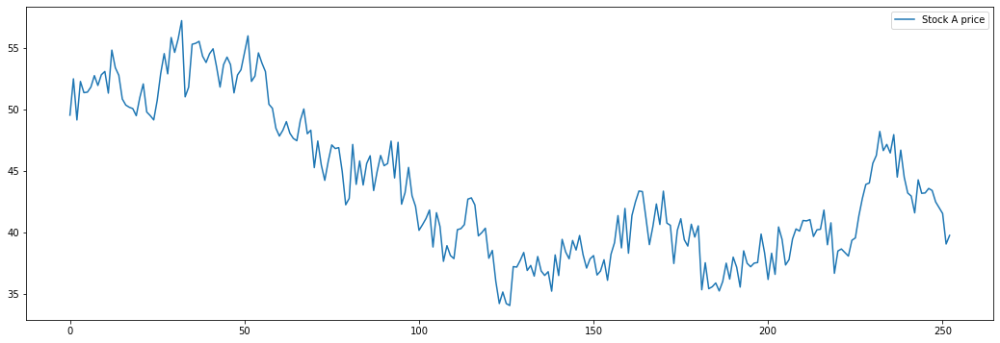
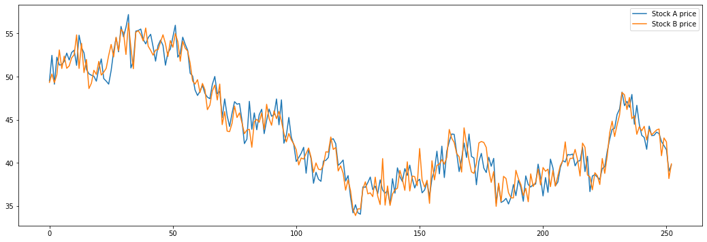
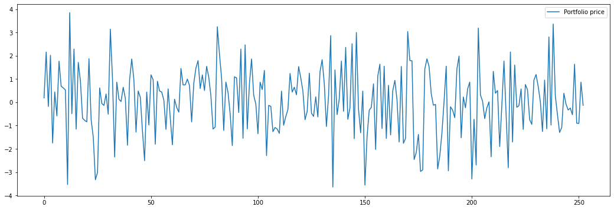
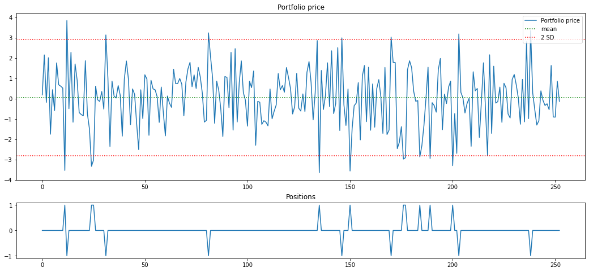

From pair trading - financial noob
https://github.com/financialnoob/pairs_trading/blob/main/1.pairs_trading.introduction.ipynb

```python
import numpy as np
import matplotlib.pyplot as plt

##================================================================================================
## First we generate stocks price time series. 
## We will generate two price series, P_a and P_b, that are cointegrated. 
## We will use a random walk process to generate the stock price series. 
## The stock price series will be generated as follows:
##================================================================================================
# generate random walk process
np.random.seed(112)
F = [50]
for i in range(252):
    F.append(F[i] + np.random.randn())
F = np.array(F)

# generate price series
P_a = F + np.random.randn(len(F))
P_b = F + np.random.randn(len(F))
```

```python
# Now let's plot the prices that we generated.
plt.figure(figsize=(18,6))
plt.plot(P_a, label='Stock A price')
plt.legend()
```


```python
plt.figure(figsize=(18,6))
plt.plot(P_b, label='Stock B price')
plt.legend()
```


```python
# Let's plot both series together.
plt.figure(figsize=(18,6))
plt.plot(P_a, label='Stock A price')
plt.plot(P_b, label='Stock B price')
plt.legend()
```



```python
# Assume that we create a portfolio by 
# taking a long position in stock A and a short position in stock B. What will the portfolio ## # # price look like?
portfolio = P_a - P_b
plt.figure(figsize=(18,6))
plt.plot(portfolio, label='Portfolio price')
plt.legend()
```


```python
## Below is the plot of portfolio price with 2-SD bands and positions that we should take (+1: ## long position, -1: short position, 0: no position)
mu = np.mean(portfolio)
sigma = np.std(portfolio)

# calculate positions
positions = np.zeros(portfolio.shape)
positions[portfolio > mu+2*sigma] = -1 # short position
positions[portfolio < mu-2*sigma] = 1 # long position

# plot portfolio price and positions
f, (a1, a2) = plt.subplots(2, 1, gridspec_kw={'height_ratios': [3, 1]})
f.set_figwidth(18)
f.set_figheight(8)
a1.plot(portfolio, label='Portfolio price')
a1.set_title('Portfolio price')
a1.axhline(y=mu, color='g', linestyle='dotted', label='mean')
a1.axhline(y=mu+2*sigma, color='r', linestyle='dotted', label='2 SD')
a1.axhline(y=mu-2*sigma, color='r', linestyle='dotted')
a1.legend(loc='upper right')
a2.plot(positions)
a2.set_title('Positions')
```



```python
# approximate profit
profit = 15*2*sigma # 15 trading opportunities, approx. 2*sigma profir per trade
print(profit)
```