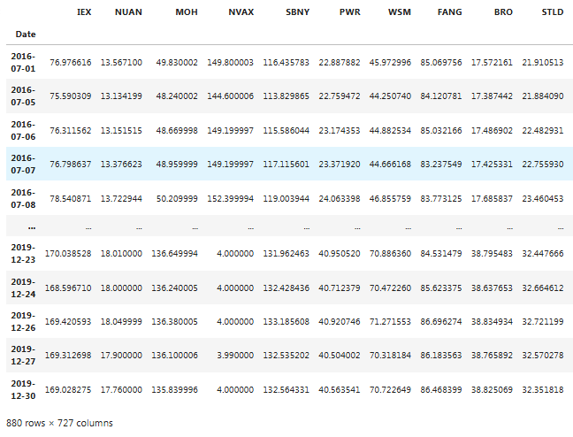

From pair trading - financial noob
https://github.com/financialnoob/pairs_trading/blob/main/1.pairs_trading.introduction.ipynb

```python
import pandas as pd
import numpy as np
import matplotlib.pyplot as plt
import yfinance as yf

# read prices from csv file
prices = pd.read_csv('vbr16_19.csv', index_col='Date')

print(prices)
```



```python
cumret = np.log(prices).diff().cumsum()+1 # calculate cumulative returns from log-prices
cumret.dropna(inplace=True) 
```

# Functions to calculate different metrics

```python
#================================================================================================
# Tính khoảng cách Euclidean giữa các cặp cổ phiếu dựa trên dữ liệu (cumulative returns)
# và trả về một danh sách các cặp được sắp xếp theo khoảng cách tăng dần.
#================================================================================================
def calculate_distances(cumret):
    '''
    calculate Euclidean distance for each pair of stocks in the dataframe
    return sorted dictionary (in ascending order)
    '''
    distances = {} # dictionary with distance for each pair
    
    # calculate distances
    for s1 in cumret.columns:
        for s2 in cumret.columns:
            if s1!=s2 and (f'{s1}-{s2}' not in distances.keys()) and (f'{s2}-{s1}' not in distances.keys()):
                dist = np.sqrt(np.sum((cumret[s1] - cumret[s2])**2)) # Euclidean distance
                distances[f'{s1}-{s2}'] = dist
    
    # sort dictionary
    sorted_distances = {k:v for k,v in sorted(distances.items(), key = lambda item: item[1])}
    
    return sorted_distances

def parse_pair(pair):
    '''
    parse pair string S1-S2
    return tickers S1, S2
    '''
    dp = pair.find('-')
    s1 = pair[:dp]
    s2 = pair[dp+1:]
    
    return s1,s2

#================================================================================================
# CADF TEST - Hàm coint thực hiện kiểm định Engle-Granger Cointegration Test.
#================================================================================================
def cadf_pvalue(s1, s2, cumret):
    '''
    perform CADF cointegration tests
    since it is sensitive to the order of stocks in the pair, perform both tests (s1-2 and s2-s1)
    return the smallest p-value of two tests
    '''
    from statsmodels.tsa.stattools import coint
    
    p1 = coint(cumret[s1], cumret[s2])[1]
    p2 = coint(cumret[s2], cumret[s1])[1]
    
    return min(p1,p2)

#================================================================================================
# Tính Half-life.
#================================================================================================
def calculate_halflife(spread):
    '''
    calculate half-life of mean reversion of the spread
    '''
    from statsmodels.regression.linear_model import OLS
    from statsmodels.tools.tools import add_constant
    
    ylag = spread.shift()
    deltay = spread - ylag
    ylag.dropna(inplace=True)
    deltay.dropna(inplace=True)

    res = OLS(deltay, add_constant(ylag)).fit()
    halflife = -np.log(2)/res.params[0]
    
    return halflife
```
# Hàm `calculate_halflife`

## Mục đích
Hàm `calculate_halflife` được sử dụng để tính **thời gian bán rã** (*half-life*) của quá trình hồi quy về trung bình (*mean reversion*) đối với một chuỗi thời gian `spread`.

---

## 1. Ý nghĩa
- **Thời gian bán rã (*half-life*)**: Là thời gian cần để giá trị của chuỗi hồi quy về một nửa khoảng cách so với mức trung bình dài hạn sau khi lệch khỏi mức này.
- Đây là một chỉ số quan trọng để đánh giá mức độ hồi quy về trung bình của chuỗi:
  - **Thời gian bán rã ngắn** → Chuỗi hồi quy nhanh về trung bình.
  - **Thời gian bán rã dài** → Chuỗi hồi quy chậm hoặc không đáng kể.

---

## 2. Công thức
Hàm dựa trên mô hình **Autoregressive Order 1 (AR(1))**:
\[
\Delta y_t = \rho \cdot y_{t-1} + \epsilon_t
\]
- \(\Delta y_t = y_t - y_{t-1}\): Chênh lệch giá trị.
- \(y_{t-1}\): Giá trị trước đó của chuỗi thời gian.
- \(\rho\): Hệ số hồi quy, đo lường mức độ chuỗi phụ thuộc vào giá trị trước đó.
- \(\epsilon_t\): Thành phần nhiễu ngẫu nhiên.

**Thời gian bán rã** được tính dựa trên hệ số \(\rho\):
\[
\text{Half-life} = -\frac{\ln(2)}{\ln(\rho)}
\]

---

```python
def calculate_halflife(spread):
    '''
    Calculate half-life of mean reversion of the spread.
    '''
    from statsmodels.regression.linear_model import OLS
    from statsmodels.tools.tools import add_constant
    
    ylag = spread.shift()
    deltay = spread - ylag
    ylag.dropna(inplace=True)
    deltay.dropna(inplace=True)

    res = OLS(deltay, add_constant(ylag)).fit()
    halflife = -np.log(2)/res.params[0]
    
    return halflife


```python
def calculate_metrics(sorted_distances, cumret, N=5):
    '''
    calculate metrics for N pairs with the smallest Euclidean distance
    return dataframe of results
    '''
    from hurst import compute_Hc
    from statsmodels.tsa.stattools import adfuller
    
    pairs = [k for k,v in sorted_distances.items()][:N]
    
    cols = ['Euclidean distance', 'CADF p-value', 'ADF p-value', 'Spread SD', 
        'Num zero-crossings', 'Hurst Exponent', 'Half-life of mean reversion', '% days within 2-SD band']
    results = pd.DataFrame(index=pairs, columns=cols)
    
    for pair in pairs:
        s1,s2 = parse_pair(pair)
        spread = cumret[s1] - cumret[s2]
        results.loc[pair]['Euclidean distance'] = np.sqrt(np.sum((spread)**2))
        results.loc[pair]['CADF p-value'] = cadf_pvalue(s1, s2, cumret)
        results.loc[pair]['ADF p-value'] = adfuller(spread)[1]
        results.loc[pair]['Spread SD'] = spread.std()
        results.loc[pair]['Num zero-crossings'] = ((spread[1:].values * spread[:-1].values) < 0).sum()
        results.loc[pair]['Hurst Exponent'] = compute_Hc(spread)[0]
        results.loc[pair]['Half-life of mean reversion'] = calculate_halflife(spread)
        results.loc[pair]['% days within 2-SD band'] = (abs(spread) < 2*spread.std()).sum() / len(spread) * 100
        
    return results

def plot_pairs(sorted_distances, cumret_train, cumret_test, N=5):
    '''
    plot cumulative returns of the spread for each of N pairs with smallest Euclidean distance
    '''
    pairs = [k for k,v in sorted_distances.items()][:N]
    
    for pair in pairs:
        s1,s2 = parse_pair(pair)
        spread_train = cumret_train[s1] - cumret_train[s2]
        spread_test = cumret_test[s1] - cumret_test[s2]
        spread_mean = spread_train.mean() # historical mean
        spread_std = spread_train.std() # historical standard deviation

        fig, (ax1, ax2) = plt.subplots(1, 2, figsize=(18,4))
        fig.suptitle(f'Spread of {pair} pair', fontsize=16)
        ax1.plot(spread_train, label='spread')
        ax1.set_title('Formation period')
        ax1.axhline(y=spread_mean, color='g', linestyle='dotted', label='mean')
        ax1.axhline(y=spread_mean+2*spread_std, color='r', linestyle='dotted', label='2-SD band')
        ax1.axhline(y=spread_mean-2*spread_std, color='r', linestyle='dotted')
        ax1.legend()
        ax2.plot(spread_test, label='spread')
        ax2.set_title('Trading period')
        ax2.axhline(y=spread_mean, color='g', linestyle='dotted', label='mean')
        ax2.axhline(y=spread_mean+2*spread_std, color='r', linestyle='dotted', label='2-SD band')
        ax2.axhline(y=spread_mean-2*spread_std, color='r', linestyle='dotted')
        ax2.legend()
```