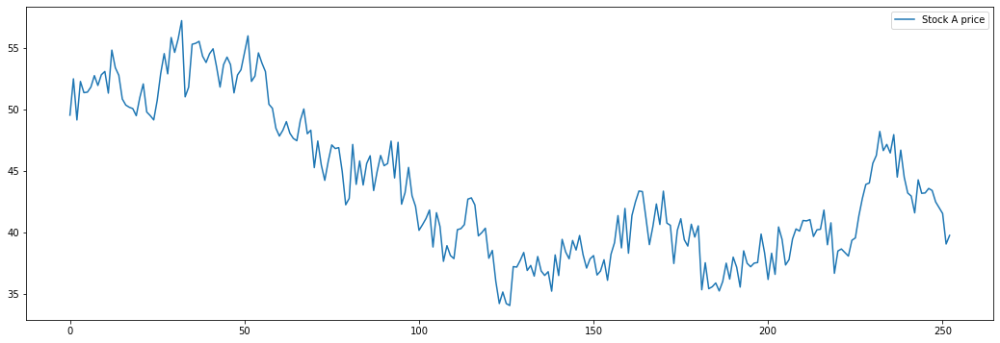
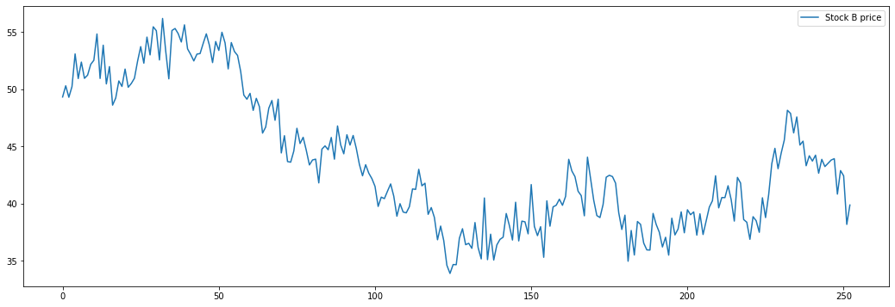
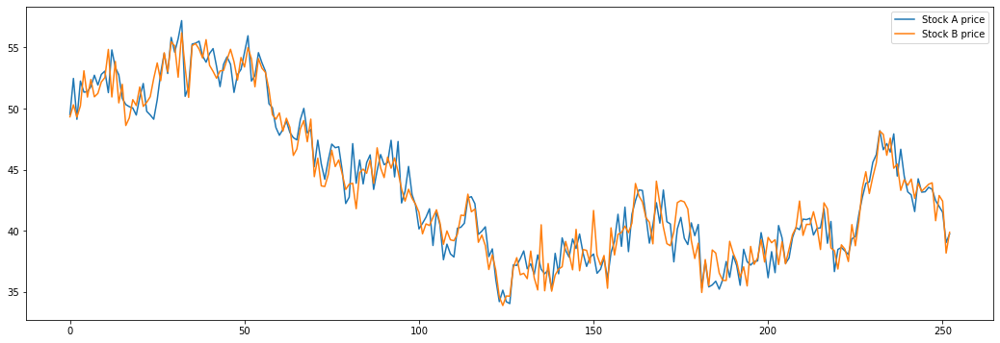
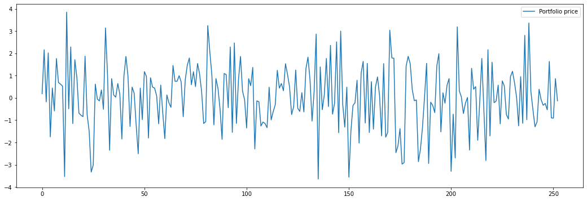

From pair trading - financial noob
- https://financialnoob.substack.com/p/pairs-trading-introduction?utm_source=profile&utm_medium=reader2
- https://github.com/financialnoob/pairs_trading/blob/main/1.pairs_trading.introduction.ipynb

# Pairs trading. Introduction.

Đầu tiên chúng ta cần tạo chuỗi giá cổ phiếu. Giả sử chúng ta có hai cổ phiếu: A và B. Giá của chúng phụ thuộc vào một yếu tố chung F cộng với một số nhiễu. Giả sử F tuân theo một quá trình *random walk*. Sau đó, chúng ta có:

\[
P_{a,t} = F_t + w_{a,t}, \quad w_a \sim \mathcal{N}(0, 1)
\]

\[
P_{b,t} = F_t + w_{b,t}, \quad w_b \sim \mathcal{N}(0, 1)
\]


Dưới đây bạn có thể thấy mã python được sử dụng để tạo giá cổ phiếu. Chúng tôi tạo ra 252 điểm dữ liệu, chúng ta có thể coi là một năm (252 ngày giao dịch) của giá đóng cửa hàng ngày.

```python
import numpy as np
import matplotlib.pyplot as plt

##================================================================================================
## First we generate stocks price time series. 
## We will generate two price series, P_a and P_b, that are cointegrated. 
## We will use a random walk process to generate the stock price series. 
## The stock price series will be generated as follows:
##================================================================================================
# generate random walk process
np.random.seed(112)
F = [50]
for i in range(252):
    F.append(F[i] + np.random.randn())
F = np.array(F)

# generate price series
P_a = F + np.random.randn(len(F))
P_b = F + np.random.randn(len(F))
```

```python
# Now let's plot the prices that we generated.
plt.figure(figsize=(18,6))
plt.plot(P_a, label='Stock A price')
plt.legend()
```

<center>


Stock A price

</center>

```python
plt.figure(figsize=(18,6))
plt.plot(P_b, label='Stock B price')
plt.legend()
```

<center>


Stock B price
</center>

```python
# Let's plot both series together.
plt.figure(figsize=(18,6))
plt.plot(P_a, label='Stock A price')
plt.plot(P_b, label='Stock B price')
plt.legend()
```

Ở đây chúng ta có thể nhận thấy giá có xu hướng di chuyển cùng nhau. Chúng ta có thể sử dụng điều này như thế nào? Giả sử chúng ta tạo một danh mục đầu tư bằng cách nắm giữ vị thế mua cổ phiếu A và vị thế bán cổ phiếu B. Giá danh mục đầu tư sẽ như thế nào?

<center>


Prices of stocks A and B

</center>

```python
# Assume that we create a portfolio by 
# taking a long position in stock A and a short position in stock B. 
# What will the portfolio price look like?
portfolio = P_a - P_b
plt.figure(figsize=(18,6))
plt.plot(portfolio, label='Portfolio price')
plt.legend()
```

<center>


Portfolio price

</center>

Chúng ta có thể thấy rằng chuỗi *time series* kết quả thể hiện hành vi *mean reverting*. Giá danh mục đầu tư dao động quanh mức 0. Về cơ bản, bằng cách tạo danh mục đầu tư như vậy, chúng ta có thể hủy bỏ thành phần *random walk* của chuỗi giá cổ phiếu riêng lẻ và giờ chúng ta chỉ còn lại các thành phần nhiễu trắng - *white noise*:

\[
P_{a,t} - P_{b,t} = F_t + w_{a,t} - F_t - w_{b,t} = w_{a,t} - w_{b,t}
\]

Nếu chúng ta quan sát thấy giá danh mục đầu tư thấp hơn hoặc cao hơn 0, chúng ta kỳ vọng nó sẽ quay trở lại mức 0. Giả sử rằng chúng ta mở một vị thế khi giá danh mục đầu tư lệch khỏi giá trị trung bình của nó hơn 2 *historical standard deviations*:

- Mở vị thế mua (*long position*) khi giá danh mục đầu tư thấp hơn 2 *standard deviations* dưới giá trị *mean*.
- Đóng vị thế mua khi giá danh mục đầu tư vượt qua giá trị *mean* từ dưới lên.
- Mở vị thế bán khống (*short position*) khi giá danh mục đầu tư cao hơn 2 *standard deviations* trên giá trị *mean*.
- Đóng vị thế bán khống khi giá danh mục đầu tư vượt qua giá trị *mean* từ trên xuống.

```python
## Below is the plot of portfolio price with 2-SD bands and positions that we should take 
## (+1: long position, -1: short position, 0: no position)
mu = np.mean(portfolio)
sigma = np.std(portfolio)

# calculate positions
positions = np.zeros(portfolio.shape)
positions[portfolio > mu+2*sigma] = -1 # short position
positions[portfolio < mu-2*sigma] = 1 # long position

# plot portfolio price and positions
f, (a1, a2) = plt.subplots(2, 1, gridspec_kw={'height_ratios': [3, 1]})
f.set_figwidth(18)
f.set_figheight(8)
a1.plot(portfolio, label='Portfolio price')
a1.set_title('Portfolio price')
a1.axhline(y=mu, color='g', linestyle='dotted', label='mean')
a1.axhline(y=mu+2*sigma, color='r', linestyle='dotted', label='2 SD')
a1.axhline(y=mu-2*sigma, color='r', linestyle='dotted')
a1.legend(loc='upper right')
a2.plot(positions)
a2.set_title('Positions')
```

Bên dưới là biểu đồ giá danh mục đầu tư với các dải 2 *standard deviations* (*2-SD bands*) và các vị thế mà chúng ta nên thực hiện (+1: vị thế mua, -1: vị thế bán khống, 0: không có vị thế).

<center>


Portfolio price and positions

</center>

```python
# approximate profit
profit = 15*2*sigma # 15 trading opportunities, approx. 2*sigma profir per trade
print(profit)
```

Có 15 cơ hội giao dịch được hiển thị trên biểu đồ ở trên. Nếu chúng ta giao dịch một danh mục đầu tư bao gồm 1 cổ phiếu của cổ phiếu A và 1 cổ phiếu của cổ phiếu B, thì chúng ta có thể kiếm được khoảng 43 usd lợi nhuận (2.87 usd mỗi giao dịch). Nếu chúng ta giao dịch một danh mục đầu tư bao gồm 100 cổ phiếu của cổ phiếu A và 100 cổ phiếu của cổ phiếu B, thì lợi nhuận và lỗ sẽ được nhân lên 100 lần, mang lại lợi nhuận $4300.

Ví dụ tổng hợp này minh họa nguyên tắc cơ bản của giao dịch cặp (*pairs trading*). Tất nhiên, trong thực tế, mọi thứ phức tạp hơn nhiều. Trong các bài viết tiếp theo, tôi sẽ mô tả một số phương pháp chọn cặp và áp dụng chúng vào dữ liệu thực tế.
