From pair **trading** - financial noob
https://financialnoob.substack.com/p/pairs-**trading**-pair-selection-distance?utm_source=profile&utm_medium=reader2
https://github.com/financialnoob/pairs_**trading**/blob/main/2.pairs_**trading**.pairs_selection.distance.ipynb

# Pairs **trading**. Pairs selection. Distance
Trong bài viết trước, tôi đã mô tả các nguyên tắc cơ bản của chiến lược giao dịch cặp (*pairs **trading***). Bây giờ, tôi muốn khám phá một trong những phương pháp nổi tiếng nhất để chọn cặp, đó là phương pháp khoảng cách (*distance method*). Phương pháp này đã được mô tả trong bài báo *'Pairs **trading**: Performance of a Relative Value Arbitrage Rule' (Gatev et al., 2006)*. Tôi sẽ triển khai phương pháp này bằng Python, áp dụng nó vào một tập dữ liệu giá cổ phiếu thực tế và cố gắng phân tích những ưu điểm và nhược điểm của nó.

Ý tưởng rất đơn giản: đối với mỗi cặp cổ phiếu, tính khoảng cách *Euclidean* giữa các *cumulative returns* được chuẩn hóa của chúng và chọn các cặp có khoảng cách nhỏ nhất để giao dịch. Khoảng thời gian được sử dụng để chọn cặp được gọi là ****formation** period**. Ngay sau đó là ****trading** period**, trong đó chúng ta giao dịch các cặp cổ phiếu đã được chọn. Trong bài báo, họ sử dụng khoảng thời gian **formation** là 12 tháng và **trading** là 6 tháng. Tôi muốn kiểm tra các khoảng thời gian **formation** với nhiều độ dài khác nhau: 12 tháng, 24 tháng và 36 tháng. ****trading** period** sẽ luôn là 6 tháng.

Tôi sẽ sử dụng các cổ phiếu thành phần của Vanguard Small Cap Value ETF (VBR) làm rổ cổ phiếu của mình. Tôi tin rằng việc sử dụng cổ phiếu vốn hóa nhỏ sẽ giúp tôi phát hiện thêm nhiều cơ hội giao dịch tiềm năng (bởi vì quá nhiều người giao dịch cổ phiếu vốn hóa lớn có tính thanh khoản cao, khiến thị trường đông đúc hơn và do đó có ít cơ hội giao dịch hơn).

### Bước đầu tiên: Thu thập dữ liệu
Để thực hiện các thử nghiệm, tôi cần 36+6=42 tháng dữ liệu. Tôi sẽ sử dụng khoảng thời gian từ **2016-07-01** đến **2019-12-31**. Tại thời điểm viết bài này, VBR chứa cổ phiếu của 967 công ty. Tôi sẽ chỉ chọn những công ty thỏa mãn:

- Có dữ liệu trên Yahoo Finance cho toàn bộ khoảng thời gian;
- Khối lượng giao dịch lớn hơn 1000 trong mỗi ngày giao dịch.

Áp dụng các quy tắc trên, chúng ta còn lại 727 cổ phiếu, tương đương với \(727 \times 726 / 2 = 263901\) cặp tiềm năng. Dưới đây là đoạn mã tôi sử dụng để tải dữ liệu (hoặc bạn có thể tải trực tiếp dưới dạng tệp CSV từ [đây](vbr16_19.csv)).  
Lưu ý: Tôi sử dụng giá điều chỉnh (*Adj Close*) để tính toán nhằm tính đến các hành động của công ty (như chia tách cổ phiếu).


```python
import pandas as pd
import numpy as np
import matplotlib.pyplot as plt
import yfinance as yf

# read prices from csv file
prices = pd.read_csv('vbr16_19.csv', index_col='Date')

print(prices)
```


Bây giờ, chúng ta cần chuyển đổi giá thành *cumulative returns* và sẵn sàng bắt đầu kiểm tra.

Đối với mỗi kết hợp của các khoảng thời gian **formation** và **trading**, tôi sẽ chọn 5 cặp có khoảng cách *Euclidean* nhỏ nhất. Đối với mỗi cặp, tôi sẽ xây dựng một danh mục đầu tư (*spread*) bao gồm hai vị thế có kích thước bằng nhau (về vốn phân bổ, không phải về số lượng cổ phiếu): vị thế mua (*long*) ở một cổ phiếu và vị thế bán khống (*short*) ở cổ phiếu còn lại. Tôi sẽ cung cấp đồ thị của *spread* trong cả giai đoạn **formation** và **trading** cũng như các chỉ số sau:

1. Khoảng cách *Euclidean* giữa *cumulative returns* của hai cổ phiếu.
2. Giá trị p của kiểm định *Cointegration Augmented Dickey-Fuller (CADF)* (nếu thấp → có đồng tích hợp).
3. Giá trị p của kiểm định *Augmented Dickey-Fuller (ADF)* (nếu thấp → chuỗi dừng).
4. *Standard deviation* của *spread*.
5. Số lần *spread* cắt qua giá trị 0.
6. *Hurst exponent* (nên nhỏ hơn 0.5 đối với *mean-reverting time series*).
7. Thời gian bán rã (*half-life*) của *mean reversion*.
8. Tỷ lệ phần trăm số ngày nằm trong dải 2-SD (nếu quá nhiều thời gian nằm ngoài dải 2-SD → cặp phân kỳ quá nhiều trong thời gian quá dài).

Let’s start.

```python
cumret = np.log(prices).diff().cumsum()+1 # calculate cumulative returns from log-prices
cumret.dropna(inplace=True) 
```

---

# Functions to calculate different metrics

```python
#================================================================================================
# Tính khoảng cách Euclidean giữa các cặp cổ phiếu dựa trên dữ liệu (cumulative returns)
# và trả về một danh sách các cặp được sắp xếp theo khoảng cách tăng dần.
#================================================================================================
def calculate_distances(cumret):
    '''
    calculate Euclidean distance for each pair of stocks in the dataframe
    return sorted dictionary (in ascending order)
    '''
    distances = {} # dictionary with distance for each pair
    
    # calculate distances
    for s1 in cumret.columns:
        for s2 in cumret.columns:
            if s1!=s2 and (f'{s1}-{s2}' not in distances.keys()) and (f'{s2}-{s1}' not in distances.keys()):
                dist = np.sqrt(np.sum((cumret[s1] - cumret[s2])**2)) # Euclidean distance
                distances[f'{s1}-{s2}'] = dist
    
    # sort dictionary
    sorted_distances = {k:v for k,v in sorted(distances.items(), key = lambda item: item[1])}
    
    return sorted_distances

def parse_pair(pair):
    '''
    parse pair string S1-S2
    return tickers S1, S2
    '''
    dp = pair.find('-')
    s1 = pair[:dp]
    s2 = pair[dp+1:]
    
    return s1,s2

#================================================================================================
# CADF TEST - Hàm coint thực hiện kiểm định Engle-Granger Cointegration Test.
#================================================================================================
def cadf_pvalue(s1, s2, cumret):
    '''
    perform CADF cointegration tests
    since it is sensitive to the order of stocks in the pair, perform both tests (s1-2 and s2-s1)
    return the smallest p-value of two tests
    '''
    from statsmodels.tsa.stattools import coint
    
    p1 = coint(cumret[s1], cumret[s2])[1]
    p2 = coint(cumret[s2], cumret[s1])[1]
    
    return min(p1,p2)
```

# Hàm `calculate_halflife`

```python
#================================================================================================
# Tính Half-life.
#================================================================================================
def calculate_halflife(spread):
    '''
    calculate half-life of mean reversion of the spread
    '''
    from statsmodels.regression.linear_model import OLS
    from statsmodels.tools.tools import add_constant
    
    ylag = spread.shift()
    deltay = spread - ylag
    ylag.dropna(inplace=True)
    deltay.dropna(inplace=True)

    res = OLS(deltay, add_constant(ylag)).fit()
    halflife = -np.log(2)/res.params[0]
    
    return halflife
```

## Mục đích
Hàm `calculate_halflife` được sử dụng để tính **thời gian bán rã** (*half-life*) của quá trình hồi quy về trung bình (*mean reversion*) đối với một chuỗi thời gian `spread`.

## 1. Ý nghĩa
- **Thời gian bán rã (*half-life*)**: Là thời gian cần để giá trị của chuỗi hồi quy về một nửa khoảng cách so với mức trung bình dài hạn sau khi lệch khỏi mức này.
- Đây là một chỉ số quan trọng để đánh giá mức độ hồi quy về trung bình của chuỗi:
  - **Thời gian bán rã ngắn** → Chuỗi hồi quy nhanh về trung bình.
  - **Thời gian bán rã dài** → Chuỗi hồi quy chậm hoặc không đáng kể.

## 2. Công thức
Hàm dựa trên mô hình **Autoregressive Order 1 (AR(1))**:
\[
\Delta y_t = \rho \cdot y_{t-1} + \epsilon_t
\]
- \(\Delta y_t = y_t - y_{t-1}\): Chênh lệch giá trị.
- \(y_{t-1}\): Giá trị trước đó của chuỗi thời gian.
- \(\rho\): Hệ số hồi quy, đo lường mức độ chuỗi phụ thuộc vào giá trị trước đó.
- \(\epsilon_t\): Thành phần nhiễu ngẫu nhiên.

**Thời gian bán rã** được tính dựa trên hệ số \(\rho\):
\[
\text{Half-life} = -\frac{\ln(2)}{\ln(\rho)}
\]

## 3. Cách hoạt động
- **`ylag`**: Dịch chuyển chuỗi `spread` xuống một bước (giá trị tại thời điểm \(t - 1\)).
- **`deltay`**: Tính \(\Delta y_t = y_t - y_{t-1}\) (chênh lệch giữa hai giá trị liên tiếp).

`res = OLS(deltay, add_constant(ylag)).fit()`
- **Thực hiện hồi quy**:
  - **Biến phụ thuộc**: \(\Delta y_t\) (`deltay`).
  - **Biến độc lập**: \(y_{t-1}\) (`ylag`) với hằng số (*constant*) thêm vào.
- **Kết quả của hồi quy** bao gồm hệ số \(\rho\) trong `res.params[0]`.

`halflife = -np.log(2)/res.params[0]`
- Tính thời gian bán rã dựa trên công thức \(-\frac{\ln(2)}{\ln(\rho)}\).

---

# Hàm `calculate_metrics`
```python
def calculate_metrics(sorted_distances, cumret, N=5):
    '''
    calculate metrics for N pairs with the smallest Euclidean distance
    return dataframe of results
    '''
    from hurst import compute_Hc
    from statsmodels.tsa.stattools import adfuller
    
    # Lấy danh sách các cặp có khoảng cách nhỏ nhất từ sorted_distances
    pairs = [k for k,v in sorted_distances.items()][:N]
    
    cols = ['Euclidean distance', 'CADF p-value', 'ADF p-value', 'Spread SD', 
        'Num zero-crossings', 'Hurst Exponent', 'Half-life of mean reversion', '% days within 2-SD band']
    results = pd.DataFrame(index=pairs, columns=cols)
    
    for pair in pairs:
        s1,s2 = parse_pair(pair)
        spread = cumret[s1] - cumret[s2]
        results.loc[pair]['Euclidean distance'] = np.sqrt(np.sum((spread)**2))
        results.loc[pair]['CADF p-value'] = cadf_pvalue(s1, s2, cumret)
        results.loc[pair]['ADF p-value'] = adfuller(spread)[1]
        results.loc[pair]['Spread SD'] = spread.std()
        results.loc[pair]['Num zero-crossings'] = ((spread[1:].values * spread[:-1].values) < 0).sum()
        results.loc[pair]['Hurst Exponent'] = compute_Hc(spread)[0]
        results.loc[pair]['Half-life of mean reversion'] = calculate_halflife(spread)
        results.loc[pair]['% days within 2-SD band'] = (abs(spread) < 2*spread.std()).sum() / len(spread) * 100
        
    return results
```

## Mục đích
Hàm `calculate_metrics` được sử dụng để tính toán một loạt các chỉ số phân tích cho **N cặp chuỗi thời gian có khoảng cách Euclidean nhỏ nhất** (theo đầu vào `sorted_distances`). Các chỉ số này được trả về dưới dạng một bảng dữ liệu (DataFrame).
- Khoảng cách Euclidean.
- Kiểm định đồng tích hợp (*CADF*).
- Kiểm định tính dừng (*ADF*).
- Độ lệch chuẩn của *spread*.
- Số lần *spread* cắt ngang 0.
- Chỉ số Hurst (*Hurst Exponent*).
- Thời gian bán rã (*Half-life*).
- Tỷ lệ ngày nằm trong dải ±2 độ lệch chuẩn (*% days within 2-SD band*).
---

```python
def plot_pairs(sorted_distances, cumret_train, cumret_test, N=5):
    '''
    plot cumulative returns of the spread for each of N pairs with smallest Euclidean distance
    '''
    pairs = [k for k,v in sorted_distances.items()][:N]
    
    for pair in pairs:
        s1,s2 = parse_pair(pair)
        spread_train = cumret_train[s1] - cumret_train[s2]
        spread_test = cumret_test[s1] - cumret_test[s2]
        spread_mean = spread_train.mean() # historical mean
        spread_std = spread_train.std() # historical standard deviation

        fig, (ax1, ax2) = plt.subplots(1, 2, figsize=(18,4))
        fig.suptitle(f'Spread of {pair} pair', fontsize=16)
        ax1.plot(spread_train, label='spread')
        ax1.set_title('**formation** period')
        ax1.axhline(y=spread_mean, color='g', linestyle='dotted', label='mean')
        ax1.axhline(y=spread_mean+2*spread_std, color='r', linestyle='dotted', label='2-SD band')
        ax1.axhline(y=spread_mean-2*spread_std, color='r', linestyle='dotted')
        ax1.legend()
        ax2.plot(spread_test, label='spread')
        ax2.set_title('**trading** period')
        ax2.axhline(y=spread_mean, color='g', linestyle='dotted', label='mean')
        ax2.axhline(y=spread_mean+2*spread_std, color='r', linestyle='dotted', label='2-SD band')
        ax2.axhline(y=spread_mean-2*spread_std, color='r', linestyle='dotted')
        ax2.legend()
```

---

# 12 months **formation** period \ 6 months **trading** period

```python
# prepare data
cumret12_6 = cumret.loc['2018-07-01':]
cumret12_6 = cumret12_6 / cumret12_6.iloc[0] # divide by first row so that all prices start at 1
train12_6 = cumret12_6.loc['2018-07-01':'2019-06-31'] # **formation** period
test12_6 = cumret12_6.loc['2019-07-01':'2019-12-31'] # **trading** period

# calculate Euclidean distances for each pair
sorted_distances12_6 = calculate_distances(train12_6)

# print top 10 pairs with smallest distance
[[k,v] for k,v in sorted_distances12_6.items()][:10]
```

`Output:`

```python
[['BXMT-PMT', 0.18534667592937973],
 ['ZION-CFR', 0.19955368463211864],
 ['CBSH-CVBF', 0.23162338738613775],
 ['CVBF-NBTB', 0.25639422937549716],
 ['CBSH-NBTB', 0.2740192531721768],
 ['CFR-SHO', 0.279677759296359],
 ['CENTA-CENT', 0.28650499260947404],
 ['UCBI-PRK', 0.290254830655206],
 ['CUZ-HPP', 0.2933625746003759],
 ['PACW-HOMB', 0.2972769080754797]]
 ```

`plot_pairs(sorted_distances12_6, train12_6, test12_6)`

Bên dưới bạn có thể thấy 5 cặp với khoảng cách *Euclidean* nhỏ nhất

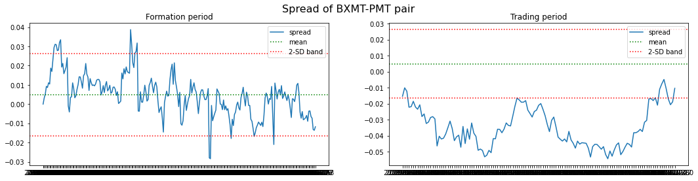
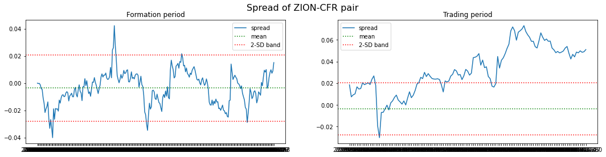
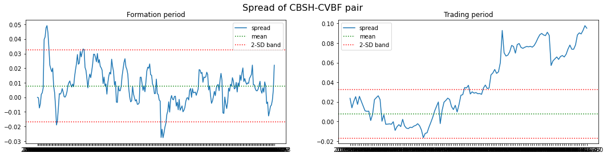
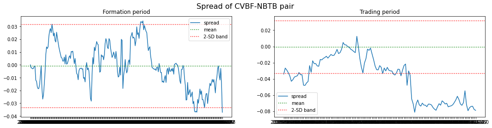
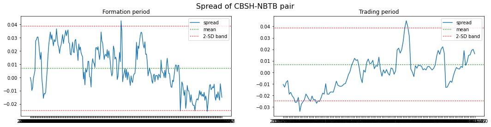

### Metrics for top5 pairs during 12m **formation** period

`calculate_metrics(sorted_distances12_6, train12_6)`

Như bạn có thể thấy, mặc dù tất cả các cặp đều thể hiện hành vi *mean reverting* tốt trong giai đoạn **formation**, hầu hết trong số chúng lại hành xử khác biệt trong giai đoạn **trading**. Trong số năm cặp, chỉ có một cặp **(CBSH-NBTB)** dường như *mean reverting* một cách tương đối trong giai đoạn **trading**. Bốn cặp còn lại lệch - *deviate* quá xa so với giá trị *historical mean* của chúng và không hội tụ trở lại (ít nhất là trong giai đoạn **trading** kéo dài 6 tháng).

Trong bảng dưới, chúng ta có thể thấy rằng trong giai đoạn **formation**, tất cả các cặp đều thể hiện nhiều đặc tính *mean-reverting*: *p-values* của các kiểm định **CADF** và **ADF** đều thấp, *Hurst exponent* nhỏ hơn 0.5, và có nhiều lần cắt qua giá trị 0. Hãy cùng xem các chỉ số tương tự trong giai đoạn **trading**.

<center>

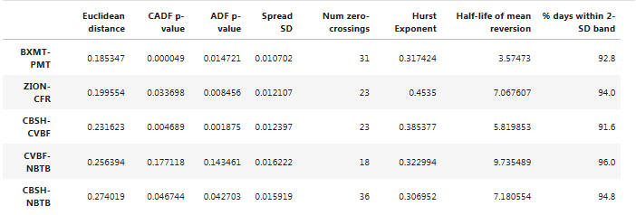
Top 5 pairs (12m formation period)

</center>

### Metrics for top5 pairs during 6m **trading** period

Bảng dưới xác nhận những gì chúng ta đã thấy trên các biểu đồ. Hầu hết các cặp không thể hiện đặc tính *mean-reverting*. Vì vậy, mặc dù phương pháp khoảng cách hoạt động rất tốt trong việc chọn các cặp *mean-reverting* trong tập dữ liệu mẫu, hành vi của các cặp được chọn ngoài mẫu lại rất khác biệt. Nhưng nếu khoảng thời gian **formation** 12 tháng là không đủ dài thì sao? Điều gì sẽ xảy ra nếu việc sử dụng khoảng thời gian **formation** dài hơn sẽ giúp chúng ta phát hiện các cặp cổ phiếu có mối quan hệ ổn định hơn trong dài hạn? Hãy thử xem.

`calculate_metrics(sorted_distances12_6, test12_6)`

<center>

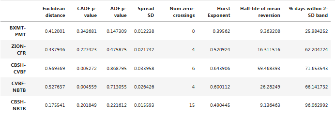
Top 5 pairs (6m trading period)

</center>

---

# 24 months **formation** period \ 6 months **trading** period

```python
# prepare data
cumret24_6 = cumret.loc['2017-07-01':]
cumret24_6 = cumret24_6 / cumret24_6.iloc[0] # divide by first row so that all prices start at 1
train24_6 = cumret24_6.loc['2017-07-01':'2019-06-31'] # **formation** period
test24_6 = cumret24_6.loc['2019-07-01':'2019-12-31'] # **trading** period

# calculate Euclidean distances for each pair
sorted_distances24_6 = calculate_distances(train24_6)

# print top 10 pairs with smallest distance
[[k,v] for k,v in sorted_distances24_6.items()][:10]
```

`Output`

```python
[['AGNC-MFA', 0.48389477832676514],
 ['CENTA-CENT', 0.49176405060607475],
 ['MTG-ESNT', 0.5020148240022925],
 ['BANF-STBA', 0.534333722623322],
 ['STWD-CIM', 0.5495869561327438],
 ['WBS-WSBC', 0.5589548024641623],
 ['ATO-OGS', 0.5657027989342371],
 ['CUZ-DEI', 0.5727710511922683],
 ['PBCT-BXS', 0.5760029939629536],
 ['APLE-SHO', 0.5856976838193417]]
```

`plot_pairs(sorted_distances24_6, train24_6, test24_6)`

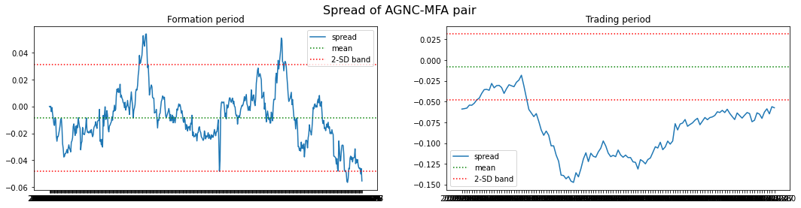
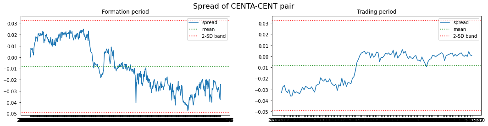
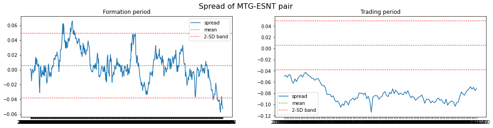
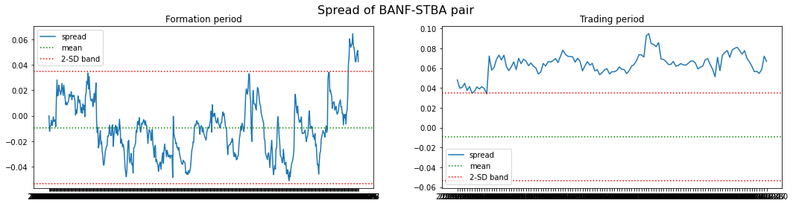
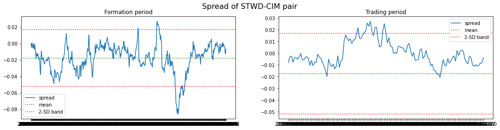

### Metrics for top5 pairs during 24m **formation** period

`calculate_metrics(sorted_distances24_6, train24_6)`

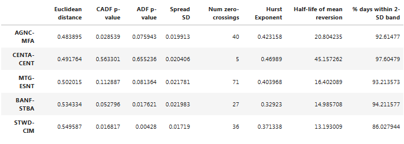

### Metrics for top5 pairs during 6m **trading** period

`calculate_metrics(sorted_distances24_6, test24_6)`

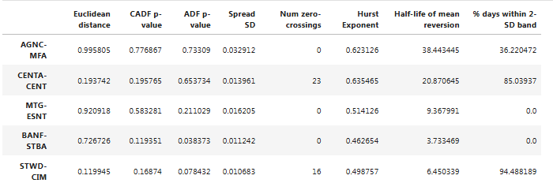

---

# 36 months **formation** period \ 6 months **trading** period

```python
# prepare data
cumret36_6 = cumret.loc['2016-07-01':]
cumret36_6 = cumret36_6 / cumret36_6.iloc[0] # divide by first row so that all prices start at 1
train36_6 = cumret36_6.loc['2016-07-01':'2019-06-31'] # **formation** period
test36_6 = cumret36_6.loc['2019-07-01':'2019-12-31'] # **trading** period

# calculate Euclidean distances for each pair
sorted_distances36_6 = calculate_distances(train36_6)

# print top 10 pairs with smallest distance
[[k,v] for k,v in sorted_distances36_6.items()][:10]
```

`Output`

```python
[['CENTA-CENT', 0.6676391478191526],
 ['CATY-BXS', 0.8623591382530676],
 ['OGS-NJR', 0.9100233351171999],
 ['POR-PNW', 0.933409249942717],
 ['AUB-BRKL', 0.9454275230286255],
 ['BXMT-ARI', 0.9801674175907916],
 ['IDA-OGS', 0.9955929228112151],
 ['BXS-CVBF', 1.0439644618397024],
 ['TRMK-NBTB', 1.045741548135903],
 ['WTM-EQC', 1.0495189596604633]]
```

`plot_pairs(sorted_distances36_6, train36_6, test36_6)`

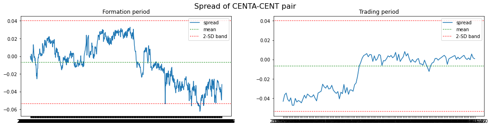
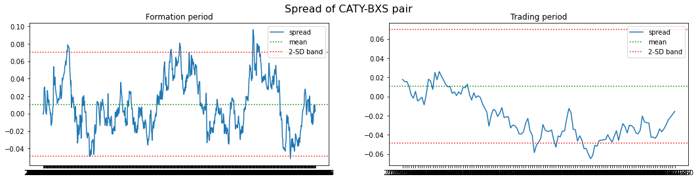

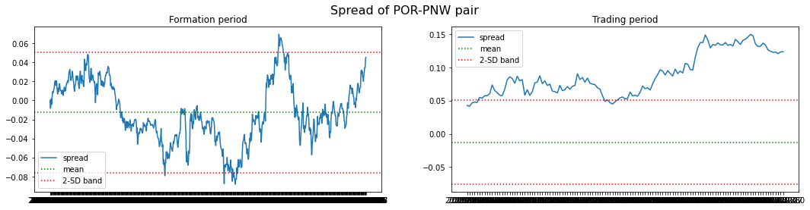
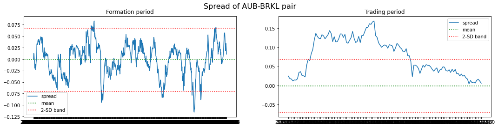

### Metrics for top5 pairs during 36m **formation** period

`calculate_metrics(sorted_distances36_6, train36_6)`

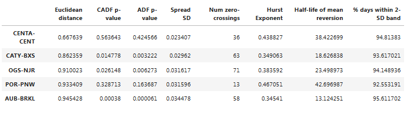

### Metrics for top5 pairs during 6m **trading** period

`calculate_metrics(sorted_distances36_6, test36_6)`

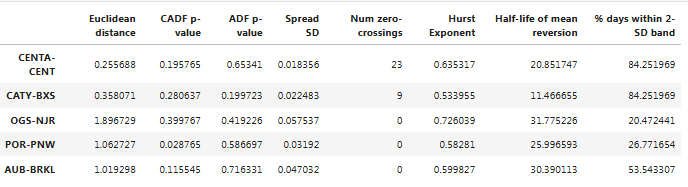