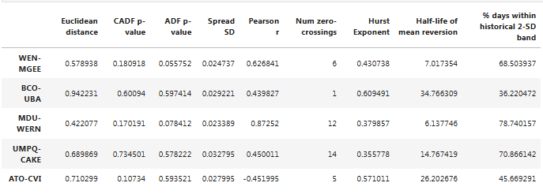

From pair trading - financial noob
https://github.com/financialnoob/pairs_trading/blob/main/3.pairs_trading.pairs_selection.distance_part2.ipynb

# Pairs trading. Pairs selection. Distance (Part 2)

```python
import pandas as pd
import numpy as np
import matplotlib.pyplot as plt
import yfinance as yf

# read prices from csv file
prices = pd.read_csv('vbr16_19.csv', index_col='Date')

print(prices)
```


```python
cumret = np.log(prices).diff().cumsum()+1 # calculate cumulative returns
cumret.dropna(inplace=True) 
```

# Some update - Functions to calculate different metrics

```python
def parse_pair(pair):
    '''
    parse pair string S1-S2
    return tickers S1, S2
    '''
    dp = pair.find('-')
    s1 = pair[:dp]
    s2 = pair[dp+1:]
    
    return s1,s2

def cadf_pvalue(s1, s2, cumret):
    '''
    perform CADF cointegration tests
    since it is sensitive to the order of stocks in the pair, perform both tests (s1-2 and s2-s1)
    return the smallest p-value of two tests
    '''
    from statsmodels.tsa.stattools import coint
    
    p1 = coint(cumret[s1], cumret[s2])[1]
    p2 = coint(cumret[s2], cumret[s1])[1]
    
    return min(p1,p2)

def calculate_halflife(spread):
    '''
    calculate half-life of mean reversion of the spread
    '''
    from statsmodels.regression.linear_model import OLS
    from statsmodels.tools.tools import add_constant
    
    ylag = spread.shift()
    deltay = spread - ylag
    ylag.dropna(inplace=True)
    deltay.dropna(inplace=True)

    res = OLS(deltay, add_constant(ylag)).fit()
    halflife = -np.log(2)/res.params[0]
    
    return halflife

def calculate_metrics(pairs, cumret, pairs_df):
    '''
    calculate metrics for pairs using data in cumret
    return dataframe of results
    '''
    from hurst import compute_Hc
    from statsmodels.tsa.stattools import adfuller
    
    cols = ['Euclidean distance', 'CADF p-value', 'ADF p-value', 'Spread SD', 'Pearson r',
        'Num zero-crossings', 'Hurst Exponent', 'Half-life of mean reversion', '% days within historical 2-SD band']
    results = pd.DataFrame(index=pairs, columns=cols)
    
    for pair in pairs:
        s1,s2 = parse_pair(pair)
        spread = cumret[s1] - cumret[s2]
        results.loc[pair]['Euclidean distance'] = np.sqrt(np.sum((spread)**2))
        results.loc[pair]['CADF p-value'] = cadf_pvalue(s1, s2, cumret)
        results.loc[pair]['ADF p-value'] = adfuller(spread)[1]
        hist_sd = pairs_df.loc[pair]['Spread SD'] # historical standard deviation
        results.loc[pair]['Spread SD'] = hist_sd
        results.loc[pair]['Pearson r'] = np.corrcoef(cumret[s1], cumret[s2])[0][1]
        results.loc[pair]['Num zero-crossings'] = ((spread[1:].values * spread[:-1].values) < 0).sum()
        results.loc[pair]['Hurst Exponent'] = compute_Hc(spread)[0]
        results.loc[pair]['Half-life of mean reversion'] = calculate_halflife(spread)
        results.loc[pair]['% days within historical 2-SD band'] = (abs(spread) < 2*hist_sd).sum() / len(spread) * 100
        
    return results

def plot_pairs(pairs, cumret_train, cumret_test):
    '''
    plot cumulative returns of the spread for each pair in pairs
    '''
    
    for pair in pairs:
        s1,s2 = parse_pair(pair)
        spread_train = cumret_train[s1] - cumret_train[s2]
        spread_test = cumret_test[s1] - cumret_test[s2]
        spread_mean = spread_train.mean() # historical mean
        spread_std = spread_train.std() # historical standard deviation

        fig, (ax1, ax2) = plt.subplots(1, 2, figsize=(18,4))
        fig.suptitle(f'Spread of {pair} pair', fontsize=16)
        ax1.plot(spread_train, label='spread')
        ax1.set_title('Formation period')
        ax1.axhline(y=spread_mean, color='g', linestyle='dotted', label='mean')
        ax1.axhline(y=spread_mean+2*spread_std, color='r', linestyle='dotted', label='2-SD band')
        ax1.axhline(y=spread_mean-2*spread_std, color='r', linestyle='dotted')
        ax1.legend()
        ax2.plot(spread_test, label='spread')
        ax2.set_title('Trading period')
        ax2.axhline(y=spread_mean, color='g', linestyle='dotted', label='mean')
        ax2.axhline(y=spread_mean+2*spread_std, color='r', linestyle='dotted', label='2-SD band')
        ax2.axhline(y=spread_mean-2*spread_std, color='r', linestyle='dotted')
        ax2.legend()
```

---

# 12 months formation period \ 6 months trading period

```python
# prepare data
cumret12_6 = cumret.loc['2018-07-01':]
cumret12_6 = cumret12_6 / cumret12_6.iloc[0] # divide by first row so that all prices start at 1
train12_6 = cumret12_6.loc['2018-07-01':'2019-06-31'] # formation period
test12_6 = cumret12_6.loc['2019-07-01':'2019-12-31'] # trading period
```

```python
def select_pairs(train):
    '''
    select pairs using data from train dataframe
    return dataframe of selected pairs
    '''
    tested = []

    from statsmodels.regression.linear_model import OLS
    from statsmodels.tools.tools import add_constant
    from hurst import compute_Hc
    from statsmodels.tsa.stattools import adfuller

    cols = ['Euclidean distance', 'Num zero-crossings', 'Pearson r', 
            'Spread SD', 'Hurst Exponent', 'Half-life of mean reversion']
    pairs = pd.DataFrame(columns=cols)

    for s1 in train.columns:
        for s2 in train.columns:
            if s1!=s2 and (f'{s1}-{s2}' not in tested) and (f'{s2}-{s1}' not in tested):
                tested.append(f'{s1}-{s2}')
                cadf_p = cadf_pvalue(s1,s2,train)
                if cadf_p<0.01:
                    spread = train[s1] - train[s2]
                    hurst = compute_Hc(spread)[0]
                    if hurst<0.5:
                        halflife = calculate_halflife(spread)
                        if halflife>1 and halflife<30:
                            num_crossings = (spread.values[1:] * spread.values[:-1] < 0).sum()
                            if num_crossings>len(train.index)/252*12: 
                                distance = np.sqrt(np.sum((train[s1] - train[s2])**2)) # Euclidean distance
                                pearson_r = np.corrcoef(train[s1], train[s2])[0][1]
                                spread_sd = spread.std()
                                pairs.loc[f'{s1}-{s2}'] = [distance, num_crossings, pearson_r,
                                                           spread_sd, hurst, halflife]
                                
    return pairs
```
## Hàm `select_pairs`

### Mục đích
- Chọn các cặp tài sản tiềm năng từ bộ dữ liệu huấn luyện dựa trên một số tiêu chí, bao gồm:
  - **Đồng tích hợp (cointegration)**.
  - **Thời gian bán rã (half-life)**.
  - Các chỉ số khác như **Hurst Exponent**, số lần cắt qua 0, độ lệch chuẩn của spread, v.v.

- **`tested`**: Danh sách lưu trữ các cặp đã kiểm tra, tránh kiểm tra trùng lặp.

- Các thư viện được sử dụng:
  - **`OLS`** và **`adfuller`**: Dùng để kiểm định đồng tích hợp và tính dừng.
  - **`compute_HC`**: Tính chỉ số Hurst.

- **`pairs`**: `DataFrame` chứa các thông tin của cặp được chọn.

```python
spread = train[s1] - train[s2]
hurst = compute_Hc(spread)[0]
if hurst < 0.5:
    halflife = calculate_halflife(spread)
    if halflife and halflife < 30:
```

- **Spread**: Độ chênh lệch giữa hai chuỗi thời gian.
- **Hurst Exponent**: Nếu `Hurst` < 0.5 → Chuỗi hồi quy về trung bình.
- **Half-life**: Chỉ xét các cặp có thời gian bán rã < 30 ngày.

```python
num_crossings = (spread.values[1:] * spread.values[:-1] < 0).sum()
distance = np.sqrt(np.sum((train[s1] - train[s2])**2))  # Khoảng cách Euclidean
pearson_r = np.corrcoef(train[s1], train[s2])[0][1]  # Pearson correlation
spread_sd = spread.std()
```

- **Số lần cắt qua 0** (`num_crossings`): Đếm số lần giá trị `spread` chuyển từ âm sang dương hoặc ngược lại.
- **Khoảng cách Euclidean** (`distance`): Tính khoảng cách giữa hai chuỗi.
- **Hệ số tương quan Pearson** (`pearson_r` - correlation): Đo mức độ tương quan tuyến tính giữa hai chuỗi.
- **Độ lệch chuẩn của spread** (`spread_sd`): Tính std của `spread`.

---

```python
pairs12_6 = select_pairs(train12_6)
print(pairs12_6)
```


### Shortest distance
```python
pairs12_6.sort_values(by='Euclidean distance')
```


```python
top5_distance = list(pairs12_6.sort_values(by='Euclidean distance').index[:5])
plot_pairs(top5_distance, train12_6, test12_6)
```


`calculate_metrics(top5_distance, test12_6, pairs12_6)`


### Highest number of zero crossings
```python
pairs12_6.sort_values(by='Num zero-crossings', ascending=False)
```


```python
top5_crossings = list(pairs12_6.sort_values(by='Num zero-crossings', ascending=False).index[:5])
plot_pairs(top5_crossings, train12_6, test12_6)
```


```python
calculate_metrics(top5_crossings, test12_6, pairs12_6)
```


### Highest Pearson r
```python
pairs12_6.sort_values(by='Pearson r', ascending=False)
```


```python
top5_pearson = list(pairs12_6.sort_values(by='Pearson r', ascending=False).index[:5])
plot_pairs(top5_pearson, train12_6, test12_6)
```


```python
calculate_metrics(top5_pearson, test12_6, pairs12_6)
```


---

# 36 months formation period \ 6 months trading period - Làm tương tự