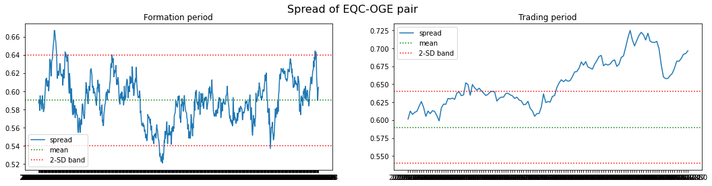

From pair trading - financial noob
- https://github.com/financialnoob/pairs_trading/blob/main/4.pairs_trading.pairs_selection.cointegration_1.ipynb
- https://financialnoob.substack.com/p/pairs-trading-pair-selection-cointegration?utm_source=profile&utm_medium=reader2

# Pairs trading. Pairs selection. Cointegration (part 1)

Trong hai bài viết trước, chúng ta đã nói về các phương pháp khoảng cách để chọn cặp. Khi chúng ta tạo danh mục đầu tư gồm hai cổ phiếu, chúng ta giả định phân bổ vốn bằng nhau cho mỗi cổ phiếu trong cặp. Điều này có lẽ đã giới hạn số lượng cặp tiềm năng được chọn để phân tích thêm. Ngay cả khi hai cổ phiếu bị ảnh hưởng bởi cùng các yếu tố rủi ro, điều đó không nhất thiết có nghĩa là các yếu tố đó có tác động giống nhau đến cả hai cổ phiếu.

Xem xét ví dụ tổng hợp này. Giả sử chúng ta có hai cổ phiếu: cổ phiếu A và cổ phiếu B. Chúng chịu ảnh hưởng bởi cùng một yếu tố rủi ro $F$, yếu tố này tuân theo một quá trình *random walk*, nhưng hệ số phụ thuộc của chúng vào $F$ (*beta*) thì khác nhau. Cụ thể, chúng ta có:

\[
P_{a,t} = 1.5 \cdot F_t + w_{a,t}, \quad w_a \sim \mathcal{N}(0,1)
\]

\[
P_{b,t} = 0.5 \cdot F_t + w_{b,t}, \quad w_b \sim \mathcal{N}(0,1)
\]


```python
import pandas as pd
import numpy as np
import matplotlib.pyplot as plt
import yfinance as yf
```

### Cointegration example

```python
# generate random walk process
np.random.seed(112)
F = [15]
for i in range(252):
    F.append(F[i] + np.random.randn())
F = np.array(F)

# generate price series
P_a = 1.5*F + np.random.randn(len(F))
P_b = 0.5*F + np.random.randn(len(F))

# plot prices
plt.figure(figsize=(18,6))
plt.plot(P_a, label='Stock A price')
plt.plot(P_b, label='Stock B price')
plt.legend()
```

<center>


Prices of stocks A and B
</center>

Bây giờ, nếu chúng ta xây dựng một danh mục đầu tư cặp bằng cách phân bổ cùng một lượng vốn cho mỗi cổ phiếu (Long cổ phiếu A và Short cổ phiếu B), chúng ta sẽ không thể loại bỏ thành phần *random walk* và do đó danh mục đầu tư của chúng ta sẽ không có tính dừng. Bạn có thể thấy bên dưới rằng giá trị trung bình của danh mục không ổn định. Điều này là do chúng ta vẫn có thành phần *random walk* trong chuỗi giá của danh mục đầu tư.

\[
P_{pf,t} = P_{a,t} - P_{b,t} = 1.5 \cdot F_t + w_{a,t} - 0.5 \cdot F_t - w_{b,t} = 1.0 \cdot F_t + w_{a,t} - w_{b,t}
\]

```python
# plot spread (equally weighted positions)
spread_ew = P_a - P_b
plt.figure(figsize=(18,6))
plt.plot(spread_ew, label='spread (equally weighted)')
plt.legend()
```

<center>


Plot of equally weighted portfolio
</center>

Nhưng lưu ý rằng vẫn có thể tạo một danh mục đầu tư *stationary*, chúng ta chỉ cần thay đổi tỷ trọng của các cổ phiếu trong danh mục để loại bỏ thành phần *random walk*. Công thức cho danh mục đầu tư mới của chúng ta sẽ như sau:

\[
P_{pf} = P_a - hedge\_ratio \cdot P_b
\]

Đối với mỗi đơn vị vốn được phân bổ vào vị thế mua (long) ở cổ phiếu A, chúng ta phân bổ $hedge\_ratio$ đơn vị vốn vào vị thế bán khống (short) ở cổ phiếu B.

Để tính toán tỷ lệ phòng hộ ($hedge\_ratio$), chúng ta có thể sử dụng phương pháp Ordinary Least Squares (OLS). Đoạn mã để tính toán tỷ lệ phòng hộ cùng với đồ thị của danh mục đầu tư được tạo ra sẽ được trình bày bên dưới.

```python
from statsmodels.regression.linear_model import OLS

# calculate hedge ratio
res = OLS(P_a, P_b).fit()
hedge_ratio = res.params[0]

# create portfolio using calculated ratio
spread_hr = P_a - hedge_ratio*P_b

plt.figure(figsize=(18,6))
plt.plot(spread_hr, label='spread (hedge ratio)')
plt.legend()
```

<center>


Plot of the spread calculated using hedge ratio
</center>

Danh mục đầu tư này trông đã *stationary* nhiều hơn đáng kể so với danh mục chúng ta có được khi sử dụng tỷ trọng bằng nhau.

Về cơ bản, nếu chúng ta có hai chuỗi *time series* và có thể xây dựng một tổ hợp tuyến tính của chúng mà chuỗi đó là chuỗi dừng (có giá trị trung bình và phương sai không đổi - *constant mean and variance*), thì hai chuỗi *time series* đó được cho là có đồng tích hợp (*cointegrated*). (Đây không phải là một định nghĩa toán học nghiêm ngặt, nhưng nó giải thích các nguyên tắc cơ bản). Hãy thử áp dụng kiểm định đồng tích hợp (*Cointegrated Augmented Dickey-Fuller test*) lên các chuỗi giá của chúng ta để xác nhận rằng chúng *cointegrated*.

```python
from statsmodels.tsa.stattools import coint

coint(P_a, P_b)
```

`Output`
```python
(-5.995727015051173,
 1.658313767794149e-06,
 array([-3.94042787, -3.36048387, -3.06132299]))
```
Giá trị thứ hai là *p-value* và nó rất gần bằng 0, vì vậy chúng ta có thể bác bỏ giả thuyết $H_0$ (*null hypothesis*) rằng các chuỗi giá không có tính chất *cointegrated*. Vì vậy, khi chúng ta có hai cổ phiếu mà giá của chúng có quan hệ *cointegrated*, chúng ta có thể thử sử dụng phương pháp được mô tả ở trên để tạo một danh mục đầu tư *mean-reverting*. Bây giờ, hãy thử áp dụng phương pháp này vào dữ liệu thực tế.

---

### Load data

```python
# read prices from csv file
prices = pd.read_csv('vbr16_19.csv', index_col='Date')

prices
```


```python
cumret = np.log(prices).diff().cumsum()+1 # calculate cumulative returns
cumret.dropna(inplace=True) 
```

Trong các bài viết trước về phương pháp khoảng cách để chọn cặp, tôi đã chứng minh rằng nhiều cặp được chọn *cointegrated* theo kiểm định **CADF**, vì vậy giờ đây chúng ta biết rằng chỉ chọn các cặp có *p-value* của **CADF** < 0.01 là không đủ để tìm ra các cặp sẽ tiếp tục *cointegrated* trong giai đoạn giao dịch. Do đó, trong bài viết này, tôi sẽ kết hợp một số kiểm định mà tôi đã sử dụng trước đây với phương pháp tiếp cận *cointegration*.

Trong phần đầu, tôi sẽ thực hiện các kiểm định tương tự như trong các bài viết trước về phương pháp khoảng cách, nhưng bây giờ tôi sẽ cho phép *spread* có các tỷ trọng khác nhau cho mỗi cổ phiếu. Nhắc lại, tôi sẽ chỉ chọn các cặp:

- *Cointegrated* (*p-value* của **CADF** < 0.01)
- *Hurst exponent* của *spread* < 0.5
- *Half-life of mean reversion* nhiều hơn 1 ngày và ít hơn 30 ngày
- Số lần *spread* cắt qua 0 > 12 lần mỗi năm

Trong phần thứ hai, tôi sẽ cố gắng kết hợp nhiều chỉ số và sử dụng một số kỹ thuật học máy để xác định cặp nào nên được chọn để giao dịch.

**Lưu ý:** có một số sai sót nhỏ trong các hàm được sử dụng để tính toán một số chỉ số mà tôi nhận ra khi bắt đầu làm việc trên bài viết này:

- Thay vì tính số lần cắt qua 0, chúng ta nên tính số lần cắt qua giá trị *historical mean*. Điều này trước đây không quan trọng vì hầu hết các *spread* có giá trị trung bình rất gần 0, nhưng bây giờ không còn như vậy nữa. Giờ đây, chúng ta có thể có các *spread* với giá trị trung bình cách xa 0.

- Dải 2-SD trên các biểu đồ được tính xung quanh giá trị 0 thay vì giá trị *historical mean*. Một lần nữa, điều này trước đây không quan trọng, nhưng bây giờ lại quan trọng, vì những lý do như trên.

Tôi sẽ sử dụng cùng một tập hợp cổ phiếu và các khoảng thời gian như tôi đã sử dụng trước đây.

---

# Some update - Functions to calculate different metrics

```python
def parse_pair(pair):
    '''
    parse pair string S1-S2
    return tickers S1, S2
    '''
    dp = pair.find('-')
    s1 = pair[:dp]
    s2 = pair[dp+1:]
    
    return s1,s2

def cadf_pvalue(s1, s2, cumret):
    '''
    perform CADF cointegration tests
    since it is sensitive to the order of stocks in the pair, perform both tests (s1-2 and s2-s1)
    return the smallest p-value of two tests
    '''
    from statsmodels.tsa.stattools import coint
    
    p1 = coint(cumret[s1], cumret[s2])[1]
    p2 = coint(cumret[s2], cumret[s1])[1]
    
    return min(p1,p2)

def calculate_halflife(spread):
    '''
    calculate half-life of mean reversion of the spread
    '''
    from statsmodels.regression.linear_model import OLS
    from statsmodels.tools.tools import add_constant
    
    ylag = spread.shift()
    deltay = spread - ylag
    ylag.dropna(inplace=True)
    deltay.dropna(inplace=True)

    res = OLS(deltay, add_constant(ylag)).fit()
    halflife = -np.log(2)/res.params[0]
    
    return halflife

def calculate_metrics(pairs, cumret, pairs_df):
    '''
    calculate metrics for pairs using data in cumret
    return dataframe of results
    '''
    from hurst import compute_Hc
    from statsmodels.tsa.stattools import adfuller
    from statsmodels.regression.linear_model import OLS
    from statsmodels.tools.tools import add_constant
    from statsmodels.tsa.stattools import coint
    
    cols = ['Distance', 'CADF p-value', 'ADF p-value', 'Spread SD', 'Pearson r',
        'Num zero-crossings', 'Hurst Exponent', 'Half-life of mean reversion', '% days within historical 2-SD band']
    results = pd.DataFrame(index=pairs, columns=cols)
    
    for pair in pairs:
        s1,s2 = parse_pair(pair)
        hedge_ratio = pairs_df.loc[pair]['Hedge ratio']
        spread = cumret[s1] - hedge_ratio*cumret[s2]
        results.loc[pair]['CADF p-value'] = coint(cumret[s1], cumret[s2])[1]
        results.loc[pair]['ADF p-value'] = adfuller(spread)[1]
        hist_mu = pairs_df.loc[pair]['Spread mean'] # historical mean
        hist_sd = pairs_df.loc[pair]['Spread SD'] # historical standard deviation
        results.loc[pair]['Spread SD'] = hist_sd
        results.loc[pair]['Pearson r'] = np.corrcoef(cumret[s1], cumret[s2])[0][1]
        # subtract the mean to calculate distances and num_crossings
        spread_nm = spread - hist_mu
        results.loc[pair]['Distance'] = np.sqrt(np.sum((spread_nm)**2))
        results.loc[pair]['Num zero-crossings'] = ((spread_nm[1:].values * spread_nm[:-1].values) < 0).sum()
        results.loc[pair]['Hurst Exponent'] = compute_Hc(spread)[0]
        results.loc[pair]['Half-life of mean reversion'] = calculate_halflife(spread)
        results.loc[pair]['% days within historical 2-SD band'] = (abs(spread-hist_mu) < 2*hist_sd).sum() / len(spread) * 100
        
    return results

def plot_pairs(pairs, cumret_train, cumret_test):
    '''
    plot cumulative returns of the spread for each pair in pairs
    '''
    
    from statsmodels.regression.linear_model import OLS
    from statsmodels.tools.tools import add_constant
    
    for pair in pairs:
        s1,s2 = parse_pair(pair)
        res = OLS(cumret_train[s1], add_constant(cumret_train[s2])).fit()
        spread_train = cumret_train[s1] - res.params[s2]*cumret_train[s2]
        spread_test = cumret_test[s1] - res.params[s2]*cumret_test[s2]
        spread_mean = spread_train.mean() # historical mean
        spread_std = spread_train.std() # historical standard deviation

        fig, (ax1, ax2) = plt.subplots(1, 2, figsize=(18,4))
        fig.suptitle(f'Spread of {pair} pair', fontsize=16)
        ax1.plot(spread_train, label='spread')
        ax1.set_title('Formation period')
        ax1.axhline(y=spread_mean, color='g', linestyle='dotted', label='mean')
        ax1.axhline(y=spread_mean+2*spread_std, color='r', linestyle='dotted', label='2-SD band')
        ax1.axhline(y=spread_mean-2*spread_std, color='r', linestyle='dotted')
        ax1.legend()
        ax2.plot(spread_test, label='spread')
        ax2.set_title('Trading period')
        ax2.axhline(y=spread_mean, color='g', linestyle='dotted', label='mean')
        ax2.axhline(y=spread_mean+2*spread_std, color='r', linestyle='dotted', label='2-SD band')
        ax2.axhline(y=spread_mean-2*spread_std, color='r', linestyle='dotted')
        ax2.legend()
        
def select_pairs(train):
    '''
    select pairs using data from train dataframe
    return dataframe of selected pairs
    '''
    tested = []

    from statsmodels.regression.linear_model import OLS
    from statsmodels.tools.tools import add_constant
    from hurst import compute_Hc
    from statsmodels.tsa.stattools import adfuller
    from statsmodels.tsa.stattools import coint

    cols = ['Distance', 'Num zero-crossings', 'Pearson r', 'Spread mean', 
            'Spread SD', 'Hurst Exponent', 'Half-life of mean reversion', 'Hedge ratio']
    pairs = pd.DataFrame(columns=cols)

    for s1 in train.columns:
        for s2 in train.columns:
            if s1!=s2 and (f'{s1}-{s2}' not in tested):
                tested.append(f'{s1}-{s2}')
                cadf_p = coint(train[s1], train[s2])[1]
                if cadf_p<0.01 and (f'{s2}-{s1}' not in pairs.index): # stop if pair already added as s2-s1
                    res = OLS(train[s1], add_constant(train[s2])).fit()
                    hedge_ratio = res.params[s2]
                    if hedge_ratio > 0: # hedge ratio should be posititve
                        spread = train[s1] - hedge_ratio*train[s2]
                        hurst = compute_Hc(spread)[0]
                        if hurst<0.5:
                            halflife = calculate_halflife(spread)
                            if halflife>1 and halflife<30:
                                # subtract the mean to calculate distances and num_crossings
                                spread_nm = spread - spread.mean() 
                                num_crossings = (spread_nm.values[1:] * spread_nm.values[:-1] < 0).sum()
                                if num_crossings>len(train.index)/252*12: 
                                    distance = np.sqrt(np.sum(spread_nm**2))
                                    pearson_r = np.corrcoef(train[s1], train[s2])[0][1]
                                    pairs.loc[f'{s1}-{s2}'] = [distance, num_crossings, pearson_r, spread.mean(),
                                                               spread.std(), hurst, halflife, hedge_ratio]
                                
    return pairs
```

---

### 12 months formation period \ 6 months trading period

Sau khi kiểm tra 263901 cặp có thể, chúng ta còn lại 4760 cặp thỏa mãn tất cả các tiêu chí (so với 1703 cặp được tìm thấy khi sử dụng *equally weighted portfolio*). Vì vậy, chúng ta có gần gấp ba lần số lượng cặp tiềm năng.

Vì giờ đây chúng ta đã xây dựng được danh mục đầu tư cặp mà không có tỷ trọng bằng nhau, thay vì sử dụng khoảng cách *Euclidean* giữa giá của hai cổ phiếu, tôi sẽ chọn các cặp có khoảng cách nhỏ nhất giữa *price of portfolio* và giá trị *mean* của nó. Dưới đây, bạn có thể thấy các cặp được chọn và biểu đồ danh mục đầu tư của chúng.

```python
# prepare data
cumret12_6 = cumret.loc['2018-07-01':]
cumret12_6 = cumret12_6 / cumret12_6.iloc[0] # divide by first row so that all prices start at 1
train12_6 = cumret12_6.loc['2018-07-01':'2019-06-31'] # formation period
test12_6 = cumret12_6.loc['2019-07-01':'2019-12-31'] # trading period

pairs12_6 = select_pairs(train12_6)

print(pairs12_6)
```

<center>


</center>

---

### Shortest distance

```python
pairs12_6.sort_values(by='Distance')
```

<center>


Pairs sorted by distance from the mean (ascending)
</center>

```python
top5_distance = list(pairs12_6.sort_values(by='Distance').index[:5])
plot_pairs(top5_distance, train12_6, test12_6)
```


```python
calculate_metrics(top5_distance, test12_6, pairs12_6)
```

<center>


Metrics of top 5 pairs during trading period
</center>

Như chúng ta có thể thấy, không có sự cải thiện thực sự nào so với *equally weighted portfolios* mà chúng ta đã kiểm tra trước đó. Tất cả các cặp đều lệch quá xa khỏi *historical mean* của chúng.

Bây giờ, tôi sẽ thử chọn 5 cặp có số lần cắt qua 0 nhiều nhất.

---

### Highest number of zero crossings

```python
pairs12_6.sort_values(by='Num zero-crossings', ascending=False)
```

<center>


Pairs sorted by number of zero crossings (descending)
</center>

```python
top5_crossings = list(pairs12_6.sort_values(by='Num zero-crossings', ascending=False).index[:5])
plot_pairs(top5_crossings, train12_6, test12_6)
```


```python
calculate_metrics(top5_crossings, test12_6, pairs12_6)
```

<center>


Metrics of top 5 pairs during trading period
</center>

Lại cùng một vấn đề: tất cả các cặp đều phân kỳ. Hãy thử chọn 5 cặp có hệ số *Pearson correlation* cao nhất.

---

### Highest Pearson r

```python
pairs12_6.sort_values(by='Pearson r', ascending=False)
```

<center>


Pairs sorted by Pearson correlation coefficient (descending)
</center>

```python
top5_pearson = list(pairs12_6.sort_values(by='Pearson r', ascending=False).index[:5])
plot_pairs(top5_pearson, train12_6, test12_6)
```


```python
calculate_metrics(top5_pearson, test12_6, pairs12_6)
```

<center>


Metrics of top 5 pairs during trading period
</center>

Lại không có cải thiện thực sự nào. Có lẽ chúng ta nên thử sử dụng giai đoạn hình thành (**formation period**) dài hơn?

---

### 36 months formation period \ 6 months trading period

Ở đây tôi có được 2639 cặp tiềm năng, so với 236 cặp mà chúng ta đã có trước đó. Hơn gấp mười lần. Hãy xem liệu điều này có cải thiện chất lượng các cặp mà chúng ta chọn để giao dịch hay không.

Các cặp có khoảng cách *Euclidean* nhỏ nhất từ giá trị trung bình:

```python
# prepare data
cumret36_6 = cumret.loc['2016-07-01':]
cumret36_6 = cumret36_6 / cumret36_6.iloc[0] # divide by first row so that all prices start at 1
train36_6 = cumret36_6.loc['2016-07-01':'2019-06-31'] # formation period
test36_6 = cumret36_6.loc['2019-07-01':'2019-12-31'] # trading period

pairs36_6 = select_pairs(train36_6)

print(pairs36_6)
```

<center>


</center>

---

### Shortest distance

```python
pairs36_6.sort_values(by='Distance')
```

<center>


Pairs sorted by distance from the mean (ascending)
</center>

```python
top5_distance = list(pairs36_6.sort_values(by='Distance').index[:5])
plot_pairs(top5_distance, train36_6, test36_6)
```




```python
calculate_metrics(top5_distance, test36_6, pairs36_6)
```

<center>


Metrics of top 5 pairs during trading period
</center>

Ở đây chúng ta lại thấy rằng hầu hết các cặp đều phân kỳ quá xa so với *historical mean* của chúng. Một điều thú vị cần lưu ý là 3 cặp cuối cùng đều chứa cùng một cổ phiếu **(EQC)**. Có lẽ chúng ta nên tránh giao dịch những cặp như vậy. <span style="color:red">Việc có một danh mục cặp, trong đó nhiều cặp chứa cùng một cổ phiếu, làm cho danh mục rất nhạy cảm với các rủi ro từ cổ phiếu đó.</span> Nếu giá của **EQC** tăng hoặc giảm đáng kể do một số tin tức cụ thể liên quan đến công ty đó, chúng ta sẽ chịu lỗ ở cả ba cặp, vì tất cả chúng sẽ phân kỳ.

Bây giờ chúng ta sẽ chọn các cặp có số lần cắt qua 0 nhiều nhất.

---

### Highest number of zero crossings

```python
pairs36_6.sort_values(by='Num zero-crossings', ascending=False)
```

<center>


Pairs sorted by number of zero crossings (descending)
</center>

```python
top5_crossings = list(pairs36_6.sort_values(by='Num zero-crossings', ascending=False).index[:5])
plot_pairs(top5_crossings, train36_6, test36_6)
```


```python
calculate_metrics(top5_crossings, test36_6, pairs36_6)
```

<center>


Metrics of top 5 pairs during trading period
</center>

Kết quả tương tự như những gì chúng ta đã có trong bài kiểm tra trước. Cuối cùng, hãy thử chọn các cặp có hệ số *Pearson correlation* cao nhất.

---

### Highest Pearson r

```python
pairs36_6.sort_values(by='Pearson r', ascending=False)
```

<center>


Pairs sorted by Pearson correlation coefficient (descending)
</center>

```python
top5_pearson = list(pairs36_6.sort_values(by='Pearson r', ascending=False).index[:5])
plot_pairs(top5_pearson, train36_6, test36_6)
```


```python
calculate_metrics(top5_pearson, test36_6, pairs36_6)
```

<center>


Metrics of top 5 pairs during trading period
</center>

Không có cặp nào tốt ở đây, tất cả đều phân kỳ quá xa so với *historical mean*.

---

# Kết luận

Ưu điểm chính của phương pháp *cointegration* mà chúng ta đã thấy cho đến nay là chúng ta có nhiều cặp tiềm năng hơn. Vấn đề chính là các kỹ thuật mà chúng ta sử dụng để chọn các cặp "tốt nhất" cho giao dịch không hoạt động tốt như mong muốn. Trong bài viết tiếp theo, tôi sẽ thử nghiệm một số kỹ thuật máy học để chọn các cặp dựa trên nhiều số liệu cùng một lúc.
