From pair trading - financial noob
- https://github.com/financialnoob/pairs_trading/blob/main/5.pairs_trading.pairs_selection.cointegration_2.ipynb
- https://financialnoob.substack.com/p/pairs-trading-pair-selection-cointegration-9fc?utm_source=profile&utm_medium=reader2

# Pairs trading. Pairs selection. Cointegration (part 2)

Trong bài viết trước, chúng ta đã phát hiện rằng mặc dù phương pháp *cointegration* cung cấp cho chúng ta nhiều cặp cổ phiếu tiềm năng để giao dịch, nhưng các phương pháp chọn cặp tốt nhất để giao dịch lại không hoạt động như mong đợi. Hầu hết các cặp được chọn đều phân kỳ quá nhiều trong giai đoạn giao dịch. Trong bài viết này, tôi muốn thử nghiệm một số kỹ thuật máy học để kết hợp nhiều số liệu và sử dụng chúng để dự đoán cổ phiếu nào sẽ "hoạt động tốt" trong giai đoạn giao dịch.

Bước đầu tiên là chuẩn bị dữ liệu cho các thuật toán máy học. Tôi sẽ sử dụng hai tập dữ liệu: một cho việc huấn luyện và chọn mô hình, và một tập khác chỉ dùng để kiểm tra ngoài mẫu (*out-of-sample test*). Vũ trụ cổ phiếu trong cả hai tập dữ liệu sẽ giống nhau (cổ phiếu từ **VBR small cap ETF**), nhưng tôi sẽ sử dụng các khoảng thời gian không trùng nhau:

- **01.01.2013–30.06.2016** cho dữ liệu huấn luyện (3 năm giai đoạn hình thành + 6 tháng giai đoạn giao dịch)
- **01.07.2016–31.12.2019** cho dữ liệu kiểm tra (cũng là 3 năm giai đoạn hình thành + 6 tháng giai đoạn giao dịch)

```python
import pandas as pd
import numpy as np
import matplotlib.pyplot as plt
import yfinance as yf

prices_train = pd.read_csv('vbr13_16.csv', index_col='Date')
prices_test = pd.read_csv('vbr16_19.csv', index_col='Date')

# calculate cumulative returns
cumret_train = np.log(prices_train).diff().cumsum()+1
cumret_train.dropna(how='all', inplace=True)
cumret_train.dropna(axis=1, inplace=True)
cumret_test = np.log(prices_test).diff().cumsum()+1
cumret_test.dropna(how='all', inplace=True)

# divide by first row so that all prices start at 1
cumret_train = cumret_train / cumret_train.iloc[0]
cumret_test = cumret_test / cumret_test.iloc[0]
```

---

# Functions to calculate different metrics - some update

Sau đó, với mỗi tập dữ liệu, tôi thực hiện các bước sau:

1. Sử dụng giá cổ phiếu từ giai đoạn hình thành để chọn các cặp cổ phiếu tiềm năng cho giao dịch, áp dụng các tiêu chí giống như ở phần trước:
   - *CADF p-value* < 0.01
   - *Hurst Exponent* < 0.5
   - 1 < *Half life of mean reversion* < 30
   - Số lần cắt qua giá trị 0 > 12 mỗi năm

2. Với mỗi cặp được chọn, tôi tạo một danh mục đầu tư (spread) và tính toán các chỉ số sau (chỉ sử dụng giá từ giai đoạn hình thành):

- Khoảng cách *Euclidean* từ giá trị trung bình
- *CADF p-value*
- *ADF p-value*
- *Spread standard deviation*
- *Pearson correlation*
- Số lần cắt qua giá trị 0
- *Hurst exponent*
- *Half life of mean reversion*
- Tỷ lệ phần trăm số ngày nằm trong dải *2-SD historical*
- *Hedge ratio*

Đây là các biến độc lập của chúng ta.

3. Với mỗi cặp, tính số lần cắt qua giá trị 0 bằng cách sử dụng giá từ **trading period**. Đây là biến phụ thuộc của chúng tôi, mà chúng tôi cố gắng dự đoán.

Tôi đã quyết định sử dụng số lần cắt qua giá trị 0, bởi vì trong tất cả các chỉ số, chỉ số này thực sự cần thiết để giao dịch thành công, vì chúng ta đóng vị thế khi giá danh mục vượt qua giá trị trung bình lịch sử. Không có lần cắt qua giá trị 0 -> không đóng vị thế -> không có lợi nhuận.

```python
def parse_pair(pair):
    '''
    parse pair string S1-S2
    return tickers S1, S2
    '''
    dp = pair.find('-')
    s1 = pair[:dp]
    s2 = pair[dp+1:]
    
    return s1,s2

def cadf_pvalue(s1, s2, cumret):
    '''
    perform CADF cointegration tests
    since it is sensitive to the order of stocks in the pair, perform both tests (s1-2 and s2-s1)
    return the smallest p-value of two tests
    '''
    from statsmodels.tsa.stattools import coint
    
    p1 = coint(cumret[s1], cumret[s2])[1]
    p2 = coint(cumret[s2], cumret[s1])[1]
    
    return min(p1,p2)

def calculate_halflife(spread):
    '''
    calculate half-life of mean reversion of the spread
    '''
    from statsmodels.regression.linear_model import OLS
    from statsmodels.tools.tools import add_constant
    
    ylag = spread.shift()
    deltay = spread - ylag
    ylag.dropna(inplace=True)
    deltay.dropna(inplace=True)

    res = OLS(deltay, add_constant(ylag)).fit()
    halflife = -np.log(2)/res.params[0]
    
    return halflife

def calculate_metrics(pairs, cumret, pairs_df):
    '''
    calculate metrics for pairs using data in cumret
    return dataframe of results
    '''
    from hurst import compute_Hc
    from statsmodels.tsa.stattools import adfuller
    from statsmodels.regression.linear_model import OLS
    from statsmodels.tools.tools import add_constant
    from statsmodels.tsa.stattools import coint
    
    cols = ['Distance', 'CADF p-value', 'ADF p-value', 'Spread SD', 'Pearson r',
        'Num zero-crossings', 'Hurst Exponent', 'Half-life of mean reversion', '% days within historical 2-SD band']
    results = pd.DataFrame(index=pairs, columns=cols)
    
    for pair in pairs:
        s1,s2 = parse_pair(pair)
        hedge_ratio = pairs_df.loc[pair]['Hedge ratio']
        spread = cumret[s1] - hedge_ratio*cumret[s2]
        results.loc[pair]['CADF p-value'] = coint(cumret[s1], cumret[s2])[1]
        results.loc[pair]['ADF p-value'] = adfuller(spread)[1]
        hist_mu = pairs_df.loc[pair]['Spread mean'] # historical mean
        hist_sd = pairs_df.loc[pair]['Spread SD'] # historical standard deviation
        results.loc[pair]['Spread SD'] = hist_sd
        results.loc[pair]['Pearson r'] = np.corrcoef(cumret[s1], cumret[s2])[0][1]
        # subtract the mean to calculate distances and num_crossings
        spread_nm = spread - hist_mu
        results.loc[pair]['Distance'] = np.sqrt(np.sum((spread_nm)**2))
        results.loc[pair]['Num zero-crossings'] = ((spread_nm[1:].values * spread_nm[:-1].values) < 0).sum()
        results.loc[pair]['Hurst Exponent'] = compute_Hc(spread)[0]
        results.loc[pair]['Half-life of mean reversion'] = calculate_halflife(spread)
        results.loc[pair]['% days within historical 2-SD band'] = (abs(spread-hist_mu) < 2*hist_sd).sum() / len(spread) * 100
        
    return results

def plot_pairs(pairs, cumret_train, cumret_test):
    '''
    plot cumulative returns of the spread for each pair in pairs
    '''
    
    from statsmodels.regression.linear_model import OLS
    from statsmodels.tools.tools import add_constant
    
    for pair in pairs:
        s1,s2 = parse_pair(pair)
        res = OLS(cumret_train[s1], add_constant(cumret_train[s2])).fit()
        spread_train = cumret_train[s1] - res.params[s2]*cumret_train[s2]
        spread_test = cumret_test[s1] - res.params[s2]*cumret_test[s2]
        spread_mean = spread_train.mean() # historical mean
        spread_std = spread_train.std() # historical standard deviation

        fig, (ax1, ax2) = plt.subplots(1, 2, figsize=(18,4))
        fig.suptitle(f'Spread of {pair} pair', fontsize=16)
        ax1.plot(spread_train, label='spread')
        ax1.set_title('Formation period')
        ax1.axhline(y=spread_mean, color='g', linestyle='dotted', label='mean')
        ax1.axhline(y=spread_mean+2*spread_std, color='r', linestyle='dotted', label='2-SD band')
        ax1.axhline(y=spread_mean-2*spread_std, color='r', linestyle='dotted')
        ax1.legend()
        ax2.plot(spread_test, label='spread')
        ax2.set_title('Trading period')
        ax2.axhline(y=spread_mean, color='g', linestyle='dotted', label='mean')
        ax2.axhline(y=spread_mean+2*spread_std, color='r', linestyle='dotted', label='2-SD band')
        ax2.axhline(y=spread_mean-2*spread_std, color='r', linestyle='dotted')
        ax2.legend()
        
def select_pairs(train):
    '''
    select pairs using data from train dataframe
    return dataframe of selected pairs
    '''
    tested = []

    from statsmodels.regression.linear_model import OLS
    from statsmodels.tools.tools import add_constant
    from hurst import compute_Hc
    from statsmodels.tsa.stattools import adfuller
    from statsmodels.tsa.stattools import coint

    cols = ['Distance', 'Num zero-crossings', 'Pearson r', 'Spread mean', 
            'Spread SD', 'Hurst Exponent', 'Half-life of mean reversion', 'Hedge ratio']
    pairs = pd.DataFrame(columns=cols)

    for s1 in train.columns:
        for s2 in train.columns:
            if s1!=s2 and (f'{s1}-{s2}' not in tested):
                tested.append(f'{s1}-{s2}')
                cadf_p = coint(train[s1], train[s2])[1]
                if cadf_p<0.01 and (f'{s2}-{s1}' not in pairs.index): # stop if pair already added as s2-s1
                    res = OLS(train[s1], add_constant(train[s2])).fit()
                    hedge_ratio = res.params[s2]
                    if hedge_ratio > 0: # hedge ratio should be posititve
                        spread = train[s1] - hedge_ratio*train[s2]
                        hurst = compute_Hc(spread)[0]
                        if hurst<0.5:
                            halflife = calculate_halflife(spread)
                            if halflife>1 and halflife<30:
                                # subtract the mean to calculate distances and num_crossings
                                spread_nm = spread - spread.mean() 
                                num_crossings = (spread_nm.values[1:] * spread_nm.values[:-1] < 0).sum()
                                if num_crossings>len(train.index)/252*12: 
                                    distance = np.sqrt(np.sum(spread_nm**2))
                                    pearson_r = np.corrcoef(train[s1], train[s2])[0][1]
                                    pairs.loc[f'{s1}-{s2}'] = [distance, num_crossings, pearson_r, spread.mean(),
                                                               spread.std(), hurst, halflife, hedge_ratio]
                                
    return pairs
```

```python
# prepare data
train_form = cumret_train.loc['2013-01-01':'2015-12-31'] # formation period (train data)
train_trade = cumret_train.loc['2016-01-01':] # trading period (train data)
test_form = cumret_test.loc['2016-07-01':'2019-06-31'] # formation period (test data)
test_trade = cumret_test.loc['2019-07-01':] # trading period (test data)

train_form
```

<center>

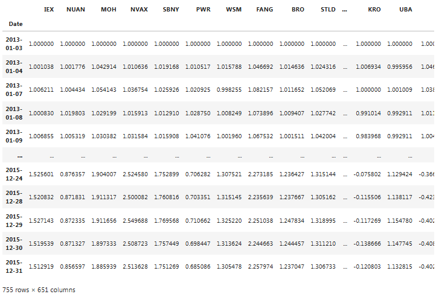
</center>

```python
pairs_train = select_pairs(train_form)
pairs_train
```

<center>

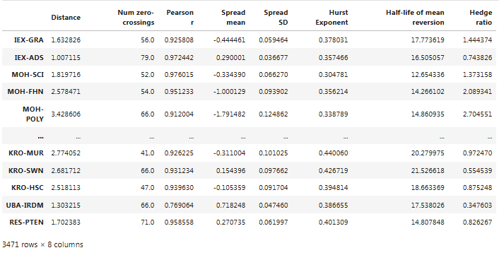
</center>

```python
pairs_train.index.rename('Pair', inplace=True)

pairs_train.to_csv('pairs13_16.csv')

pairs_train = pd.read_csv('pairs13_16.csv', index_col='Pair')

pairs_test = select_pairs(test_form)

pairs_test
```

<center>

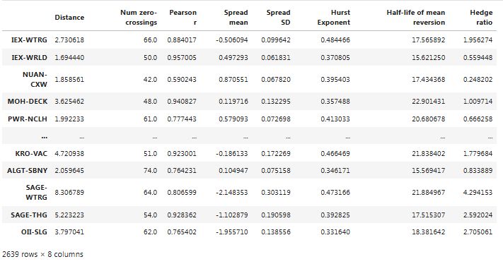
</center>

```python
pairs_test.index.rename('Pair', inplace=True)
pairs_test.to_csv('pairs16_19.csv')

pairs_test = pd.read_csv('pairs16_19.csv', index_col='Pair')

# calculate metrics for selected pairs
metrics_train_form = calculate_metrics(pairs_train.index, train_form, pairs_train) # in formation period
metrics_train_trade = calculate_metrics(pairs_train.index, train_trade, pairs_train) # in trading period

# add hedge ratio to metrics just in case
metrics_train_form['Hedge ratio'] = pairs_train['Hedge ratio']
metrics_train_form
```

<center>

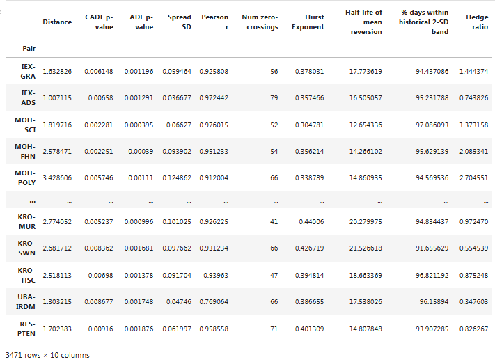
</center>

```python
metrics_train_trade
```

<center>

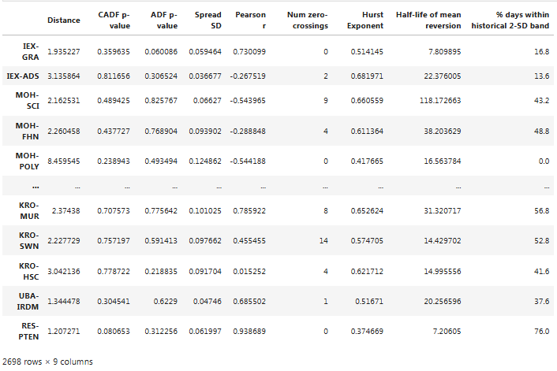
</center>

```python
# repeat the procedure for test data
metrics_test_form = calculate_metrics(pairs_test.index, test_form, pairs_test)
metrics_test_trade = calculate_metrics(pairs_test.index, test_trade, pairs_test)
metrics_test_form['Hedge ratio'] = pairs_test['Hedge ratio']
```

---

### Data preparation

```python
data_train = metrics_train_form.copy()
data_train['Num zero-crossings trade'] = metrics_train_trade['Num zero-crossings']
data_train
```

<center>

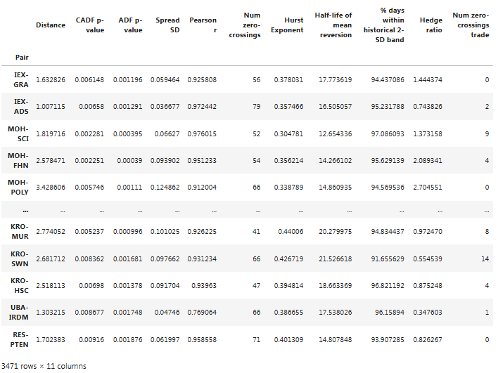
</center>

```python
data_test = metrics_test_form.copy()
data_test['Num zero-crossings trade'] = metrics_test_trade['Num zero-crossings']
data_test
```

<center>

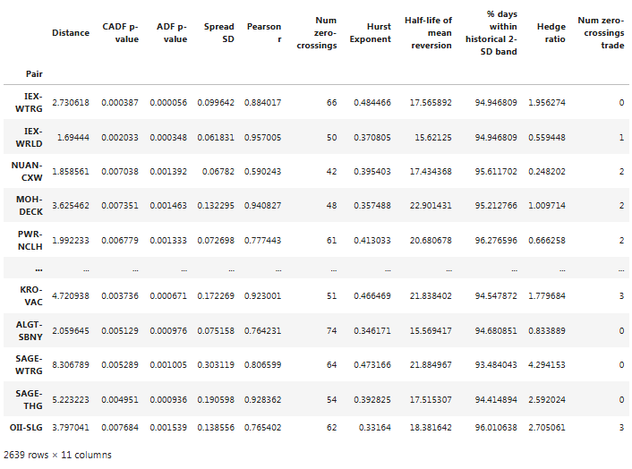
</center>

---

### Data exploration

`data_train.dtypes`

```python
Distance                               object
CADF p-value                           object
ADF p-value                            object
Spread SD                              object
Pearson r                              object
Num zero-crossings                     object
Hurst Exponent                         object
Half-life of mean reversion            object
% days within historical 2-SD band     object
Hedge ratio                           float64
Num zero-crossings trade               object
dtype: object
```

```python
# convert data to numeric types
data_train = data_train.apply(pd.to_numeric, errors='raise')
data_test = data_test.apply(pd.to_numeric, errors='raise')

print(data_test)
```

<center>

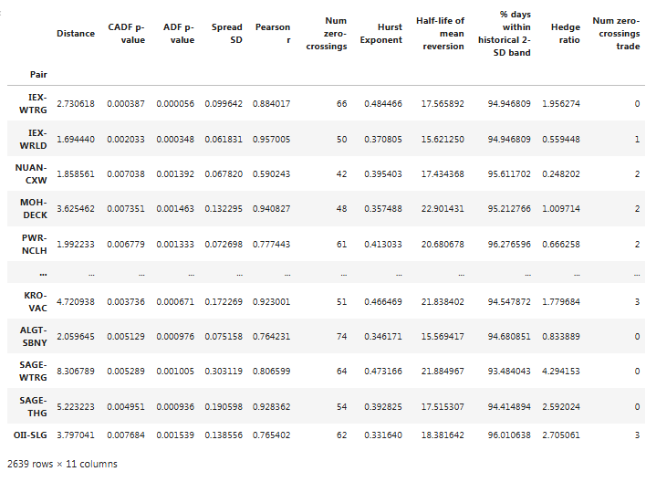
</center>

`data_train.dtypes`

```python
Distance                              float64
CADF p-value                          float64
ADF p-value                           float64
Spread SD                             float64
Pearson r                             float64
Num zero-crossings                      int64
Hurst Exponent                        float64
Half-life of mean reversion           float64
% days within historical 2-SD band    float64
Hedge ratio                           float64
Num zero-crossings trade                int64
dtype: object
```

<center>

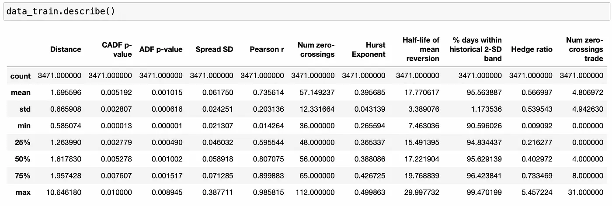
</center>

Ở đây tôi nhận thấy một số điều:

- Giá trị tối thiểu của **hedge ratio** quá thấp. Điều này có nghĩa là chúng ta cần phân bổ 99% vốn cho một cổ phiếu và 1% vốn cho cổ phiếu còn lại, điều mà tôi nghĩ là không hợp lý. Vì vậy, chúng ta cần loại bỏ các cặp có giá trị *hedge ratio* quá nhỏ.

- Các cặp thú vị nhất (các cặp có số lần cắt qua giá trị 0 nhiều nhất trong giai đoạn **trading period**) thực chất là các giá trị ngoại lai - *outliers*. 75% các cặp có ít hơn 8 lần cắt qua giá trị 0.

- Không phải tất cả các đặc điểm đều ở cùng một quy mô, điều này có nghĩa là chúng ta có thể cần áp dụng một số chuyển đổi cho dữ liệu của mình.

Trước khi tiếp tục, tôi sẽ loại bỏ tất cả các cặp có *hedge ratio* nhỏ hơn 0.2 và lớn hơn 5.

```python

# remove pairs with too big or too small hedge ratio
data_train = data_train[(data_train['Hedge ratio']>0.2) & (data_train['Hedge ratio']<5)]
data_test = data_test[(data_test['Hedge ratio']>0.2) & (data_test['Hedge ratio']<5)]

data_train.corr()
```
Bây giờ hãy xem xét *correlations*.

<center>

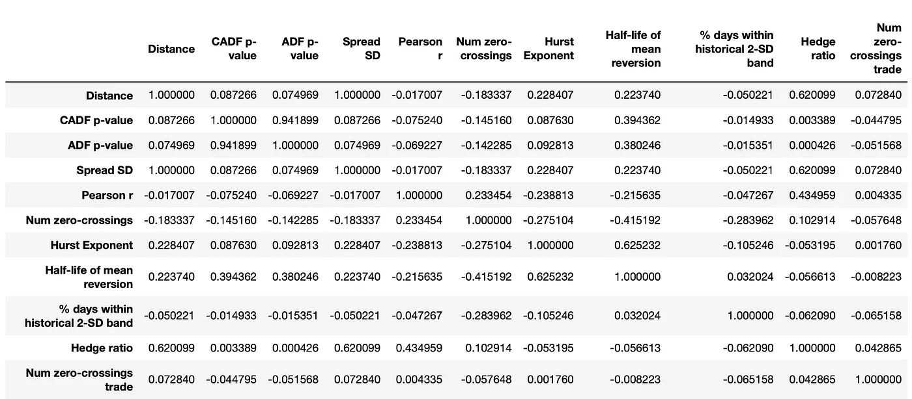
Pairwise correlations of variables
</center>

Một số điều cần lưu ý:

- Một số biến độc lập của chúng ta có hệ số *correlation* cao, điều này có thể ảnh hưởng đến hiệu suất của một số thuật toán học máy.

- Các biến độc lập - *Independent variables* hầu như không có tương quan - *zero correlation* với biến phụ thuộc - *dependent variable*, đây không phải là một dấu hiệu tốt (theo [link](https://www.quora.com/Does-it-make-sense-to-include-independent-variables-who-have-no-correlation-with-the-dependent-variable-in-a-regression-analysis)).

Bây giờ chúng ta sẽ cố gắng trực quan hóa dữ liệu của mình.

---

### Visualize data

```python
_ = data_train.hist(figsize=(18,12))
```

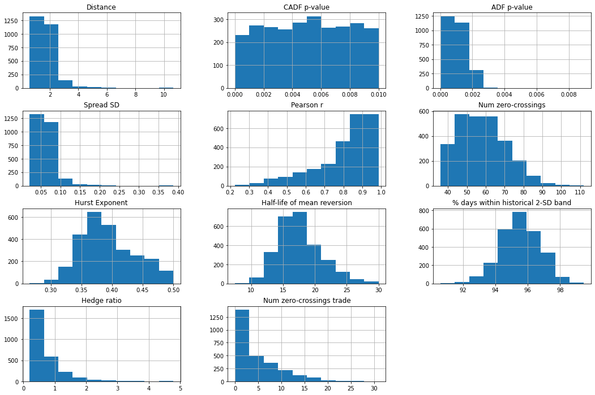

```python
_ = data_train.plot(kind='density', subplots=True, layout=(4,3), sharex=False, figsize=(18,12))
```

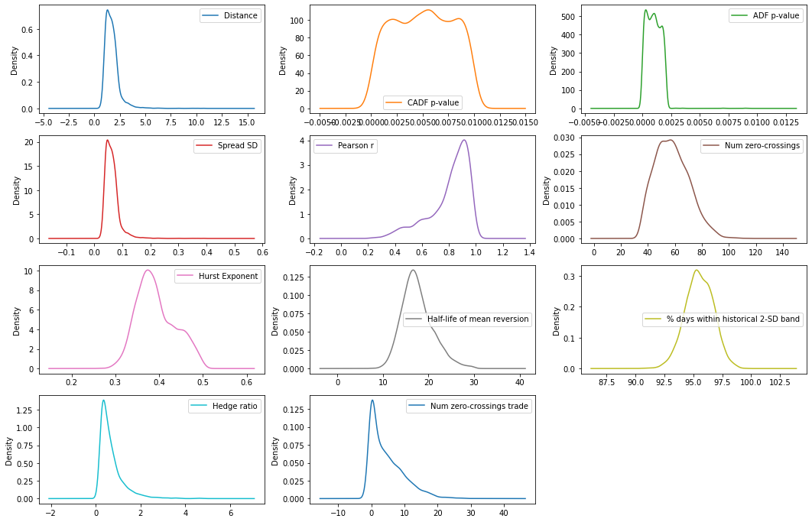

Chúng ta thấy rằng nhiều phân phối bị lệch - *a lot of distributions are skewed*, vì vậy có thể cần áp dụng phép biến đổi lũy thừa - *power transformation* cho các đặc trưng của chúng ta.

---

Trước khi thử nghiệm các thuật toán học máy khác nhau, chúng ta cần làm rõ mục tiêu cuối cùng của mình. Chúng ta không thực sự cần xác định mỗi cặp có bao nhiêu lần cắt qua 0 trong suốt giai đoạn giao dịch. Điều chúng ta cần làm là tìm ra một số cặp có số lần cắt qua 0 cao. Do đó, tôi nghĩ chúng ta nên xây dựng vấn đề dưới dạng một bài toán phân loại - *classification*.

Khi chọn các cặp tiềm năng, chúng ta đã đặt yêu cầu rằng một cặp phải có hơn 12 lần cắt qua 0 mỗi năm. Vì giai đoạn giao dịch của chúng ta là 6 tháng, hãy thử dự đoán các cặp sẽ có hơn 6 lần cắt qua 0.

---

### Classification

```python
X_train = data_train.values[:,:10]
X_test = data_test.values[:,:10]
y_train = data_train.values[:,10]
y_test = data_test.values[:,10]

# what fraction of samples has more than 6 crossings?
len(y_train[y_train>6]) / len(y_train)
```

- `X_train`, `X_test`: Tập biến độc lập (*features*), bao gồm 10 cột đầu tiên của `data_train` và `data_test`.

- `y_train`, `y_test`: Tập biến phụ thuộc (*labels*), là cột thứ 11 (chỉ số 10) trong `data_train` và `data_test`.

- `y_train` > 6: Lọc các giá trị trong `y_train` lớn hơn 6.

- `len(y_train[y_train > 6])`: Đếm số lượng mẫu trong `y_train` thỏa mãn điều kiện > 6.

- `len(y_train)`: Tổng số mẫu trong `y_train`.

- **Kết quả**: Tỷ lệ các mẫu trong tập huấn luyện có nhiều hơn 6 lần cắt qua 0.

Bây giờ, hãy xác định `baseline` của chúng ta. Có bao nhiêu cặp sẽ có hơn 6 lần cắt qua 0 nếu chúng ta chọn chúng ngẫu nhiên?

`Output` 0.30207561156412155

Xấp xỉ 30%. Nhưng để có một thuật toán giao dịch thành công, chúng ta cần xác định đúng hơn 50% (giả sử rằng số tiền chúng ta mất ở các vị thế thua bằng với số tiền chúng ta kiếm được ở các vị thế thắng).

Một điều khác là chúng ta không thực sự cần phân loại chính xác tất cả các cặp có hơn 6 lần cắt qua 0. Chúng ta chỉ cần tìm ra một vài cặp mà chúng ta tự tin nhất. Để chọn thuật toán tốt nhất cho nhiệm vụ này, tôi đã tạo ra một chỉ số đo lường tùy chỉnh:

```python
from sklearn.preprocessing import PowerTransformer
from sklearn.model_selection import StratifiedKFold
from sklearn.model_selection import cross_val_score
from sklearn.pipeline import Pipeline
from sklearn.decomposition import PCA
from sklearn.linear_model import LogisticRegression
from sklearn.discriminant_analysis import LinearDiscriminantAnalysis
from sklearn.neighbors import KNeighborsClassifier
from sklearn.tree import DecisionTreeClassifier
from sklearn.naive_bayes import GaussianNB
from sklearn.svm import SVC

#===============================================================================
def top10_accuracy(estimator, X, y):
    '''
    compute accuracy of top 10 predictions:
    select top 10 samples with the highest probability of belonging to class 1
    return the fraction of samples actually belonging to class1
    '''
    pred_prob = estimator.predict_proba(X)
    top10_ind = np.argsort(pred_prob[:,1])[-10:]
    score = sum(y[top10_ind] == np.ones(10))/10
    
    return score
```

- `PowerTransformer`: Chuẩn hóa dữ liệu để làm giảm ảnh hưởng của độ lệch chuẩn.
- Phân chia dữ liệu: `StratifiedKFold` giúp chia dữ liệu huấn luyện với tỷ lệ nhãn giống nhau trong mỗi tập con.
- Mô hình phân loại: Sử dụng nhiều thuật toán khác nhau như: `LogisticRegression`, `LinearDiscriminantAnalysis`, `KNeighborsClassifier`, `DecisionTreeClassifier`, `GaussianNB`, `SVC`.
- Giảm chiều dữ liệu: `PCA` (*Principal Component Analysis*) để giảm số chiều trong dữ liệu.

Sử dụng bộ ước lượng được cung cấp để dự đoán xác suất của mỗi cặp thuộc về class 1 (có 6 lần cắt qua 0 trong **trading period**), chọn 10 cặp có xác suất cao nhất và tính tỷ lệ các cặp đó thực sự thuộc về class 1 (thực sự có hơn 6 lần cắt qua 0 trong **trading period**).

`pred_prob = estimator.predict_proba(X)`

- Sử dụng `predict_proba` của mô hình (*estimator*) để dự đoán xác suất thuộc từng lớp cho dữ liệu đầu vào X.

`top10_ind = np.argsort(pred_prob[:,1])[-10:]`

- Sắp xếp chỉ số của các mẫu dựa trên xác suất thuộc lớp 1 (pred_prob[:,1]).
- Lấy 10 mẫu có xác suất cao nhất.

`score = sum(y[top10_ind] == np.ones(10)) / 10`

- So sánh nhãn thực tế của 10 mẫu với giá trị 1.
- Tính tỷ lệ chính xác (số mẫu đúng trong 10 mẫu dự đoán).

---

Bây giờ chúng ta cần nhị phân hóa biến kết quả và sẵn sàng bắt đầu.

```python
from sklearn.preprocessing import Binarizer

# binarize dependent variable
binarizer = Binarizer(threshold=6).fit(y_train.reshape(-1,1))
y_train_bin = binarizer.transform(y_train.reshape(-1,1))
binarizer = Binarizer(threshold=6).fit(y_test.reshape(-1,1))
y_test_bin = binarizer.transform(y_test.reshape(-1,1))
```

- Sử dụng `Binarizer` từ thư viện `sklearn` để chuyển đổi giá trị biến phụ thuộc (`y_train` và `y_test`) thành nhị phân. Dữ liệu nhị phân này có thể sử dụng trong các bài toán phân loại nhị phân (`binary classification`).
- Ngưỡng (`threshold`) được đặt là 6:
    - Giá trị > 6 → 1.
    - Giá trị ≤ 6 → 0.

---

```python
def test_models_class(models, X=X_train, y=y_train_bin.flatten(), n_folds=10, scoring=top10_accuracy, seed=45):
    '''
    cross-validate each model in models using n_folds and scoring
    '''
    
    results = []
    names = []
    for name,model in models:
        kfold = StratifiedKFold(n_splits=n_folds, shuffle=True, random_state=seed)
        cv_results = cross_val_score(model, X, y, cv=kfold, scoring=scoring)
        results.append(cv_results)
        names.append(name)
        print(f'{name}: {cv_results.mean()} ({cv_results.std()})')
        
    return results, names
```

- Hàm `test_models_class` thực hiện đánh giá (*cross-validation*) các mô hình phân loại đã được định nghĩa trong danh sách *models*.
- Mục tiêu: Đánh giá hiệu suất của từng mô hình bằng phương pháp chia tập dữ liệu thành *n_folds* (gập nếp chéo) và sử dụng tiêu chí đánh giá được chỉ định trong *scoring*.
- `StratifiedKFold`:
    - Chia dữ liệu thành n_folds tập, đảm bảo tỷ lệ nhãn (*class proportions*) trong mỗi tập giống nhau.
    - `shuffle=True`: Xáo trộn dữ liệu trước khi chia.
    - `random_state`: Đảm bảo tính tái lập (*reproducibility*).
- `cross_val_score`:
    - Thực hiện đánh giá gập nếp chéo (*cross-validation*).
    - Trả về danh sách điểm số của từng gập (*fold*) dựa trên tiêu chí đánh giá `scoring`.

Đầu tiên, tôi sẽ kiểm tra một số thuật toán học máy (*ML*) mà không thực hiện bất kỳ điều chỉnh nào. Tôi sẽ chỉ sử dụng thuộc tính `class_weight` nếu nó khả dụng, bởi vì chúng ta có rất nhiều mẫu thuộc class 0 so với class 1. Đây là những gì tôi thu được:

```python
models = []
models.append(('LR', LogisticRegression(max_iter=300, class_weight='balanced')))
models.append(('LDA', LinearDiscriminantAnalysis()))
models.append(('KNN', KNeighborsClassifier()))
models.append(('CART', DecisionTreeClassifier(class_weight='balanced')))
models.append(('NB', GaussianNB()))
models.append(('SVM', SVC(class_weight='balanced', probability=True)))

results,names = test_models_class(models, y=y_train_bin.flatten())
```

- Danh sách `models` chứa các mô hình phân loại phổ biến từ thư viện `sklearn`.
- Các mô hình được thiết lập với các thông số mặc định hoặc được tinh chỉnh:
    - `LogisticRegression` (**LR**):
        - Sử dụng tối đa 300 vòng lặp (`max_iter`).
        - Tự động cân bằng dữ liệu mất cân đối bằng cách điều chỉnh trọng số (`class_weight='balanced'`).
    - `LinearDiscriminantAnalysis` (**LDA**):
        - Áp dụng phân tích hồi quy tuyến tính để phân loại.
    - `KNeighborsClassifier` (**KNN**):
        - Thuật toán k-láng giềng gần nhất (*k-Nearest Neighbors*).
    - `DecisionTreeClassifier` (**CART**):
        - Sử dụng thuật toán cây quyết định (*Decision Tree*).
        - Tự động cân bằng lớp (`class_weight='balanced'`).
    - `GaussianNB`:
        - Thuật toán *Naive Bayes* với phân phối *Gaussian*.
    - `SVC` (**Support Vector Classifier**):
        - Thuật toán máy vector hỗ trợ (*Support Vector Machine*).
        - Cân bằng lớp (`class_weight='balanced'`).
        - Trả về xác suất dự đoán (`probability=True`).

`Output`

LR: 0.4 (0.10954451150103323)
LDA: 0.43 (0.10049875621120889)
KNN: 0.35 (0.13601470508735444)
CART: 0.42000000000000004 (0.2181742422927143)
NB: 0.35 (0.15)
SVM: 0.26 (0.10198039027185571)

Điều này về cơ bản giống như việc chọn cặp ngẫu nhiên. Có thể tốt hơn một chút. Bây giờ tôi sẽ thử áp dụng phép biến đổi lũy thừa Box-Cox - *Box-Cox power transformation* cho dữ liệu để loại bỏ độ lệch mà chúng ta đã thấy trên các biểu đồ.

```python
pipelines = []
for name,model in models:
    pipelines.append((f'scaled{name}', Pipeline([('scaler', PowerTransformer(method='box-cox')),
                                                 (name,model)])))
    
results,names = test_models_class(pipelines, y=y_train_bin.flatten())
```

Chuẩn hóa dữ liệu:
- `PowerTransformer(method='box-cox')`:
    - Phương pháp `Box-Cox Transformation` để chuẩn hóa dữ liệu, giảm độ lệch chuẩn và đưa dữ liệu về dạng gần chuẩn (*Gaussian-like*).
- Bộ chuẩn hóa được gán nhãn `'scaler'`.

`Output`

scaledLR: 0.38 (0.10770329614269007)
scaledLDA: 0.39 (0.12206555615733701)
scaledKNN: 0.39 (0.1445683229480096)
scaledCART: 0.35 (0.16881943016134132)
scaledNB: 0.35 (0.0806225774829855)
scaledSVM: 0.42000000000000004 (0.116619037896906)

Kết quả rất giống nhau, chỉ có hiệu suất của **SVM** được cải thiện. Hãy thử loại bỏ các đặc trưng không cần thiết bằng hàm `SelectKBest`.


```python
from sklearn.feature_selection import SelectKBest
from sklearn.feature_selection import f_classif

pipelines = []
for name,model in models:
    pipelines.append((f'scaled{name}_4ft', Pipeline([('scaler', PowerTransformer(method='box-cox')),
                                                 ('KBest', SelectKBest(score_func=f_classif, k=4)),
                                                 (name,model)])))
    
results,names = test_models_class(pipelines, y=y_train_bin.flatten())
```
- `SelectKBest`:
    - Là một kỹ thuật chọn lọc đặc trưng (*feature selection*) trong học máy.
    - Lựa chọn **k** đặc trưng tốt nhất dựa trên một hàm điểm (`scoring function`).
- `f_classif`:
    - Là hàm điểm cho bài toán phân loại, sử dụng kiểm định thống kê `ANOVA F-test` để tính độ liên quan giữa các đặc trưng và nhãn.
- Chuẩn hóa dữ liệu:
    - `PowerTransformer(method='box-cox')`: Chuẩn hóa dữ liệu để giảm độ lệch chuẩn, đưa dữ liệu về dạng gần chuẩn.
- Chọn lọc đặc trưng:
    - `SelectKBest(score_func=f_classif, k=4)`: Chọn 4 đặc trưng tốt nhất dựa trên điểm số *ANOVA F-test*.

- `y_train_bin.flatten()`: Nhãn dữ liệu huấn luyện đã được chuyển sang dạng nhị phân.

Đoạn code đã thêm bước `SelectKBest` để chọn 4 đặc trưng quan trọng nhất. Giảm số lượng đặc trưng, tăng hiệu suất và khả năng tổng quát của mô hình.

`Output`

scaledLR_4ft: 0.4 (0.07745966692414834)
scaledLDA_4ft: 0.39 (0.07)
scaledKNN_4ft: 0.43 (0.1345362404707371)
scaledCART_4ft: 0.4 (0.15491933384829668)
scaledNB_4ft: 0.36 (0.1624807680927192)
scaledSVM_4ft: 0.4699999999999999 (0.1552417469626002)

Không có cải thiện thực sự nào về điểm trung bình, nhưng chúng ta thấy rằng độ lệch chuẩn của `Logistic Regression` và `Linear Discriminant Analysis` giảm. Bây giờ tôi sẽ thử một số mô hình tập hợp (*ensemble models*).

---

```python
from sklearn.ensemble import AdaBoostClassifier
from sklearn.ensemble import GradientBoostingClassifier
from sklearn.ensemble import RandomForestClassifier
from sklearn.ensemble import ExtraTreesClassifier

ensembles = []
ensembles.append(('ADA', AdaBoostClassifier()))
ensembles.append(('GBM', GradientBoostingClassifier()))
ensembles.append(('RF', RandomForestClassifier(class_weight='balanced')))
ensembles.append(('ET', ExtraTreesClassifier(class_weight='balanced')))

results,names = test_models_class(ensembles, y=y_train_bin.flatten())
```

Một số mô hình được sử dụng:
- `AdaBoostClassifier`:
    - Áp dụng thuật toán tăng cường thích ứng (*Adaptive Boosting*).
    - Kết hợp nhiều bộ phân loại yếu (*weak classifiers*), thường là cây quyết định nông, để tạo thành một mô hình mạnh hơn.
- `GradientBoostingClassifier`:
    - Một phương pháp tăng cường độ dốc (*Gradient Boosting*).
    - Tối ưu hóa hàm mất mát theo hướng giảm dần độ dốc, xây dựng mô hình tuần tự bằng cách thêm từng bộ phân loại yếu.
- `RandomForestClassifier`:
    - Một mô hình rừng ngẫu nhiên (*Random Forest*).
    - Kết hợp nhiều cây quyết định độc lập để tạo ra một bộ phân loại mạnh.
    - Hỗ trợ tham số `class_weight='balanced'` để xử lý dữ liệu mất cân đối.
- `ExtraTreesClassifier`:
    - Tương tự *Random Forest*, nhưng các cây được xây dựng bằng cách chọn ngẫu nhiên các ngưỡng phân chia.
    - Hỗ trợ `class_weight='balanced'`.

`Output`

ADA: 0.26999999999999996 (0.09)
GBM: 0.39 (0.15132745950421556)
RF: 0.41000000000000003 (0.10440306508910549)
ET: 0.5 (0.10954451150103321)

`ExtraTreesClassifier` dường như là tốt nhất ở đây. Tôi sẽ cố gắng cải thiện hiệu suất của nó bằng cách sử dụng *grid search* để tinh chỉnh các tham số.

---

```python
from sklearn.model_selection import GridSearchCV

n_estimators=[10,50,100,150]
max_depth = [5,7,10,15]
max_leaf_nodes = [50,100,150]
min_samples_leaf = [1,3,5,7,10,15]
param_grid = dict(n_estimators=n_estimators, max_depth=max_depth, 
                  max_leaf_nodes=max_leaf_nodes, min_samples_leaf=min_samples_leaf)
model = ExtraTreesClassifier(class_weight='balanced')
kfold = StratifiedKFold(n_splits=10, shuffle=True, random_state=45)
grid = GridSearchCV(estimator=model, param_grid=param_grid, scoring=top10_accuracy, cv=kfold)
grid_result = grid.fit(X_train, y_train_bin.flatten())

#===============================================================================
print(grid_result.best_score_)
print(grid_result.best_params_)
```

- `GridSearchCV`:
    - Công cụ để tìm kiếm tổ hợp tham số tối ưu cho một mô hình học máy.
    - Thực hiện tìm kiếm trên một lưới các giá trị tham số được chỉ định, sử dụng gập nếp chéo (*cross-validation*) để đánh giá từng tổ hợp.

**Định nghĩa các tham số cần tối ưu:**
- `n_estimators`: Số lượng cây trong mô hình ExtraTreesClassifier.
- `max_depth`:
    - Độ sâu tối đa của mỗi cây.
    - Quy định mức độ phân chia tối đa của các nhánh trong cây.
- `max_leaf_nodes`:
    - Số lượng nút lá tối đa.
    - Giới hạn số nút lá để kiểm soát độ phức tạp của cây.
- `min_samples_leaf`:
    - Số lượng mẫu tối thiểu cần thiết tại một nút lá.
    - Quy định kích thước tối thiểu của mỗi nút lá để tránh *overfitting*.

`param_grid`: Tập hợp tất cả các tổ hợp tham số có thể thử nghiệm.

**Khởi tạo mô hình và GridSearchCV**

- **Mô hình** (`model`):
    - `ExtraTreesClassifier`: Mô hình sử dụng cây ngẫu nhiên với trọng số lớp cân bằng (`class_weight='balanced'`).

- **K-fold Cross-Validation**: `StratifiedKFold`: Chia dữ liệu thành 10 tập con, đảm bảo tỷ lệ nhãn (class proportions) được giữ nguyên.

- **GridSearchCV**:
    - `estimator=model`: Mô hình cần tối ưu.
    - `param_grid=param_grid`: Lưới các giá trị tham số cần thử nghiệm.
    - `scoring=top10_accuracy`: Hàm đánh giá được sử dụng (độ chính xác của top 10 dự đoán).
    - `cv=kfold`: Sử dụng gập nếp chéo với 10 tập.

`Output`

0.5499999999999999
{'max_depth': 10, 'max_leaf_nodes': 50, 'min_samples_leaf': 15, 'n_estimators': 10}

Có vẻ như chúng ta đã đạt được một chút cải thiện. Hãy thử tinh chỉnh một vài mô hình khác. Để tinh chỉnh mô hình `logistic regression`, tôi sẽ sử dụng lớp `LogisticRegressionCV` được bao gồm trong `sklearn`.

---

```python
from sklearn.linear_model import LogisticRegressionCV

models = [('scaledLR_4ft_cv', Pipeline([('scaler', PowerTransformer(method='box-cox')), 
                            ('KBest', SelectKBest(score_func=f_classif, k=4)), 
                            ('LR', LogisticRegressionCV(max_iter=300, class_weight='balanced', 
                                                        scoring=top10_accuracy))]))]

results,names = test_models_class(models, y=y_train_bin.flatten())
```

- `LogisticRegressionCV`:
    - Là phiên bản mở rộng của *Logistic Regression* có tích hợp *Cross-Validation (CV)*.
    - Tự động chọn tham số tối ưu (như *C - regularization strength*) bằng cách sử dụng gập nếp chéo (*cross-validation*).

**Định nghĩa mô hình `models`**
Pipeline: Gồm 3 bước chính:
- **Bước chuẩn hóa** (`scaler`):
    - Sử dụng `PowerTransformer` với phương pháp `box-cox` để chuẩn hóa dữ liệu, giúp giảm độ lệch chuẩn và đưa dữ liệu về phân phối chuẩn.
- **Bước chọn lọc đặc trưng** (`KBest`):
    - Sử dụng `SelectKBest` với hàm điểm `f_classif` (*ANOVA F-test*) để chọn 4 đặc trưng quan trọng nhất.
- **Mô hình Logistic Regression có CV** (`LogisticRegressionCV`):
    - Logistic Regression tích hợp gập nếp chéo để tự động chọn giá trị tối ưu cho tham số C (regularization strength).
    - Cấu hình:
        - `max_iter=300`: Số vòng lặp tối đa cho quá trình tối ưu.
        - `class_weight='balanced'`: Điều chỉnh trọng số để xử lý dữ liệu mất cân đối.
        - `scoring=top10_accuracy`: Sử dụng hàm đánh giá được định nghĩa để tính độ chính xác của top 10 dự đoán.

`Output`

scaledLR_4ft_cv: 0.39 (0.08306623862918076)

Không có sự cải thiện nào cho mô hình *logistic regression*. Tiếp theo, tôi sẽ thử tinh chỉnh **SVC**.

---

```python
scaler = PowerTransformer(method='box-cox').fit(X_train)
scaledX = scaler.transform(X_train)
scaledX_4ft = SelectKBest(score_func=f_classif, k=4).fit_transform(X_train, y_train_bin.flatten())
c_values = [0.1, 0.3, 0.5, 0.7, 0.9, 1.0, 1.3, 1.5, 1.7, 2]
kernel_values = ['linear', 'poly', 'rbf', 'sigmoid']
param_grid = dict(C=c_values, kernel=kernel_values)
model = SVC(class_weight='balanced', probability=True)
kfold = StratifiedKFold(n_splits=10, shuffle=True, random_state=45)
grid = GridSearchCV(estimator=model, param_grid=param_grid, scoring=top10_accuracy, cv=kfold)
grid_result = grid.fit(scaledX_4ft, y_train_bin.flatten()

#===============================================================================
print(grid_result.best_score_)
print(grid_result.best_params_)
```

**Định nghĩa lưới tham số (grid search parameters)**
- `C` (*Regularization strength*):
    - Tham số điều chỉnh sức mạnh của thuật toán phân tách tuyến tính:
    - Giá trị nhỏ của `C` → Tăng cường *regularization*, tránh *overfitting*.
    - Giá trị lớn của `C` → Giảm *regularization*, tăng độ phù hợp với dữ liệu.

- `kernel`:
    - Các hàm nhân (`kernel`) dùng trong **SVM**:
    - `linear`: Phân tách tuyến tính.
    - `poly`: Hàm nhân đa thức.
    - `rbf`: Hàm nhân Gaussian (*Radial Basis Function*).
    - `sigmoid`: Hàm nhân *sigmoid*.

- `param_grid`: Lưới tham số cần thử nghiệm, bao gồm tất cả các kết hợp của `C` và `kernel`.

`Output`

0.44000000000000006
{'C': 2, 'kernel': 'poly'}

```python
scaler = PowerTransformer(method='box-cox').fit(X_train)
scaledX = scaler.transform(X_train)
scaledX_4ft = SelectKBest(score_func=f_classif, k=4).fit_transform(X_train, y_train_bin.flatten())
param_grid = dict(n_neighbors=np.arange(1,22,2))
model = KNeighborsClassifier()
kfold = StratifiedKFold(n_splits=10, shuffle=True, random_state=45)
grid = GridSearchCV(estimator=model, param_grid=param_grid, scoring=top10_accuracy, cv=kfold)
grid_result = grid.fit(scaledX_4ft, y_train_bin.flatten())

#===============================================================================
print(grid_result.best_score_)
print(grid_result.best_params_)
```

**Khởi tạo mô hình KNN và GridSearchCV**

- **Mô hình KNN** (`KNeighborsClassifier`):
    - Mô hình phân loại dựa trên **k** láng giềng gần nhất.
    - Không có tham số nào được tinh chỉnh ban đầu, vì `GridSearchCV` sẽ thực hiện điều đó.

- **K-fold Cross-Validation**:
    - Sử dụng `StratifiedKFold` để chia dữ liệu thành 10 tập con, đảm bảo tỷ lệ nhãn giống nhau trong mỗi tập.

- **GridSearchCV**:
    - `estimator=model`: Mô hình KNN cần tối ưu hóa.
    - `param_grid=param_grid`: Lưới tham số để thử nghiệm.
    - `scoring=top10_accuracy`: Hàm đánh giá hiệu suất (độ chính xác của top 10 dự đoán).

`Output`

0.45
{'n_neighbors': 17}

Không có cải thiện nào đối với **SVC** và chỉ có cải thiện rất nhỏ với **KNN**. Nhìn chung, chúng ta chỉ có một thuật toán đạt được điểm chính xác hơn 50% trong quá trình kiểm định ché - *cross validation*. Hãy thử huấn luyện nó và kiểm tra cách nó hoạt động trên *unseen data*.

```python
# train ET using parameters obtained in grid search
model = ExtraTreesClassifier(class_weight='balanced', max_depth=10, max_leaf_nodes=50, 
                             min_samples_leaf=15, n_estimators=10)
model.fit(X_train, y_train_bin.flatten())
```

`Output`

ExtraTreesClassifier(class_weight='balanced', max_depth=10, max_leaf_nodes=50,
                     min_samples_leaf=15, n_estimators=10)

```python
# accuracy on train data
top10_accuracy(model, X_train, y_train_bin.flatten())
```

`Output` 0.7

```python
# accuracy on test data
top10_accuracy(model, X_test, y_test_bin.flatten())
```

`Output` 0.7

Thật thú vị. Chúng ta đã đạt được độ chính xác 70% trên cả kiểm tra *in-sample* và *out-of-sample tests*. Hãy cùng xem các cặp hàng đầu.

---

```python
pred_prob = model.predict_proba(X_test) # predict probabilities
# select top 10 pairs with highest probability of belonging to class 1 (sort in descending order)
top10_ind = np.argsort(pred_prob[:,1])[-10:][::-1] 
data_test.iloc[top10_ind,:] # show data
```

<center>

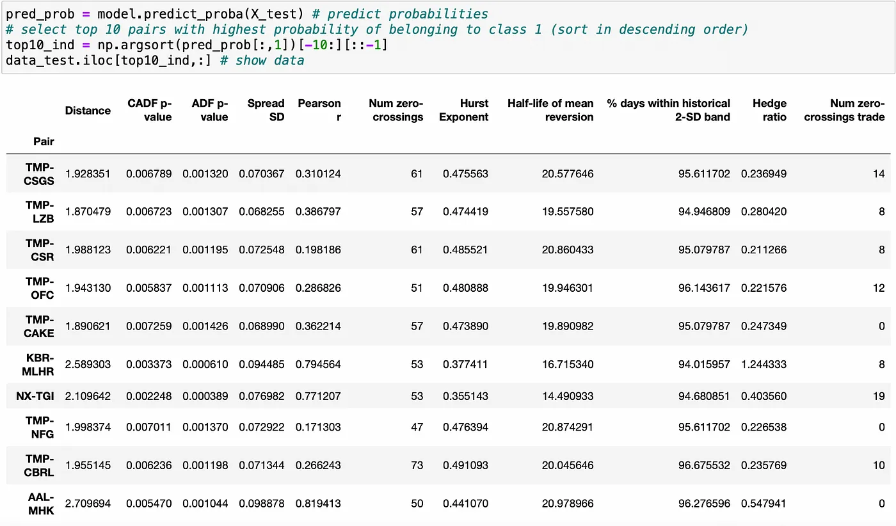
</center>

Điều kỳ lạ ở đây là hầu hết các cặp đều chứa cổ phiếu **TMP**. Điều này rõ ràng không tốt cho việc đa dạng hóa. Ngoài ra, hãy chú ý rằng hầu hết các cặp này có *hedge ratio* rất nhỏ, có lẽ chúng ta nên giới hạn phạm vi của nó hơn nữa. Hãy thử chọn 5 cặp dự đoán hàng đầu mà tất cả đều chứa các cổ phiếu khác nhau.

```python
top50_ind = np.argsort(pred_prob[:,1])[-50:][::-1]
top50_pairs = data_test.iloc[top50_ind,:].index

selected_pairs = []
selected_stocks = []
for pair in top50_pairs:
    s1,s2 = parse_pair(pair)
    if (s1 not in selected_stocks) and (s2 not in selected_stocks):
        selected_stocks.append(s1)
        selected_stocks.append(s2)
        selected_pairs.append(pair)
        
        if len(selected_pairs)==5:
            break

#===============================================================================      
selected_pairs
```

`Output`

['TMP-CSGS', 'KBR-MLHR', 'NX-TGI', 'AAL-MHK', 'AMCX-FF']

`plot_pairs(selected_pairs, test_form, test_trade)`

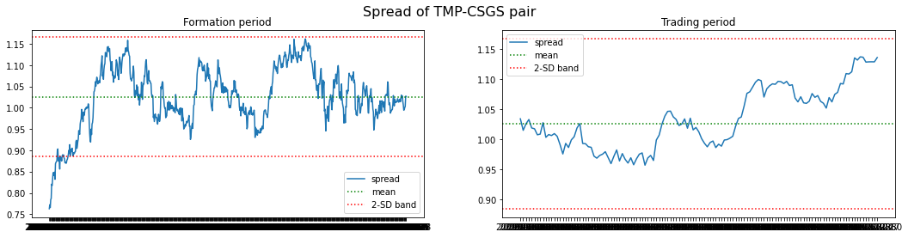
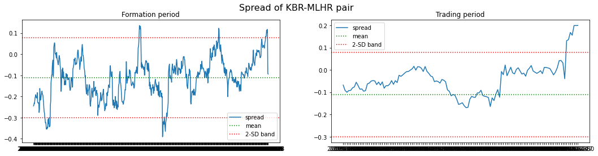
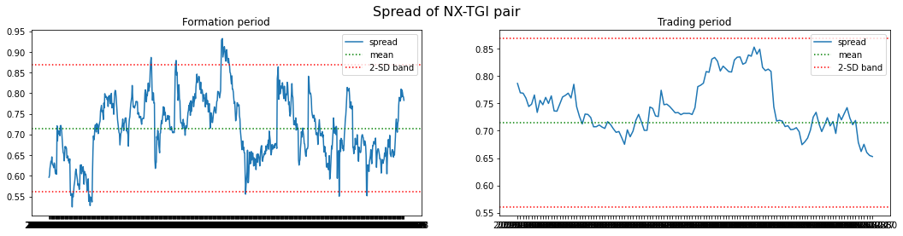
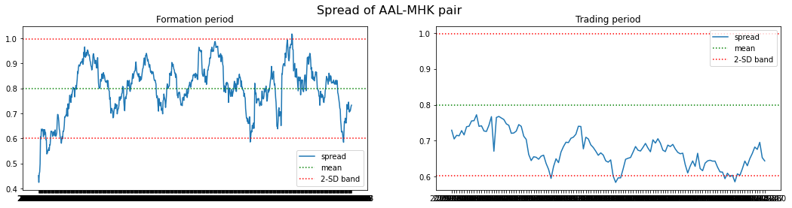
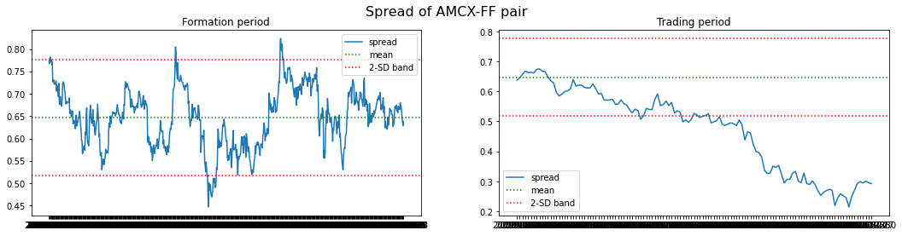

Kết quả không quá ấn tượng, nhưng tôi tin rằng chúng tốt hơn so với những gì chúng ta đạt được trong bài viết trước. Ít nhất, hầu hết các cặp vẫn nằm trong phạm vi 2-SD trong suốt giai đoạn giao dịch.

Sau khi thử nghiệm với các mô hình học máy khác nhau, rõ ràng rằng việc chọn các cặp để giao dịch không phải là một nhiệm vụ dễ dàng. Tất cả các thuật toán được thử nghiệm đều không tạo ra dự đoán tốt, với các mô hình tốt nhất có độ chính xác chỉ hơn 50% một chút (mặc dù vẫn tốt hơn so với baseline 30%). Tôi tin rằng từ đây, chúng ta có thể kết luận rằng không có *heuristic* đơn giản nào được biết đến (chẳng hạn như chọn các cặp có khoảng cách *Euclidean* nhỏ nhất) có thể mang lại kết quả tốt hơn.

---

# Các cải tiến có thể:

- Sử dụng các thuật toán phát hiện dị thường (*anomaly detection*) để phân loại.
- Thử nghiệm các phương pháp biến đổi đặc trưng hoặc kỹ thuật *feature engineering* khác.
- Thử nghiệm với giai đoạn hình thành (**formation period**) dài hơn.
- Sử dụng biến phụ thuộc khác (ví dụ: khoảng cách *Euclidean* hoặc hệ số *Pearson correlation*).
- Thử phân loại các cặp thỏa mãn tất cả các tiêu chí cho các cặp tiềm năng (*CADF p-value* < 0.01, *Hurst exponent* < 0.5, v.v.) trong suốt **trading period**. (Có tổng cộng 33 cặp trong số 3471 cặp trong dữ liệu huấn luyện thỏa mãn điều kiện, có thể phát hiện dị thường sẽ hữu ích).
