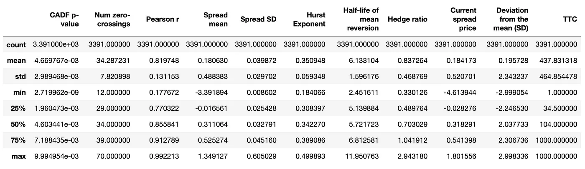
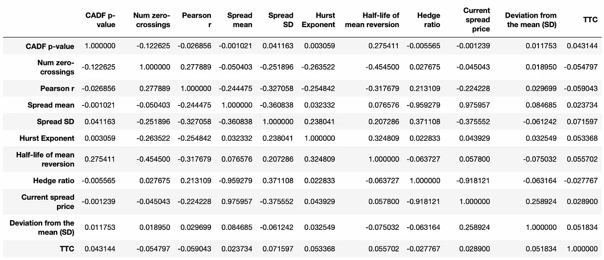
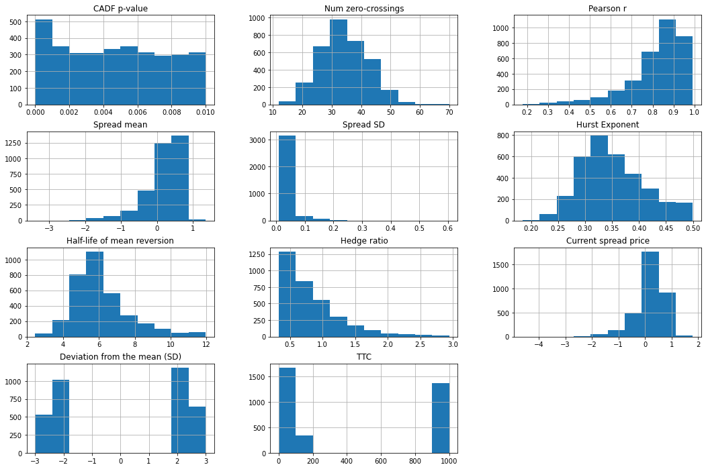
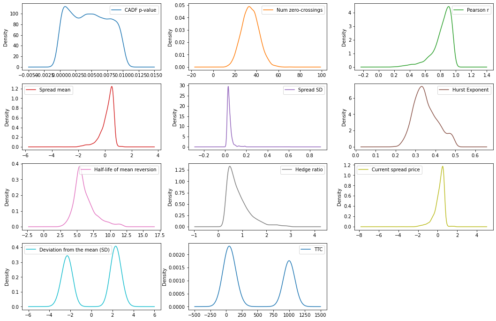
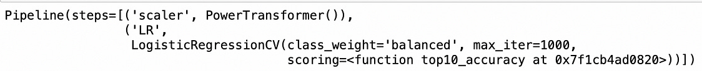

From pair trading - financial noob
- https://github.com/financialnoob/pairs_trading/blob/main/6.pairs_trading.pairs_selection.cointegration_3.ipynb
- https://financialnoob.substack.com/p/pairs-trading-pair-selection-cointegration-b0b?utm_source=profile&utm_medium=reader2

# Pairs trading. Pairs selection. Cointegration (part 3)

Tôi tin rằng nhược điểm chính của tất cả các phương pháp lựa chọn cặp mà chúng ta đã thử nghiệm cho đến nay là giả định rằng điều kiện thị trường không thay đổi trong suốt giai đoạn giao dịch. Chúng ta đã phân tích dữ liệu giá và đánh giá cặp nào phù hợp để giao dịch chỉ một lần vào đầu kỳ. Sau đó, chúng ta giả định rằng mối quan hệ giữa hai cổ phiếu trong các cặp được chọn sẽ tiếp tục hành xử giống như trước đây. Tôi nghĩ rằng giả định này là không thực tế trong các thị trường tài chính hiện đại, vốn có xu hướng rất năng động.

Trong bài viết này, tôi muốn kiểm tra cách các phương pháp lựa chọn cặp của chúng ta sẽ hoạt động nếu giới hạn giai đoạn giao dịch trong một tháng. Đây là những gì tôi muốn làm:

- Sử dụng giai đoạn hình thành 12 tháng để chọn các cặp tiềm năng cho giao dịch (sử dụng các điều kiện tương tự như trong bài viết trước).

- Trong tất cả các cặp tiềm năng, chỉ chọn những cặp có *standard deviations* lớn hơn 2 và ít hơn 3 so với *historical mean* vào ngày cuối cùng của **formation period**.

- Thực hiện và đánh giá hiệu suất của một số thuật toán máy học trong việc dự đoán xem các cặp được chọn có khả năng hội tụ trong 30 ngày tiếp theo hay không.

- Ước tính liệu hiệu suất đạt được có đủ để tạo ra một chiến lược giao dịch có lợi nhuận hay không.

Tôi sẽ sử dụng dữ liệu giá lịch sử cho các cổ phiếu từ **Vanguard Small-Cap Value Index Fund (VBR)** từ ngày 01.07.2016 đến ngày 31.12.2019. Giai đoạn hình thành sẽ kéo dài 12 tháng và tôi sẽ cuộn tiến mỗi tháng - *roll it one month forward* để có tổng cộng 24 giai đoạn.

```python
import pandas as pd
import numpy as np
import matplotlib.pyplot as plt

#===========================================================================
prices = pd.read_csv('vbr16_19.csv', index_col='Date')

# calculate cumulative returns
cumret = np.log(prices).diff().cumsum()+1
cumret.dropna(how='all', inplace=True)
cumret.dropna(axis=1, inplace=True)

#===========================================================================
# define a set of formation\trading periods
periods = [('2016-07-01', '2017-07-01', '2017-07-01', '2018-01-01'),
           ('2016-08-01', '2017-08-01', '2017-08-01', '2018-02-01'),
           ('2016-09-01', '2017-09-01', '2017-09-01', '2018-03-01'),
           ('2016-10-01', '2017-10-01', '2017-10-01', '2018-04-01'),
           ('2016-11-01', '2017-11-01', '2017-11-01', '2018-05-01'),
           ('2016-12-01', '2017-12-01', '2017-12-01', '2018-06-01'),
           ('2017-01-01', '2018-01-01', '2018-01-01', '2018-07-01'),
           ('2017-02-01', '2018-02-01', '2018-02-01', '2018-08-01'),
           ('2017-03-01', '2018-03-01', '2018-03-01', '2018-09-01'),
           ('2017-04-01', '2018-04-01', '2018-04-01', '2018-10-01'),
           ('2017-05-01', '2018-05-01', '2018-05-01', '2018-11-01'),
           ('2017-06-01', '2018-06-01', '2018-06-01', '2018-12-01'),
           ('2017-07-01', '2018-07-01', '2018-07-01', '2019-01-01'),
           ('2017-08-01', '2018-08-01', '2018-08-01', '2019-02-01'),
           ('2017-09-01', '2018-09-01', '2018-09-01', '2019-03-01'),
           ('2017-10-01', '2018-10-01', '2018-10-01', '2019-04-01'),
           ('2017-11-01', '2018-11-01', '2018-11-01', '2019-05-01'),
           ('2017-12-01', '2018-12-01', '2018-12-01', '2019-06-01'),
           ('2018-01-01', '2019-01-01', '2019-01-01', '2019-07-01'),
           ('2018-02-01', '2019-02-01', '2019-02-01', '2019-08-01'),
           ('2018-03-01', '2019-03-01', '2019-03-01', '2019-09-01'),
           ('2018-04-01', '2019-04-01', '2019-04-01', '2019-10-01'),
           ('2018-05-01', '2019-05-01', '2019-05-01', '2019-11-01'),
           ('2018-06-01', '2019-06-01', '2019-06-01', '2019-12-01'),
           ('2018-07-01', '2019-07-01', '2019-07-01', '2020-01-01')]

#===========================================================================
def parse_pair(pair):
    '''
    parse pair string S1-S2
    return tickers S1, S2
    '''
    dp = pair.find('-')
    s1 = pair[:dp]
    s2 = pair[dp+1:]
    
    return s1,s2

def calculate_halflife(spread):
    '''
    calculate half-life of mean reversion of the spread
    '''
    from statsmodels.regression.linear_model import OLS
    from statsmodels.tools.tools import add_constant
    
    ylag = spread.shift()
    deltay = spread - ylag
    ylag.dropna(inplace=True)
    deltay.dropna(inplace=True)

    res = OLS(deltay, add_constant(ylag)).fit()
    halflife = -np.log(2)/res.params[0]
    
    return halflife

def select_pairs(cumret_form, cumret_trade):
    '''
    select pairs using data from train dataframe
    return dataframe of selected pairs
    '''
    tested = []

    from statsmodels.regression.linear_model import OLS
    from statsmodels.tools.tools import add_constant
    from hurst import compute_Hc
    from statsmodels.tsa.stattools import adfuller
    from statsmodels.tsa.stattools import coint

    cols = ['CADF p-value', 'Num zero-crossings', 'Pearson r', 'Spread mean', 'Spread SD', 'Hurst Exponent', 
            'Half-life of mean reversion', 'Hedge ratio', 'Current spread price']
    pairs = pd.DataFrame(columns=cols)

    for s1 in cumret_form.columns:
        for s2 in cumret_form.columns:
            if s1!=s2 and (f'{s1}-{s2}' not in tested):
                tested.append(f'{s1}-{s2}')
                cadf_p = coint(cumret_form[s1], cumret_form[s2])[1]
                if cadf_p<0.01 and (f'{s2}-{s1}' not in pairs.index): # stop if pair already added as s2-s1
                    res = OLS(cumret_form[s1], add_constant(cumret_form[s2])).fit()
                    hedge_ratio = res.params[s2]
                    if hedge_ratio > 0: # hedge ratio should be posititve
                        spread_form = cumret_form[s1] - hedge_ratio*cumret_form[s2]
                        spread_mean = spread_form.mean()
                        spread_std = spread_form.std()
                        hurst = compute_Hc(spread_form)[0]
                        if hurst<0.5:
                            halflife = calculate_halflife(spread_form)
                            if halflife>1 and halflife<12:
                                # subtract the mean to calculate num_crossings
                                spread_nm = spread_form - spread_form.mean() 
                                num_crossings = (spread_nm.values[1:] * spread_nm.values[:-1] < 0).sum()
                                if num_crossings>len(cumret_form.index)/252*12: 
                                    pearson_r = np.corrcoef(cumret_form[s1], cumret_form[s2])[0][1]
                                    pairs.loc[f'{s1}-{s2}'] = [cadf_p, num_crossings, pearson_r, spread_mean, 
                                                               spread_std, hurst, halflife, hedge_ratio, 
                                                               spread_form[-1]]
                                
    return pairs

#===================================================================================================================
cols = ['CADF p-value', 'Num zero-crossings', 'Pearson r', 'Spread mean', 'Spread SD', 'Hurst Exponent', 
        'Half-life of mean reversion', 'Hedge ratio', 'Current spread price', 'Deviation from the mean (SD)', 'TTC']
data = pd.DataFrame(columns=cols)

for form_start,form_end,trade_start,trade_end in periods:
    print(f'Processing period {form_start} : {trade_end}')
    # select prices for formation and trading periods
    cumret_tmp = cumret[form_start:trade_end]
    cumret_tmp = cumret_tmp/cumret_tmp.iloc[0]
    cumret_form = cumret_tmp[:form_end]
    cumret_trade = cumret_tmp[trade_start:]
    
    # select potential pairs
    pairs_tmp = select_pairs(cumret_form, cumret_trade)
    
    # calculate current deviation from the mean (in standard deviations)
    pairs_tmp['Deviation from the mean (SD)'] = (pairs_tmp['Current spread price'] - 
                                                 pairs_tmp['Spread mean'])/pairs_tmp['Spread SD']
    # separate deviated pairs
    deviated_pairs = pairs_tmp[(abs(pairs_tmp['Deviation from the mean (SD)'])>=2) & 
                               (abs(pairs_tmp['Deviation from the mean (SD)'])<=3)].copy()
    
    # calculate time to converge (in days)
    for pair in deviated_pairs.index:
        s1,s2 = parse_pair(pair)
        hedge_ratio = deviated_pairs.loc[pair]['Hedge ratio']
        spread_mean = deviated_pairs.loc[pair]['Spread mean']
        spread_dev = deviated_pairs.loc[pair]['Deviation from the mean (SD)']
        spread_trade = cumret_trade[s1] - hedge_ratio*cumret_trade[s2]
        # calculate time to convergence
        if spread_dev<0 and len(spread_trade[spread_trade>spread_mean])>0:
            deviated_pairs.loc[pair, ['TTC']] = (pd.to_datetime(spread_trade[spread_trade>spread_mean].index[0])
                                                 - pd.to_datetime(trade_start)).days
        elif spread_dev>0 and len(spread_trade[spread_trade<spread_mean])>0:
            deviated_pairs.loc[pair, ['TTC']] = (pd.to_datetime(spread_trade[spread_trade<spread_mean].index[0])
                                                 - pd.to_datetime(trade_start)).days
        else:
            deviated_pairs.loc[pair, ['TTC']] = 1000
    
    # save data
    data = pd.concat([data,deviated_pairs], axis=0, ignore_index=True)
```

Sau khi xử lý toàn bộ 24 giai đoạn, chúng ta sẽ có bộ dữ liệu dưới đây.

<center>


</center>

Cột cuối cùng (**TTC**) biểu thị số ngày lịch mà *spread* mất để quay trở lại *historical mean* của nó. Giá trị bằng 1000 nếu spread không hội tụ trong vòng 6 tháng tiếp theo.

Trước khi tiến hành xa hơn, tôi đã loại bỏ các mẫu có *hedge ratio* quá lớn hoặc quá nhỏ: lớn hơn 3 hoặc nhỏ hơn 0.33.

```python
# filter too big and too small hedge ratios
data = data[(data['Hedge ratio']<3) & (data['Hedge ratio'] > 0.33)]

data.dtypes
```

`Output`
CADF p-value                    float64
Num zero-crossings              float64
Pearson r                       float64
Spread mean                     float64
Spread SD                       float64
Hurst Exponent                  float64
Half-life of mean reversion     float64
Hedge ratio                     float64
Current spread price            float64
Deviation from the mean (SD)    float64
TTC                             float64
dtype: object


Sau đó, chúng ta còn lại 3391 mẫu. Thống kê tóm tắt được cung cấp bên dưới.

```python
data.describe()
```

<center>


Summary statistic of the data
</center>

```python
data.corr()
```

Bây giờ hãy nhìn vào *correlation matrix*.

<center>


Correlation matrix
</center>

Như đã đề cập ở phần trước, chúng ta có thể nhận thấy rằng không có đặc trưng nào *correlated* với biến phụ thuộc (**TTC**). Hệ số *correlated* cao nhất là 0.07. Đây không phải là một dấu hiệu tốt. Tuy nhiên, *correlated* chỉ đo lường các mối quan hệ tuyến tính, vì vậy vẫn có thể đạt được kết quả thỏa đáng.

Bây giờ chúng ta sẽ xem xét các biểu đồ dữ liệu.

```python
_ = data.hist(figsize=(18,12))
```

<center>


Histograms of the data
</center>

```python
_ = data.plot(kind='density', subplots=True, layout=(4,3), sharex=False, figsize=(18,12))
```

<center>


Density plots of the data
</center>

Chúng ta có thể nhận thấy rằng phân phối của một số đặc trưng bị lệch, vì vậy có thể cần sử dụng phép biến đổi lũy thừa (*power transformations*) để làm cho chúng trông giống phân phối *Gaussian* hơn.

```python
len(data.columns)
```

`Output` 11

### ML Classification

```python
from sklearn.preprocessing import Binarizer
from sklearn.preprocessing import PowerTransformer
from sklearn.model_selection import StratifiedKFold
from sklearn.model_selection import cross_val_score
from sklearn.model_selection import train_test_split
from sklearn.pipeline import Pipeline
from sklearn.decomposition import PCA
from sklearn.linear_model import LogisticRegressionCV
from sklearn.discriminant_analysis import LinearDiscriminantAnalysis
from sklearn.discriminant_analysis import QuadraticDiscriminantAnalysis
from sklearn.neighbors import KNeighborsClassifier
from sklearn.neural_network import MLPClassifier
from sklearn.gaussian_process import GaussianProcessClassifier
from sklearn.gaussian_process.kernels import RBF
from sklearn.tree import DecisionTreeClassifier
from sklearn.naive_bayes import GaussianNB
from sklearn.svm import SVC
```

Tôi sử dụng đoạn mã sau để chuẩn bị dữ liệu cho các thuật toán học máy. Biến phụ thuộc - *dependent* (*outcome*) được nhị phân hóa sao cho các mẫu mất hơn 30 ngày để hội tụ sẽ thuộc class 1 và các mẫu mất ít hơn 30 ngày để hội tụ sẽ thuộc class 0. Sau đó, tôi chia dữ liệu thành tập huấn luyện và kiểm tra - *train and test datasets* (70–30) sử dụng tham số `stratify` để bảo toàn lớp phân phối của tập dữ liệu gốc.

```python
X = data.values[:,:10]
y = data.values[:,10]
binarizer = Binarizer(threshold=30).fit(y.reshape(-1,1))
y_bin = binarizer.transform(y.reshape(-1,1)).flatten()
X_train, X_test, y_train, y_test = train_test_split(X, y_bin, test_size=0.3, shuffle=True, 
                                                    random_state=14, stratify=y_bin)
```

Nhiệm vụ của chúng ta sau đó là dự đoán mẫu nào thuộc class 0. Tôi sẽ sử dụng cùng một hàm tính điểm độ chính xác tùy chỉnh - *accuracy score function* mà tôi đã sử dụng ở phần trước, nhưng với một số chỉnh sửa nhỏ. Tôi đã nhận thấy rằng nhiều thuật toán học máy không đưa ra hơn 50% khả năng thuộc class 0 cho tất cả các mẫu. Các thuật toán như vậy là vô ích cho mục tiêu cuối cùng của chúng ta vì chúng ta cần chọn một vài cặp để giao dịch. Vì vậy, bây giờ tôi sẽ gán điểm bằng 0 cho bất kỳ thuật toán nào không cung cấp ít nhất 10 mẫu có khả năng lớn hơn 50% thuộc class 0. Mã cho tiêu chí này được cung cấp dưới đây.

```python
def top10_accuracy(estimator, X, y):
    '''
    compute accuracy of top 10 predictions:
    select top 10 samples with the highest probability of belonging to class 0
    return the fraction of samples actually belonging to class 0
    '''
    pred_prob = estimator.predict_proba(X)[:,0]
    top10_ind = np.argsort(pred_prob)[-10:]
    top10_prob = pred_prob[top10_ind]
    # if at least one of top ten probabilities is less than 0.5, return 0 score
    if len(top10_prob[top10_prob<0.5])>0:
        score = 0
    else:
        score = sum(y[top10_ind] == np.zeros(10))/10
    
    return score
```

Chúng ta cũng cần tính độ chính xác *baseline* mà chúng ta sẽ đạt được nếu chọn các cặp một cách ngẫu nhiên. Độ chính xác này xấp xỉ 23%.

```python
# benchmark score
len(y_train[y_train==0]) / len(y_train)
```

`Output` 0.22882427307206069

Tôi sẽ kiểm tra các thuật toán máy học sau:
- Logistic Regression
- Linear Discriminant Analysis
- Quadratic Discriminant Analysis
- K Neighbors
- Decision Tree
- Naive Bayes
- Gaussian Process
- Multi Layer Perceptron
- Support Vector Machine

Đầu tiên, tôi sẽ kiểm tra chúng trên dữ liệu gốc mà không thực hiện bất kỳ chuyển đổi nào. Kết quả của các bài kiểm tra này được cung cấp bên dưới.


```python  
def test_models_class(models, X=X_train, y=y_train, n_folds=10, scoring=top10_accuracy, seed=45):
    '''
    cross-validate each model in models using n_folds and scoring
    '''
    
    results = []
    names = []
    for name,model in models:
        kfold = StratifiedKFold(n_splits=n_folds, shuffle=True, random_state=seed)
        cv_results = cross_val_score(model, X, y, cv=kfold, scoring=scoring)
        results.append(cv_results)
        names.append(name)
        print(f'{name}: {cv_results.mean()} ({cv_results.std()})')
        
    return results, names

#===============================================================================================    
models = []
models.append(('LR', LogisticRegressionCV(max_iter=1000, class_weight='balanced', scoring=top10_accuracy)))
models.append(('LDA', LinearDiscriminantAnalysis()))
models.append(('QDA_1', QuadraticDiscriminantAnalysis()))
models.append(('QDA_2', QuadraticDiscriminantAnalysis(reg_param=0.1)))
models.append(('KNN_1', KNeighborsClassifier()))
models.append(('KNN_2', KNeighborsClassifier(weights='distance')))
models.append(('CART_1', DecisionTreeClassifier(class_weight='balanced')))
models.append(('CART_2', DecisionTreeClassifier(max_features='auto', class_weight='balanced')))
models.append(('NB', GaussianNB()))
models.append(('GPC', GaussianProcessClassifier(1.0 * RBF(1.0), n_jobs=-1)))
models.append(('MLP_1', MLPClassifier(max_iter=5000)))
models.append(('MLP_2', MLPClassifier(alpha=1, max_iter=5000)))
models.append(('SVM', SVC(class_weight='balanced', probability=True)))

results,names = test_models_class(models)
```

`Output`
LR: 0.25999999999999995 (0.066332495807108)
LDA: 0.0 (0.0)
QDA_1: 0.37999999999999995 (0.14696938456699069)
QDA_2: 0.0 (0.0)
KNN_1: 0.24 (0.128062484748657)
KNN_2: 0.23000000000000004 (0.10999999999999999)
CART_1: 0.27999999999999997 (0.12489995996796796)
CART_2: 0.22000000000000003 (0.07483314773547882)
NB: 0.27 (0.14866068747318506)
GPC: 0.0 (0.0)
MLP_1: 0.0 (0.0)
MLP_2: 0.0 (0.0)
SVM: 0.0 (0.0)

Độ chính xác của hầu hết các thuật toán tương đương với độ chính xác *baseline* của chúng ta là 23%. Chúng ta cũng có thể nhận thấy rằng gần một nửa số thuật toán có điểm bằng không, điều đó có nghĩa là chúng không cung cấp được 10 mẫu với xác suất lớn hơn 50% thuộc về class 0. Bây giờ, hãy thực hiện các bài kiểm tra tương tự, nhưng trước tiên chuyển đổi dữ liệu bằng cách sử dụng `PowerTransformer`.

```python
pipelines = []
for name,model in models:
    pipelines.append((f'scaled{name}', Pipeline([('scaler', PowerTransformer()),
                                                 (name,model)])))
    
results,names = test_models_class(pipelines)
```

`Output`
scaledLR: 0.38 (0.10770329614269007)
scaledLDA: 0.0 (0.0)
scaledQDA_1: 0.30999999999999994 (0.13)
scaledQDA_2: 0.04 (0.12)
scaledKNN_1: 0.29 (0.157797338380595)
scaledKNN_2: 0.29000000000000004 (0.11357816691600547)
scaledCART_1: 0.34 (0.12000000000000001)
scaledCART_2: 0.28 (0.11661903789690602)
scaledNB: 0.05 (0.15000000000000002)
scaledGPC: 0.0 (0.0)
scaledMLP_1: 0.36 (0.19595917942265426)
scaledMLP_2: 0.0 (0.0)
scaledSVM: 0.0 (0.0)

Hầu hết các thuật toán hoạt động xấp xỉ giống như trước. Hiệu suất của *Logistic Regression* cải thiện một chút. Điều gì sẽ xảy ra nếu chúng ta thử áp dụng **PCA** để giảm số lượng đặc trưng?

```python
pipelines = []
for name,model in models:
    pipelines.append((f'scaled{name}_pca4', Pipeline([('scaler', PowerTransformer()),
                                                 ('PCA', PCA(n_components=4)),
                                                 (name,model)])))
    
results,names = test_models_class(pipelines)
```

`Output`
scaledLR_pca4: 0.36 (0.11135528725660045)
scaledLDA_pca4: 0.0 (0.0)
scaledQDA_1_pca4: 0.0 (0.0)
scaledQDA_2_pca4: 0.0 (0.0)
scaledKNN_1_pca4: 0.31 (0.14456832294800961)
scaledKNN_2_pca4: 0.27 (0.11874342087037916)
scaledCART_1_pca4: 0.25 (0.11180339887498948)
scaledCART_2_pca4: 0.19 (0.09433981132056604)
scaledNB_pca4: 0.0 (0.0)
scaledGPC_pca4: 0.0 (0.0)
scaledMLP_1_pca4: 0.0 (0.0)
scaledMLP_2_pca4: 0.0 (0.0)
scaledSVM_pca4: 0.0 (0.0)

Độ chính xác của hầu hết các thuật toán đều giảm. Hãy thử áp dụng một số thuật toán ensemble.

```python
from sklearn.ensemble import AdaBoostClassifier
from sklearn.ensemble import GradientBoostingClassifier
from sklearn.ensemble import RandomForestClassifier
from sklearn.ensemble import ExtraTreesClassifier

ensembles = []
ensembles.append(('ADA', AdaBoostClassifier()))
ensembles.append(('GBM', GradientBoostingClassifier()))
ensembles.append(('RF', RandomForestClassifier(class_weight='balanced')))
ensembles.append(('ET', ExtraTreesClassifier(class_weight='balanced')))


results,names = test_models_class(ensembles)
```

`Output`
ADA: 0.03 (0.09)
GBM: 0.0 (0.0)
RF: 0.0 (0.0)
ET: 0.0 (0.0)

Các mô hình *ensemble* không hoạt động tốt với bộ dữ liệu này.

Các thuật toán tốt nhất chỉ có thể xác định đúng khoảng 30-35% các cặp hội tụ, điều này chỉ tốt hơn một chút so với chỉ số *baseline* của chúng ta. Hãy thử đánh giá hiệu suất của một trong các mô hình của chúng ta. Tôi nghĩ rằng *logistic regression* là ứng viên tốt nhất.

```python
model = Pipeline([('scaler', PowerTransformer()),
                  ('LR', LogisticRegressionCV(max_iter=1000, class_weight='balanced', scoring=top10_accuracy))])
model.fit(X_train, y_train)
```

`Output`


```python
top10_accuracy(model, X_test, y_test)
```

`Output` 0.4

Chúng ta đạt được hiệu suất 0.4, có nghĩa là chỉ có 4 trong số 10 cặp được dự đoán thực sự hội tụ trong vòng 30 ngày tới. Nếu giả sử rằng lợi nhuận từ các cặp được xác định đúng bằng với tổn thất từ các cặp xác định sai, thì hiệu suất này không đủ để tạo ra một chiến lược giao dịch có lợi nhuận.

---

Trong các bài viết trước, tôi đã cố gắng tìm các cặp cổ phiếu có hành vi hồi quy trung bình trong vòng 6 tháng tới. Tất cả các nỗ lực của tôi đều thất bại. Trong bài viết này, tôi đã cố gắng đơn giản hóa nhiệm vụ và rút ngắn thời gian dự báo xuống còn 1 tháng. Một lần nữa, tôi không đạt được kết quả thỏa đáng.

Có một số cải tiến khác mà chúng ta có thể thực hiện:

- Thử nhiều phép biến đổi dữ liệu khác nhau để cải thiện hiệu suất của các thuật toán ML.
- Sử dụng kỹ thuật tạo đặc trưng (*feature engineering*) để thêm một số đặc trưng mới vào dữ liệu.
- Thu thập thêm dữ liệu.
- Tìm một chiến lược vẫn có thể sinh lợi ngay cả khi ít hơn 50% các cặp được dự đoán thực sự hội tụ (ví dụ: tạo ra các quy tắc giao dịch sao cho chúng ta có lãi nhiều hơn trên các cặp hội tụ so với tổn thất trên các cặp không hội tụ).

Tôi nghĩ rằng nhược điểm lớn nhất của các phương pháp tiếp cận khác nhau mà tôi đã thử cho đến nay là không sử dụng dữ liệu thị trường mới nhất. Chúng ta nên tích hợp dữ liệu mới vào mô hình của mình nhanh nhất có thể (ít nhất là hàng ngày), sử dụng dữ liệu đó để cập nhật nhận định về thị trường và điều chỉnh các vị thế của mình tương ứng. Một nhược điểm khác có thể xảy ra là những phương pháp này rất phổ biến và đơn giản, đồng nghĩa với việc có nhiều người đang sử dụng chúng và các cơ hội giao dịch có thể nhanh chóng biến mất. Trong các bài viết tiếp theo, tôi sẽ cố gắng thử nghiệm các phương pháp nâng cao hơn trong *pairs trading*.
