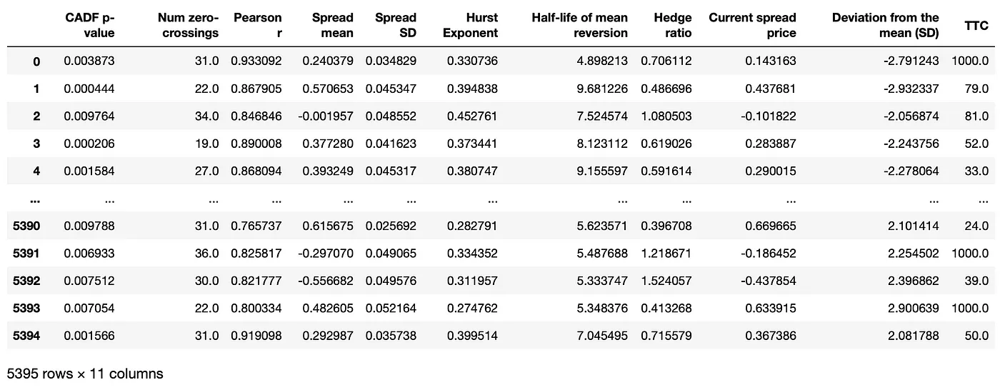
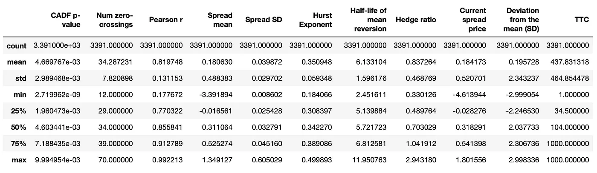
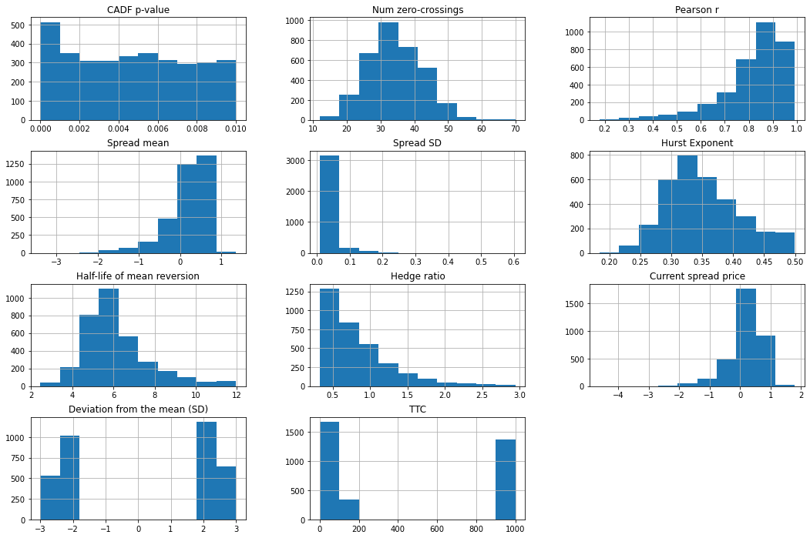
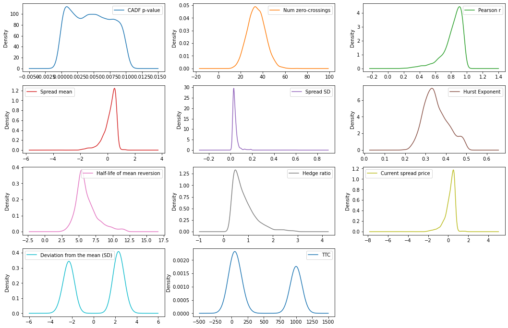

From pair trading - financial noob
- https://github.com/financialnoob/pairs_trading/blob/main/6.pairs_trading.pairs_selection.cointegration_3.ipynb
- https://financialnoob.substack.com/p/pairs-trading-pair-selection-cointegration-b0b?utm_source=profile&utm_medium=reader2

# Pairs trading. Pairs selection. Cointegration (part 3)

Tôi tin rằng nhược điểm chính của tất cả các phương pháp lựa chọn cặp mà chúng ta đã thử nghiệm cho đến nay là giả định rằng điều kiện thị trường không thay đổi trong suốt giai đoạn giao dịch. Chúng ta đã phân tích dữ liệu giá và đánh giá cặp nào phù hợp để giao dịch chỉ một lần vào đầu kỳ. Sau đó, chúng ta giả định rằng mối quan hệ giữa hai cổ phiếu trong các cặp được chọn sẽ tiếp tục hành xử giống như trước đây. Tôi nghĩ rằng giả định này là không thực tế trong các thị trường tài chính hiện đại, vốn có xu hướng rất năng động.

Trong bài viết này, tôi muốn kiểm tra cách các phương pháp lựa chọn cặp của chúng ta sẽ hoạt động nếu giới hạn giai đoạn giao dịch trong một tháng. Đây là những gì tôi muốn làm:

- Sử dụng giai đoạn hình thành 12 tháng để chọn các cặp tiềm năng cho giao dịch (sử dụng các điều kiện tương tự như trong bài viết trước).

- Trong tất cả các cặp tiềm năng, chỉ chọn những cặp có *standard deviations* lớn hơn 2 và ít hơn 3 so với *historical mean* vào ngày cuối cùng của **formation period**.

- Thực hiện và đánh giá hiệu suất của một số thuật toán máy học trong việc dự đoán xem các cặp được chọn có khả năng hội tụ trong 30 ngày tiếp theo hay không.

- Ước tính liệu hiệu suất đạt được có đủ để tạo ra một chiến lược giao dịch có lợi nhuận hay không.

Tôi sẽ sử dụng dữ liệu giá lịch sử cho các cổ phiếu từ **Vanguard Small-Cap Value Index Fund (VBR)** từ ngày 01.07.2016 đến ngày 31.12.2019. Giai đoạn hình thành sẽ kéo dài 12 tháng và tôi sẽ cuộn tiến mỗi tháng - *roll it one month forward* để có tổng cộng 24 giai đoạn.

```python
import pandas as pd
import numpy as np
import matplotlib.pyplot as plt

#===========================================================================
prices = pd.read_csv('vbr16_19.csv', index_col='Date')

# calculate cumulative returns
cumret = np.log(prices).diff().cumsum()+1
cumret.dropna(how='all', inplace=True)
cumret.dropna(axis=1, inplace=True)

#===========================================================================
# define a set of formation\trading periods
periods = [('2016-07-01', '2017-07-01', '2017-07-01', '2018-01-01'),
           ('2016-08-01', '2017-08-01', '2017-08-01', '2018-02-01'),
           ('2016-09-01', '2017-09-01', '2017-09-01', '2018-03-01'),
           ('2016-10-01', '2017-10-01', '2017-10-01', '2018-04-01'),
           ('2016-11-01', '2017-11-01', '2017-11-01', '2018-05-01'),
           ('2016-12-01', '2017-12-01', '2017-12-01', '2018-06-01'),
           ('2017-01-01', '2018-01-01', '2018-01-01', '2018-07-01'),
           ('2017-02-01', '2018-02-01', '2018-02-01', '2018-08-01'),
           ('2017-03-01', '2018-03-01', '2018-03-01', '2018-09-01'),
           ('2017-04-01', '2018-04-01', '2018-04-01', '2018-10-01'),
           ('2017-05-01', '2018-05-01', '2018-05-01', '2018-11-01'),
           ('2017-06-01', '2018-06-01', '2018-06-01', '2018-12-01'),
           ('2017-07-01', '2018-07-01', '2018-07-01', '2019-01-01'),
           ('2017-08-01', '2018-08-01', '2018-08-01', '2019-02-01'),
           ('2017-09-01', '2018-09-01', '2018-09-01', '2019-03-01'),
           ('2017-10-01', '2018-10-01', '2018-10-01', '2019-04-01'),
           ('2017-11-01', '2018-11-01', '2018-11-01', '2019-05-01'),
           ('2017-12-01', '2018-12-01', '2018-12-01', '2019-06-01'),
           ('2018-01-01', '2019-01-01', '2019-01-01', '2019-07-01'),
           ('2018-02-01', '2019-02-01', '2019-02-01', '2019-08-01'),
           ('2018-03-01', '2019-03-01', '2019-03-01', '2019-09-01'),
           ('2018-04-01', '2019-04-01', '2019-04-01', '2019-10-01'),
           ('2018-05-01', '2019-05-01', '2019-05-01', '2019-11-01'),
           ('2018-06-01', '2019-06-01', '2019-06-01', '2019-12-01'),
           ('2018-07-01', '2019-07-01', '2019-07-01', '2020-01-01')]

#===========================================================================
def parse_pair(pair):
    '''
    parse pair string S1-S2
    return tickers S1, S2
    '''
    dp = pair.find('-')
    s1 = pair[:dp]
    s2 = pair[dp+1:]
    
    return s1,s2

def calculate_halflife(spread):
    '''
    calculate half-life of mean reversion of the spread
    '''
    from statsmodels.regression.linear_model import OLS
    from statsmodels.tools.tools import add_constant
    
    ylag = spread.shift()
    deltay = spread - ylag
    ylag.dropna(inplace=True)
    deltay.dropna(inplace=True)

    res = OLS(deltay, add_constant(ylag)).fit()
    halflife = -np.log(2)/res.params[0]
    
    return halflife

def select_pairs(cumret_form, cumret_trade):
    '''
    select pairs using data from train dataframe
    return dataframe of selected pairs
    '''
    tested = []

    from statsmodels.regression.linear_model import OLS
    from statsmodels.tools.tools import add_constant
    from hurst import compute_Hc
    from statsmodels.tsa.stattools import adfuller
    from statsmodels.tsa.stattools import coint

    cols = ['CADF p-value', 'Num zero-crossings', 'Pearson r', 'Spread mean', 'Spread SD', 'Hurst Exponent', 
            'Half-life of mean reversion', 'Hedge ratio', 'Current spread price']
    pairs = pd.DataFrame(columns=cols)

    for s1 in cumret_form.columns:
        for s2 in cumret_form.columns:
            if s1!=s2 and (f'{s1}-{s2}' not in tested):
                tested.append(f'{s1}-{s2}')
                cadf_p = coint(cumret_form[s1], cumret_form[s2])[1]
                if cadf_p<0.01 and (f'{s2}-{s1}' not in pairs.index): # stop if pair already added as s2-s1
                    res = OLS(cumret_form[s1], add_constant(cumret_form[s2])).fit()
                    hedge_ratio = res.params[s2]
                    if hedge_ratio > 0: # hedge ratio should be posititve
                        spread_form = cumret_form[s1] - hedge_ratio*cumret_form[s2]
                        spread_mean = spread_form.mean()
                        spread_std = spread_form.std()
                        hurst = compute_Hc(spread_form)[0]
                        if hurst<0.5:
                            halflife = calculate_halflife(spread_form)
                            if halflife>1 and halflife<12:
                                # subtract the mean to calculate num_crossings
                                spread_nm = spread_form - spread_form.mean() 
                                num_crossings = (spread_nm.values[1:] * spread_nm.values[:-1] < 0).sum()
                                if num_crossings>len(cumret_form.index)/252*12: 
                                    pearson_r = np.corrcoef(cumret_form[s1], cumret_form[s2])[0][1]
                                    pairs.loc[f'{s1}-{s2}'] = [cadf_p, num_crossings, pearson_r, spread_mean, 
                                                               spread_std, hurst, halflife, hedge_ratio, 
                                                               spread_form[-1]]
                                
    return pairs

#===================================================================================================================
cols = ['CADF p-value', 'Num zero-crossings', 'Pearson r', 'Spread mean', 'Spread SD', 'Hurst Exponent', 
        'Half-life of mean reversion', 'Hedge ratio', 'Current spread price', 'Deviation from the mean (SD)', 'TTC']
data = pd.DataFrame(columns=cols)

for form_start,form_end,trade_start,trade_end in periods:
    print(f'Processing period {form_start} : {trade_end}')
    # select prices for formation and trading periods
    cumret_tmp = cumret[form_start:trade_end]
    cumret_tmp = cumret_tmp/cumret_tmp.iloc[0]
    cumret_form = cumret_tmp[:form_end]
    cumret_trade = cumret_tmp[trade_start:]
    
    # select potential pairs
    pairs_tmp = select_pairs(cumret_form, cumret_trade)
    
    # calculate current deviation from the mean (in standard deviations)
    pairs_tmp['Deviation from the mean (SD)'] = (pairs_tmp['Current spread price'] - 
                                                 pairs_tmp['Spread mean'])/pairs_tmp['Spread SD']
    # separate deviated pairs
    deviated_pairs = pairs_tmp[(abs(pairs_tmp['Deviation from the mean (SD)'])>=2) & 
                               (abs(pairs_tmp['Deviation from the mean (SD)'])<=3)].copy()
    
    # calculate time to converge (in days)
    for pair in deviated_pairs.index:
        s1,s2 = parse_pair(pair)
        hedge_ratio = deviated_pairs.loc[pair]['Hedge ratio']
        spread_mean = deviated_pairs.loc[pair]['Spread mean']
        spread_dev = deviated_pairs.loc[pair]['Deviation from the mean (SD)']
        spread_trade = cumret_trade[s1] - hedge_ratio*cumret_trade[s2]
        # calculate time to convergence
        if spread_dev<0 and len(spread_trade[spread_trade>spread_mean])>0:
            deviated_pairs.loc[pair, ['TTC']] = (pd.to_datetime(spread_trade[spread_trade>spread_mean].index[0])
                                                 - pd.to_datetime(trade_start)).days
        elif spread_dev>0 and len(spread_trade[spread_trade<spread_mean])>0:
            deviated_pairs.loc[pair, ['TTC']] = (pd.to_datetime(spread_trade[spread_trade<spread_mean].index[0])
                                                 - pd.to_datetime(trade_start)).days
        else:
            deviated_pairs.loc[pair, ['TTC']] = 1000
    
    # save data
    data = pd.concat([data,deviated_pairs], axis=0, ignore_index=True)
```

Sau khi xử lý toàn bộ 24 giai đoạn, chúng ta sẽ có bộ dữ liệu dưới đây.

<center>


</center>

Cột cuối cùng (**TTC**) biểu thị số ngày lịch mà *spread* mất để quay trở lại *historical mean* của nó. Giá trị bằng 1000 nếu spread không hội tụ trong vòng 6 tháng tiếp theo.

Trước khi tiến hành xa hơn, tôi đã loại bỏ các mẫu có *hedge ratio* quá lớn hoặc quá nhỏ: lớn hơn 3 hoặc nhỏ hơn 0.33.

```python
# filter too big and too small hedge ratios
data = data[(data['Hedge ratio']<3) & (data['Hedge ratio'] > 0.33)]

data.dtypes
```

`Output`
CADF p-value                    float64
Num zero-crossings              float64
Pearson r                       float64
Spread mean                     float64
Spread SD                       float64
Hurst Exponent                  float64
Half-life of mean reversion     float64
Hedge ratio                     float64
Current spread price            float64
Deviation from the mean (SD)    float64
TTC                             float64
dtype: object


Sau đó, chúng ta còn lại 3391 mẫu. Thống kê tóm tắt được cung cấp bên dưới.

```python
data.describe()
```

<center>


Summary statistic of the data
</center>

```python
data.corr()
```

Bây giờ hãy nhìn vào *correlation matrix*.

<center>


Correlation matrix
</center>

```python
_ = data.hist(figsize=(18,12))
```



```python
_ = data.plot(kind='density', subplots=True, layout=(4,3), sharex=False, figsize=(18,12))
```



