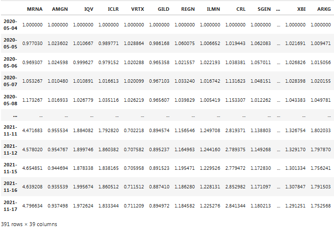
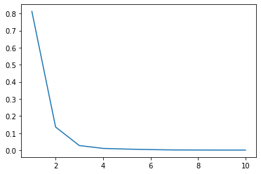
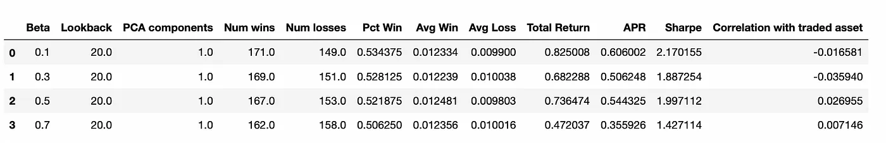
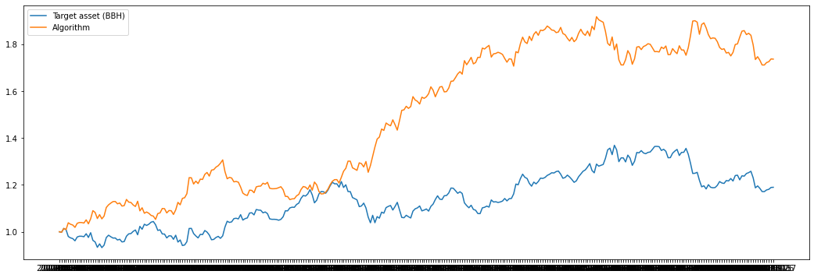
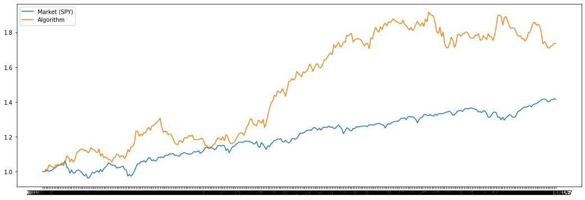
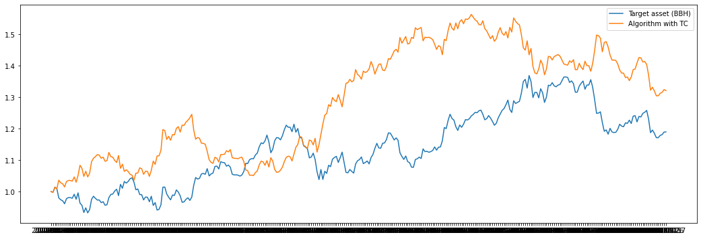
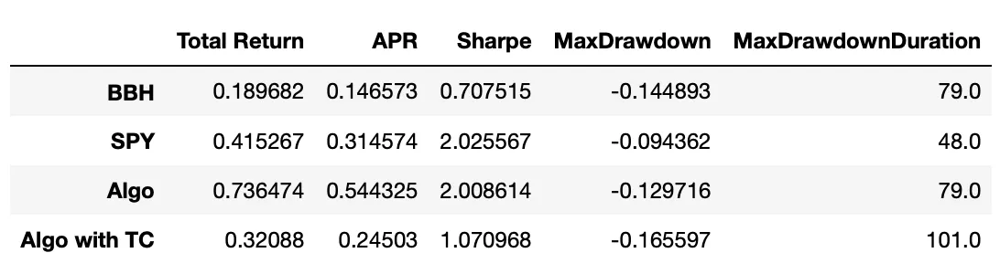
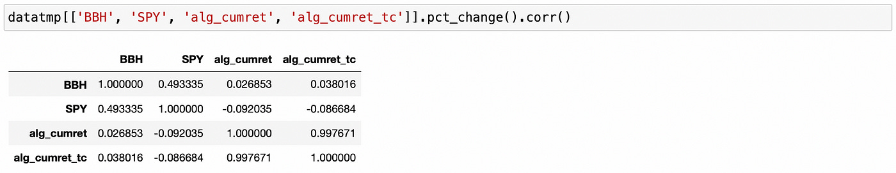

From pair **trading** - financial noob
- https://financialnoob.substack.com/p/pairs-trading-with-support-vector?utm_source=profile&utm_medium=reader2
- https://github.com/financialnoob/pairs_trading/blob/main/7.pair_trading.svr_v1.ipynb

Trong bài viết này, tôi sẽ triển khai và kiểm tra một chiến lược giao dịch lấy cảm hứng từ bài báo [*'Data mining for algorithmic asset management: an ensemble learning approach'*](https://www.researchgate.net/publication/226307803_Data_Mining_for_Algorithmic_Asset_Management) (Montana, Parella, 2009). 

Chiến lược được trình bày trong bài báo không thực sự là một chiến lược *pairs trading*. Thay vào đó, nó sử dụng một tài sản tổng hợp - *synthetic asset* (được tạo ra từ nhiều luồng dữ liệu cắt ngang - *cross-sectional data streams*) để xác định xem tài sản mục tiêu (tài sản mà chúng ta giao dịch) đang bị định giá *overpriced* hay *underpriced*.

Ý tưởng chung của thuật toán như sau:

- **Bắt đầu với (n+1) luồng dữ liệu**: giá của tài sản mục tiêu cộng với n luồng dữ liệu khác được sử dụng để xác định giá hợp lý của tài sản -  *fair price of the asset* (giá của các tài sản khác, các yếu tố thị trường, *indicators*, v.v.).
- **Tại mỗi bước thời gian** (hàng ngày trước khi thị trường đóng cửa), ước tính giá hợp lý của tài sản mục tiêu từ các dữ liệu thị trường khác bằng thuật toán *Support Vector Regression* (**SVR**).
- Nếu **fair price thấp hơn giá thị trường hiện tại**, bán tài sản mục tiêu (go short).
- Nếu **fair price cao hơn giá thị trường hiện tại**, mua tài sản mục tiêu (go long).

Số lượng luồng dữ liệu được sử dụng để ước tính giá hợp lý có thể khá lớn và nhiều trong số đó có thể *correlated* cao với nhau, gây dư thừa thông tin cho thuật toán. Để giải quyết vấn đề này, **Phân tích Thành phần Chính - Principal Component Analysis (PCA)** được sử dụng để trích xuất các đặc trưng quan trọng nhất và không tương quan với nhau. Các đặc trưng này sau đó được sử dụng làm đầu vào cho mô hình **SVR**.

Mô hình *Support Vector Regression* (**SVR**) có một số siêu tham số - *hyperparameters* cần xác định:
- **C** – tham số điều chuẩn.
- **gamma** – hệ số hạt nhân - *kernel coefficient* (ký hiệu là sigma trong bài báo).
- **epsilon** – độ rộng của vùng mà trong đó không áp dụng phạt trong hàm mất mát - *The width of the tube within which no penalty is given in the loss function*.

Thay vì cố gắng xác định một tập hợp cố định các siêu tham số để sử dụng, một tập hợp mô hình (được gọi là *experts* trong bài báo) được huấn luyện, và thuật toán **Weighted Majority Voting (WMV)** được sử dụng để đưa ra dự đoán cuối cùng. Tác giả đã sử dụng tổng cộng **2560 mô hình**, mỗi mô hình có một tập hợp siêu tham số khác nhau.

Thuật toán WMV hoạt động như sau:

- **Tất cả các mô hình bắt đầu với trọng số bằng một**.
- Mỗi mô hình được huấn luyện trên dữ liệu đầu vào và được sử dụng để dự đoán hướng đi tiếp theo của thị trường (liệu giá của tài sản mục tiêu sẽ tăng hay giảm vào ngày hôm sau).
- Quyết định cuối cùng được xác định bằng cách so sánh tổng trọng số của các mô hình dự đoán rằng giá sẽ tăng với tổng trọng số của các mô hình dự đoán rằng giá sẽ giảm.
- Nếu quyết định cuối cùng là đúng, **không có điều chỉnh nào đối với trọng số**.
- Nếu quyết định cuối cùng là sai, thì trọng số của các mô hình sai sẽ được nhân với tham số **beta** (tham số này được người dùng chọn và có giá trị từ 0 đến 1).

Thuật toán này cho phép điều chỉnh với điều kiện thị trường động bằng cách giảm dần trọng số của các mô hình mắc nhiều lỗi.

Trong bài báo, các tác giả mô tả các thuật toán gia tăng cho cả **PCA** và **SVR**, cho phép cập nhật các mô hình tại mỗi bước mà không cần phải huấn luyện lại. Tuy nhiên, tôi chưa thể hoàn toàn hiểu và triển khai các thuật toán gia tăng này, vì vậy tôi quyết định thử nghiệm chiến lược tương tự nhưng sử dụng **PCA** và **SVR** thông thường (không phải gia tăng).

Tài sản mục tiêu mà tôi sẽ sử dụng là **VanEck Biotech ETF (BBH)**. Các luồng dữ liệu khác (được sử dụng làm đầu vào) bao gồm giá của danh mục **ETF** này, giá của các **ETF** công nghệ sinh học khác và giá của **SPY ETF**.

Để kiểm tra lại chiến lược này, chúng ta cần xác định một số tham số, cụ thể là:

- **Tham số *beta*** để giảm trọng số của các mô hình sai. (Trong bài báo, nhiều giá trị khác nhau được thử nghiệm).

- **Số lượng thành phần chính (principal components)** để trích xuất và sử dụng làm đặc trưng. (Trong bài báo, chỉ một thành phần được sử dụng).

- **Số lượng mô hình cần huấn luyện**, cũng như các giá trị của siêu tham số mô hình được sử dụng trong lưới tìm kiếm. (Trong bài báo, 2560 mô hình được sử dụng, nhưng không có thông tin về các giá trị chính xác của các siêu tham số. Chỉ các khoảng giá trị được cung cấp: *epsilon* thay đổi trong khoảng từ 0.00000001 đến 0.1, **C** và **gamma** thay đổi từ 0.0001 đến 1000).

- **Số ngày giao dịch cuối cùng** được sử dụng để huấn luyện mô hình. (Trong bài báo, 20 ngày cuối cùng được sử dụng).

Tôi cũng sẽ thử nghiệm một số giá trị của **beta** và số lượng thành phần chính khác nhau để xác định cái nào hoạt động tốt nhất. Tôi sẽ sử dụng số lượng mô hình nhỏ hơn - 512 mô hình. Số ngày giao dịch được sử dụng trong huấn luyện mô hình sẽ được giữ nguyên - 20 ngày.

Let’s get started.

```python
import pandas as pd
import numpy as np
import matplotlib.pyplot as plt
import requests
from time import sleep

bbh =  ['MRNA', 'AMGN', 'IQV', 'ICLR', 'VRTX', 'GILD', 'REGN', 'ILMN', 'CRL', 'SGEN', 'ILMN', 
            'BIIB', 'TECH', 'BNTX', 'BGNE', 'EXAS', 'ALNY', 'NVAX', 'QGEN', 'GH', 'NTRA', 'BMRN', 
            'INCY', 'TXG', 'NTLA', 'CRSP', 'BBH']
other_etfs = ['SPY', 'IBB', 'XBI', 'ARKG', 'FBT', 'LABU', 'IDNA', 'PBE', 'GNOM', 'BIB', 'SBIO', 'BTEC']
symbols = bbh + other_etfs

#====================================================
data = pd.read_csv('biotech_av_v1.csv', index_col=0)

# transform prices into cumulative returns
data = (data.pct_change()+1).cumprod()
data = data.iloc[1:]
data = data / data.iloc[0]

print(data)
```

<center>


</center>

`data.columns`

`Output`

```python
Index(['MRNA', 'AMGN', 'IQV', 'ICLR', 'VRTX', 'GILD', 'REGN', 'ILMN', 'CRL',
       'SGEN', 'ILMN.1', 'BIIB', 'TECH', 'BNTX', 'BGNE', 'EXAS', 'ALNY',
       'NVAX', 'QGEN', 'GH', 'NTRA', 'BMRN', 'INCY', 'TXG', 'NTLA', 'CRSP',
       'BBH', 'SPY', 'IBB', 'XBI', 'ARKG', 'FBT', 'LABU', 'IDNA', 'PBE',
       'GNOM', 'BIB', 'SBIO', 'BTEC'],
      dtype='object')
```

Sau đó, tôi tách giá của tài sản mục tiêu khỏi các dữ liệu đầu vào khác.

```python
# input data
s = ['MRNA', 'AMGN', 'IQV', 'ICLR', 'VRTX', 'GILD', 'REGN', 'ILMN', 'CRL',
     'SGEN', 'ILMN.1', 'BIIB', 'TECH', 'BNTX', 'BGNE', 'EXAS', 'ALNY',
     'NVAX', 'QGEN', 'GH', 'NTRA', 'BMRN', 'INCY', 'TXG', 'NTLA', 'CRSP',
     'SPY', 'IBB', 'XBI', 'ARKG', 'FBT', 'LABU', 'IDNA', 'PBE',
     'GNOM', 'BIB', 'SBIO', 'BTEC']
# target asset
y = ['BBH']
```

Bây giờ, tôi muốn xem số lượng thành phần chính nào là hợp lý để sử dụng. Để làm điều này, tôi sẽ sử dụng biểu đồ Scree.

---

### PCA scree plot

```python
from sklearn.decomposition import PCA

Xtmp = data[s] # select data without the target asset
pca = PCA(n_components=10)
pca.fit(Xtmp)

n_comp = np.arange(1,11)
plt.plot(n_comp, pca.explained_variance_ratio_)
```

`Output` [<matplotlib.lines.Line2D at 0x7fce98362dc0>]

<center>


PCA scree plot
</center>

```python
pca.explained_variance_ratio_
```

`Output`

```python
array([8.12122960e-01, 1.35439425e-01, 2.70884325e-02, 1.04287168e-02,
       6.36786132e-03, 3.39209482e-03, 1.34305394e-03, 9.38947133e-04,
       6.07863391e-04, 5.34904941e-04])
```

Chúng ta thấy rằng tỷ lệ phương sai giải thích - *explained variance ratio* giảm đáng kể sau thành phần thứ 2-3. Vì vậy, tôi nghĩ rằng chúng ta nên trích xuất không quá 3 thành phần chính làm các đặc trưng.

Trước tiên, tôi sẽ kiểm tra ngược với các giá trị khác nhau của **beta**, giữ cố định số lượng thành phần chính.

```python
# strategy parameters
betas = [0.1,0.3,0.5,0.7] # betas for downgrading weights
lookbacks = [20] # how many last trading days to include in model training
pca_comps = [1] # number of principal components to use
```

Và các giá trị sau đây của siêu tham số **SVR** (dẫn đến 8 * 8 * 8 = 512 mô hình):

```python
# SVR hyperparameters
Cs = set((0.0001, 0.001, 0.01, 0.1, 1, 10, 100, 1000))
gammas = set((0.0001, 0.001, 0.01, 0.1, 1, 10, 100, 1000))
epsilons = set((0.00000001, 0.0000001, 0.000001, 0.00001, 0.0001, 0.001, 0.01, 0.1))
```

### Parameter selection

```python
from sklearn.svm import SVR
from sklearn.preprocessing import StandardScaler
from sklearn.pipeline import make_pipeline
from itertools import product

def compute_votes(data, pca_comp, beta, lookback, Cs, gammas, epsilons):
    '''
    compute daily votes of the models with the given parameters
    '''
    # start with equal weights
    weights = np.ones(len(Cs)*len(gammas)*len(epsilons))
    weights = weights/sum(weights) # normalize so that weights sum to 1

    daily_votes = np.zeros(len(data.index))

    for t in range(lookback,len(data.index)-1):
        predictions = []
        for C,gamma,epsilon in product(Cs,gammas,epsilons):
            model = make_pipeline(StandardScaler(), PCA(n_components=pca_comp), 
                                  SVR(C=C, gamma=gamma, epsilon=epsilon))
            X_train = data[s].iloc[t-lookback:t+1].values
            y_train = data[y].iloc[t-lookback:t+1].values.flatten()
            model.fit(X_train,y_train)
            X_test = data[s].iloc[t].values.reshape(1,-1)
            yhat = model.predict(X_test)
            predictions.append(yhat)
        # log all votes
        votes = -np.sign(data[y].iloc[t].values.flatten() - np.array(predictions)) # if price>fair, go short
        final_vote = np.dot(weights,votes)
        daily_votes[t] = final_vote   

        # update weights based on true direction
        true_direction = np.sign((data[y].iloc[t+1] - data[y].iloc[t]).values.flatten()) 
        if final_vote!=true_direction:
            incorrect_votes_ind = np.where(votes!=true_direction)[0]
            weights[incorrect_votes_ind] = beta * weights[incorrect_votes_ind]
            weights = weights/sum(weights)

    return daily_votes

#======================================================================================
columns = ['Beta', 'Lookback', 'PCA components', 'Num wins', 'Num losses', 'Pct Win', 
           'Avg Win', 'Avg Loss', 'Total Return', 'APR', 'Sharpe', 'Correlation with traded asset']
results = pd.DataFrame(columns=columns)

for pca_comp,beta,lookback in product(pca_comps,betas,lookbacks):
    daily_votes = compute_votes(data, pca_comp=pca_comp, beta=beta, lookback=lookback, 
                                Cs=Cs, gammas=gammas, epsilons=epsilons)
    
    datatmp = data[['BBH']].iloc[lookback+50:].copy() # skip first 50 days
    datatmp['vote'] = daily_votes[lookback+50:]
    datatmp['vote'] = datatmp['vote'].shift()
    datatmp['BBH_returns'] = datatmp['BBH'].pct_change()
    datatmp['alg_returns'] = (np.sign(datatmp['vote']) * datatmp['BBH_returns'])
    datatmp['alg_cumret'] = np.cumprod(datatmp['alg_returns']+1)
    
    datatmp.dropna(inplace=True)
    
    num_wins = (np.sign(datatmp[['BBH_returns']].values) == np.sign(datatmp[['vote']].values)).sum()
    num_losses = (np.sign(datatmp[['BBH_returns']].values) != np.sign(datatmp[['vote']].values)).sum()
    pct_win = num_wins / (num_wins + num_losses)
    avg_win = abs(datatmp[np.sign(datatmp['BBH_returns']) == np.sign(datatmp['vote'])]['BBH_returns']).sum()/num_wins
    avg_loss = abs(datatmp[np.sign(datatmp['BBH_returns']) != np.sign(datatmp['vote'])]['BBH_returns']).sum()/num_losses
    total_return = (datatmp['alg_cumret'][-1] - datatmp['alg_cumret'][0]) / datatmp['alg_cumret'][0]
    apr = (1+total_return)**(252/len(datatmp.index)) - 1
    sharpe = np.sqrt(252)*datatmp['alg_returns'].mean() / datatmp['alg_returns'].std()
    corrcoef = np.corrcoef(datatmp['BBH_returns'], datatmp['alg_returns'])[0,1]
    
    results = results.append({'Beta':beta, 'Lookback':lookback, 'PCA components':pca_comp, 
                              'Num wins':num_wins, 'Num losses':num_losses, 'Pct Win':pct_win, 
                              'Avg Win':avg_win, 'Avg Loss':avg_loss, 'Total Return':total_return, 
                              'APR':apr, 'Sharpe':sharpe, 'Correlation with traded asset':corrcoef}, 
                              ignore_index=True)


print(results)
```
Tôi bỏ qua 50 ngày đầu tiên khi tính toán hiệu suất của chiến lược để cho phép trọng số của thuật toán *WMV* điều chỉnh. Dưới đây là kết quả tôi nhận được:



### Model: beta=0.5, pca_comp=1

```python
daily_votes = compute_votes(data, pca_comp=1, beta=0.5, lookback=20, 
                            Cs=Cs, gammas=gammas, epsilons=epsilons)
    
datatmp = data[['BBH']].iloc[lookback+50:].copy() # skip first 50 days
datatmp['vote'] = daily_votes[lookback+50:]
datatmp['vote'] = datatmp['vote'].shift()
datatmp['BBH_returns'] = datatmp['BBH'].pct_change()
datatmp['alg_returns'] = (np.sign(datatmp['vote']) * datatmp['BBH_returns'])
datatmp['alg_cumret'] = np.cumprod(datatmp['alg_returns']+1)
datatmp.dropna(inplace=True)

#======================================================================================
plt.figure(figsize=(18,6))
plt.plot(datatmp[['BBH']]/datatmp[['BBH']].iloc[0], label='Target asset (BBH)')
plt.plot(datatmp[['alg_cumret']]/datatmp[['alg_cumret']].iloc[0], label='Algorithm')
plt.legend()
```

`Output` <matplotlib.legend.Legend at 0x7fce8110af10>

<center>


Cumulative returns of the strategy and the target asset
</center>

```python
datatmp['SPY'] = data.loc[datatmp.index, ['SPY']]

plt.figure(figsize=(18,6))
plt.plot(datatmp[['SPY']]/datatmp[['SPY']].iloc[0], label='Market (SPY)')
plt.plot(datatmp[['alg_cumret']]/datatmp[['alg_cumret']].iloc[0], label='Algorithm')
plt.legend()
```

`Output` <matplotlib.legend.Legend at 0x7fce80db25e0>

<center>


Cumulative returns of the strategy and the market
</center>

```python
# create an indicator of positions change
# -1 when we change position from long to short or vice versa
datatmp['pos_change'] = np.sign(datatmp['vote'])*np.sign(datatmp['vote'].shift())
datatmp['pos_change'][datatmp['pos_change']!=-1]=0
# subtract 0.2% fee from the return when we change position
datatmp['alg_returns_tc'] = datatmp['alg_returns'] + 0.002 * datatmp['pos_change']
# calculate cumulative returns with transaction costs
datatmp['alg_cumret_tc'] = np.cumprod(datatmp['alg_returns_tc']+1)


plt.figure(figsize=(18,6))
plt.plot(datatmp[['BBH']]/datatmp[['BBH']].iloc[0], label='Target asset (BBH)')
plt.plot(datatmp[['alg_cumret_tc']]/datatmp[['alg_cumret_tc']].iloc[0], label='Algorithm with TC')
plt.legend()
```

`Output` <matplotlib.legend.Legend at 0x7fce80db2910>

<center>


Cumulative returns of the strategy (with transaction costs) and the target asset
</center>

```python
def calculate_metrics(cumret):
    '''
    calculate performance metrics from cumulative returns
    '''
    total_return = (cumret[-1] - cumret[0])/cumret[0]
    apr = (1+total_return)**(252/len(cumret)) - 1
    sharpe = np.sqrt(252) * np.nanmean(cumret.pct_change()) / np.nanstd(cumret.pct_change())
    
    # maxdd and maxddd
    highwatermark=np.zeros(cumret.shape)
    drawdown=np.zeros(cumret.shape)
    drawdownduration=np.zeros(cumret.shape)
    for t in np.arange(1, cumret.shape[0]):
        highwatermark[t]=np.maximum(highwatermark[t-1], cumret[t])
        drawdown[t]=cumret[t]/highwatermark[t]-1
        if drawdown[t]==0:
            drawdownduration[t]=0
        else:
            drawdownduration[t]=drawdownduration[t-1]+1
    maxDD=np.min(drawdown)
    maxDDD=np.max(drawdownduration)
    
    return total_return, apr, sharpe, maxDD, maxDDD
metrics = pd.DataFrame(columns=['Total Return', 'APR', 'Sharpe', 'MaxDrawdown', 'MaxDrawdownDuration'], 
                       index=['BBH', 'SPY', 'Algo', 'Algo with TC'])

metrics.loc['BBH',:] = calculate_metrics(datatmp['BBH'])
metrics.loc['SPY',:] = calculate_metrics(datatmp['SPY'])
metrics.loc['Algo',:] = calculate_metrics(datatmp['alg_cumret'])
metrics.loc['Algo with TC',:] = calculate_metrics(datatmp['alg_cumret_tc'])

metrics
```
<center>


Performance metrics
</center>

```python
datatmp[['BBH', 'SPY', 'alg_cumret', 'alg_cumret_tc']].pct_change().corr()
```

<center>


Correlations of daily returns
</center>