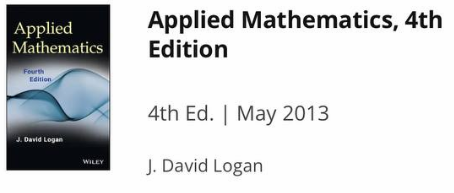
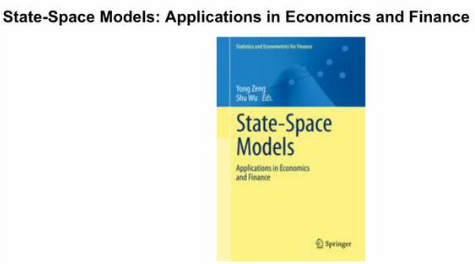
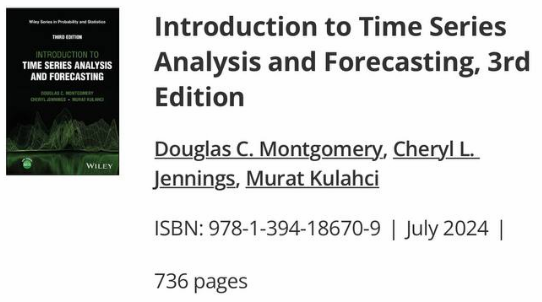
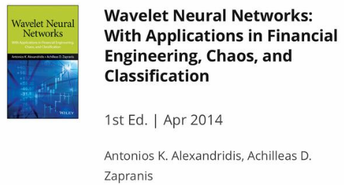
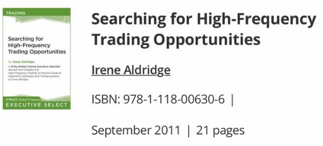
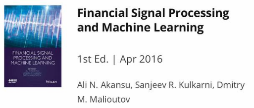

## Math

---

## Time-series

---
- https://en.m.wikipedia.org/wiki/Time_series

- https://200lab.io/blog/kham-pha-time-series-analysis-phan-1?srsltid=AfmBOoolI_obkS3X0VzUaTue5Z_qWWrOdUw2O7xU0VdQO4doXk9uWdv4
https://bookdown.org/rushad_16/TSA_Lectures_book/
---

## Machine learing

https://machinelearningmastery.com/products/

---

## Introduction & Collections

Liu Peng

- https://youtube.com/playlist?list=PLA2Lu2TlMqzVPeD043744URgdejZf1vlr&si=3tjhwIeTegsR1u4O

(Quantopian) quantrocket-codeload/quant-finance-lectures 

- https://github.com/quantrocket-codeload/quant-finance-lectures/blob/master/quant_finance_lectures/Lecture42-Introduction-to-Pairs-Trading.ipynb

- https://gist.github.com/ih2502mk/50d8f7feb614c8676383431b056f4291

Portfolio Optimization

- https://bookdown.org/palomar/portfoliooptimizationbook/15.1-mean-reversion.html

TheQuantPy

- https://github.com/TheQuantPy/youtube-tutorials

---

## Roadmap

- https://medium.com/@akjha22/the-quants-blueprint-a-roadmap-for-building-a-career-in-quantitative-finance-fa5218f81e7b

- https://medium.com/@akjha22/the-quants-blueprint-a-roadmap-for-building-a-career-in-quantitative-finance-fa5218f81e7b

- https://medium.com/@nikitasinghiitk/how-to-prepare-for-quant-roles-a-complete-6-month-roadmap-1981c5050a3f

- https://www.facebook.com/share/p/15p4Uk3p7g/?mibextid=wwXIfr

---

## Strategy

Calculating S/R in python using K-means Clustering

- https://www.alpharithms.com/calculating-support-resistance-in-python-using-k-means-clustering-101517/

#### Momentum

Fast trend following

- https://open.substack.com/pub/quantitativo/p/fast-trend-following?r=1h6hhj&utm_medium=ios&utm_campaign=post

Trading the mean reversion curve

- https://www.quantitativo.com/p/trading-the-mean-reversion-curve

Momentum Strategy from "Stocks on the Move" in Python

- https://teddykoker.com/2019/05/momentum-strategy-from-stocks-on-the-move-in-python/

#### StatArb
1. Pairs Trading
    - https://www.quantifiedstrategies.com/pairs-trading-strategy/
    - https://www.youtube.com/watch?v=f73ItMWO4z8&t=345s
    - https://www.youtube.com/watch?v=JTucMRYMOyY&list=PLRFLF1OxMm_UL7WUWM31iynp0jMVf_vLW&index=4

    Financial noob:
    - https://github.com/financialnoob/pairs_trading?tab=readme-ov-file
    

#### AI for Trading

- https://community.quantopian.com/c/ai-for-trading

#### Signal-processing

