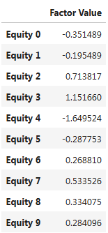
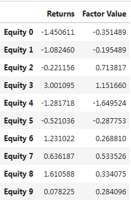
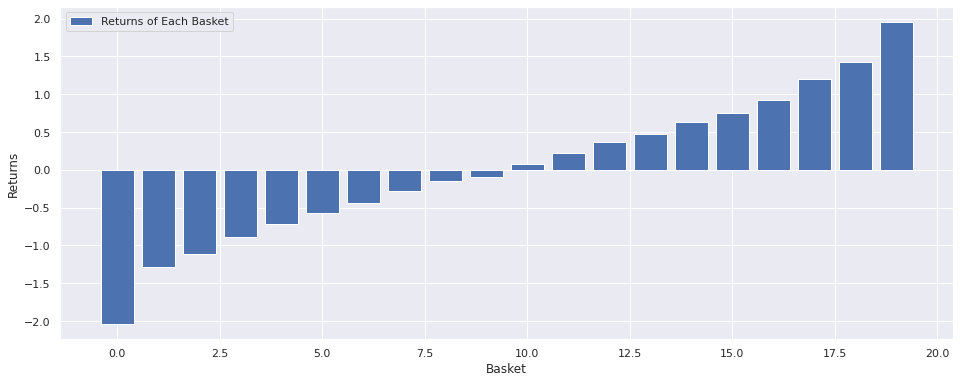

# Long-Short Equity Strategies

By Delaney Granizo-Mackenzie

Giao dịch *long-short equity* ám chỉ việc chiến lược vừa thực hiện vị thế **LONG** (mua) vừa thực hiện vị thế **SHORT** (bán) trên thị trường cổ phiếu. Đây là một khái niệm khá chung chung, nhưng theo thời gian đã phát triển thành một bộ các chiến lược cụ thể. Các chiến lược này xếp hạng tất cả cổ phiếu trên thị trường dựa trên một mô hình. Chiến lược sau đó sẽ thực hiện vị thế **LONG** (mua) với $n$ các cổ phiếu nằm trong nhóm đầu của bảng xếp hạng và thực hiện vị thế **SHORT** (bán) với $n$ các cổ phiếu nằm trong nhóm cuối, đồng thời duy trì giá trị bằng nhau giữa các vị thế **LONG** và **SHORT**.

Phương pháp này có ưu điểm là mang tính trung hòa thống kê, vì việc xếp hạng cổ phiếu và thực hiện hàng trăm hoặc hàng nghìn vị thế giúp giảm rủi ro thị trường. Bạn cũng đang đặt cược dựa trên chất lượng của mô hình xếp hạng thay vì chỉ dựa vào một vài cổ phiếu rủi ro. Ngoài ra, việc giữ cân bằng giá trị giữa các vị thế **LONG** và **SHORT** đảm bảo rằng chiến lược vẫn trung hòa với thị trường - *market neutral* (không bị ảnh hưởng bởi sự biến động của thị trường).

### Hệ thống xếp hạng (Ranking Scheme)

Hệ thống xếp hạng là bất kỳ mô hình nào có thể gán cho mỗi cổ phiếu một số thứ hạng, trong đó giá trị cao hơn là tốt hơn và giá trị thấp hơn là tệ hơn. Ví dụ, hệ thống có thể dựa trên các yếu tố giá trị, chỉ số kỹ thuật, mô hình định giá, hoặc sự kết hợp của tất cả các yếu tố trên. Hệ thống xếp hạng là phần quan trọng nhất trong chiến lược *long-short equity*, do đó việc phát triển nó không hề đơn giản.

### Đặt cược dựa trên hệ thống xếp hạng

Khi đã xác định được hệ thống xếp hạng, chúng ta sẽ tìm cách tận dụng nó để thu lợi nhuận. Điều này được thực hiện bằng cách đầu tư một lượng tiền bằng nhau vào nhóm cổ phiếu đầu bảng (**LONG**) và nhóm cuối bảng (**SHORT**). Điều này đảm bảo rằng chiến lược sẽ tạo ra lợi nhuận tương ứng với chất lượng của hệ thống xếp hạng và vẫn duy trì *market neutral*.

### LONG và SHORT Baskets

Nếu bạn đang xếp hạng **m** cổ phiếu, đầu tư **d** usd và tổng số lượng vị thế cần giữ là **2n**, thì rổ long và rổ short được tạo ra như sau:
- Đối với mỗi cổ phiếu ở các vị trí từ **1, 2, ..., n** trong bảng xếp hạng, bạn sell \(\frac{1}{2n} \times d\) usd của cổ phiếu đó.
- Đối với mỗi cổ phiếu ở các vị trí từ **m - n, ..., m** trong bảng xếp hạng, bạn buy \(\frac{1}{2n} \times d\) usd của cổ phiếu đó.

# Friction Because of Prices

Do giá cổ phiếu không phải lúc nào cũng chia đều cho \( \frac{1}{2n} \cdot d \), và cổ phiếu phải được mua với số lượng nguyên - *integer*, sẽ có một số sai lệch và thuật toán nên cố gắng tiến gần nhất có thể đến con số này. Hầu hết các thuật toán sẽ có quyền truy cập vào một số đòn bẩy trong quá trình thực thi, vì vậy việc mua hơi nhiều hơn \( \frac{1}{2n} \cdot d \) usd cho mỗi cổ phiếu là chấp nhận được. Tuy nhiên, điều này sẽ gây ra một số ma sát - *friction* khi vốn thấp. Đối với một chiến lược với \( d = 100000 \), và \( n = 500 \), ta có:

\[
\frac{1}{2n} \cdot d = \frac{1}{1000} \cdot 100000 = 100
\]

Điều này sẽ gây ra vấn đề lớn đối với các cổ phiếu có giá cao, và làm thuật toán bị sử dụng đòn bẩy quá mức. Vấn đề này có thể được khắc phục bằng cách giao dịch ít cổ phiếu hơn hoặc tăng vốn, \( d \). May mắn thay, các chiến lược cổ phiếu *long-short* thường có công suất - *capacity* rất lớn, vì vậy trong hầu hết các trường hợp, không có giới hạn trên về số tiền mà một người có thể đầu tư.

# Lợi Nhuận Đến Từ Sự Chênh Lệch Xếp Hạng - Returns Come From The Ranking Spread

Lợi nhuận của một chiến lược *long-short equity* phụ thuộc vào mức độ tốt mà sự chênh lệch xếp hạng *spreads* giữa các *returns* cao và thấp. Để hiểu cách điều này hoạt động, hãy xem xét ví dụ giả định sau đây.

```python
import numpy as np
import pandas as pd
import matplotlib.pyplot as plt

# We'll generate a random factor
current_factor_values = np.random.normal(0, 1, 10000)
equity_names = ['Equity ' + str(x) for x in range(10000)]
# Put it into a dataframe
factor_data = pd.Series(current_factor_values, index = equity_names)
factor_data = pd.DataFrame(factor_data, columns=['Factor Value'])
# Take a look at the dataframe
factor_data.head(10)
```



```python
# Now let's say our future returns are dependent on our factor values
future_returns = current_factor_values + np.random.normal(0, 1, 10000)

returns_data = pd.Series(future_returns, index=equity_names)
returns_data = pd.DataFrame(returns_data, columns=['Returns'])
# Put both the factor values and returns into one dataframe
data = returns_data.join(factor_data)
# Take a look
data.head(10)
```



Bây giờ, khi đã có các giá trị yếu tố và lợi nhuận - *values and returns*, chúng ta có thể thấy điều gì sẽ xảy ra nếu chúng ta xếp hạng các cổ phiếu dựa trên giá trị yếu tố -  *factor values*, và sau đó thực hiện các vị thế mua và bán.

```python
# Rank the equities
ranked_data = data.sort_values('Factor Value')

# Compute the returns of each basket
# Baskets of size 500, so we create an empty array of shape (10000/500)
number_of_baskets = 10000//500
basket_returns = np.zeros(number_of_baskets)

for i in range(number_of_baskets):
    start = i * 500
    end = i * 500 + 500 
    basket_returns[i] = ranked_data[start:end]['Returns'].mean()

# Plot the returns of each basket
plt.bar(range(number_of_baskets), basket_returns)
plt.ylabel('Returns')
plt.xlabel('Basket')
plt.legend(['Returns of Each Basket']);
```



Hãy tính toán lợi nhuận nếu chúng ta mua nhóm cổ phiếu xếp hạng cao nhất và bán nhóm cổ phiếu xếp hạng thấp nhất.

```python
basket_returns[number_of_baskets-1] - basket_returns[0]
```

`Output` 4.000532530068508

# Market Neutrality is Built-In

Điều thú vị về việc kiếm tiền dựa trên *spread* xếp hạng là nó không bị ảnh hưởng bởi những gì thị trường làm.

```python
# We'll generate a random factor
current_factor_values = np.random.normal(0, 1, 10000)
equity_names = ['Equity ' + str(x) for x in range(10000)]
# Put it into a dataframe
factor_data = pd.Series(current_factor_values, index = equity_names)
factor_data = pd.DataFrame(factor_data, columns=['Factor Value'])

# Now let's say our future returns are dependent on our factor values
future_returns = -10 + current_factor_values + np.random.normal(0, 1, 10000)

returns_data = pd.Series(future_returns, index=equity_names)
returns_data = pd.DataFrame(returns_data, columns=['Returns'])
# Put both the factor values and returns into one dataframe
data = returns_data.join(factor_data)

# Rank the equities
ranked_data = data.sort_values('Factor Value')

# Compute the returns of each basket
# Baskets of size 500, so we create an empty array of shape (10000/500
number_of_baskets = 10000//500
basket_returns = np.zeros(number_of_baskets)

for i in range(number_of_baskets):
    start = i * 500
    end = i * 500 + 500 
    basket_returns[i] = ranked_data[start:end]['Returns'].mean()

basket_returns[number_of_baskets-1] - basket_returns[0]
```

`Output` 4.170357931065307

# Choice and Evaluation of a Ranking Scheme

Phương pháp xếp hạng là nơi chiến lược *long-short* có được lợi thế của nó và là thành phần quan trọng nhất. Việc chọn một phương pháp xếp hạng tốt là toàn bộ vấn đề, và đó không phải là câu trả lời dễ dàng. Một điểm khởi đầu tốt là chọn các kỹ thuật đã biết, và xem liệu bạn có thể sửa đổi chúng một chút để tăng lợi nhuận hay không. Thông tin thêm về cách xây dựng phương pháp xếp hạng có thể được tìm thấy trong các sổ ghi chú được liệt kê bên dưới.

Trong quá trình nghiên cứu phương pháp xếp hạng, điều quan trọng là xác định liệu phương pháp xếp hạng của bạn có thực sự dự đoán được lợi nhuận tương lai hay không. Điều này có thể được thực hiện bằng cách sử dụng **Spearman rank correlation**.

Thông tin về xây dựng và đánh giá các phương pháp xếp hạng có sẵn trong các bài giảng sau:

- Chọn lựa Vũ trụ (Universe Selection)
- Tương quan Xếp hạng Spearman (Spearman Rank Correlation)
- Phân tích Yếu tố với Alphalens (Factor Analysis with Alphalens)

# Long-Short is a Modular Strategy

Để thực thi một chiến lược *long-short equity*, về cơ bản bạn chỉ cần xác định phương pháp xếp hạng. Mọi thứ sau đó chỉ là thao tác cơ học. Một khi bạn có một chiến lược *long-short equity*, bạn có thể thay đổi các phương pháp xếp hạng khác nhau mà không cần thay đổi bất kỳ điều gì khác. Đây là một cách rất tiện lợi để nhanh chóng thử nghiệm các ý tưởng mà bạn có mà không cần phải lo lắng về việc điều chỉnh mã mỗi lần.

Các phương pháp xếp hạng có thể xuất phát từ hầu hết bất kỳ mô hình nào. Chúng không nhất thiết phải là một mô hình dựa trên các yếu tố giá trị, mà có thể là một kỹ thuật học máy dự đoán lợi nhuận trước một tháng và xếp hạng dựa trên đó.

# Rebalancing Frequency

Mỗi hệ thống xếp hạng sẽ dự đoán lợi nhuận trong một khung thời gian hơi khác nhau. Một hệ thống dựa trên giá với trung bình hồi quy có thể dự đoán trong vài ngày, trong khi một mô hình yếu tố dựa trên giá trị có thể dự đoán trong nhiều tháng. Điều quan trọng là xác định khung thời gian mà mô hình của bạn nên dự đoán, và xác minh điều đó một cách thống kê trước khi thực thi chiến lược của bạn. Bạn không muốn bị *overfit* bằng cách cố gắng *optimize the relabancing frequency*, vì điều đó sẽ dẫn đến việc bạn vô tình chọn một tần suất ngẫu nhiên tốt hơn những tần suất khác, nhưng không nhất thiết xuất phát từ mô hình của bạn.

Khi bạn đã xác định được khung thời gian mà phương pháp xếp hạng của bạn có tính dự đoán, hãy cố gắng cân bằng lại ở tần suất đó để tận dụng tối đa các mô hình của bạn.

# Transaction Costs

Giao dịch nhiều cổ phiếu sẽ dẫn đến chi phí giao dịch cao. Giả sử bạn muốn mua 1000 cổ phiếu, bạn sẽ phải chịu hàng nghìn usd chi phí mỗi lần cân bằng lại danh mục. Vốn cơ sở của bạn phải đủ lớn để chi phí giao dịch chỉ là một phần nhỏ so với lợi nhuận được tạo ra bởi chiến lược của bạn. Giả sử bạn đang vận hành với 100.000 usd và tạo ra 1% mỗi tháng, thì 1000 usd chi phí giao dịch mỗi tháng sẽ chiếm hết toàn bộ lợi nhuận của bạn. Bạn cần vận hành chiến lược này với hàng triệu usd để có thể sinh lợi khi giao dịch hơn 1000 cổ phiếu.

Công suất tối thiểu của chiến lược khá cao và phụ thuộc phần lớn vào số lượng cổ phiếu được giao dịch. Tuy nhiên, công suất tối đa cũng rất lớn, với các chiến lược *long-short equity* có khả năng giao dịch hàng trăm triệu usd mà không làm mất đi lợi thế. Điều này đúng bởi vì chiến lược cân bằng lại khá không thường xuyên và tổng khối lượng usd được chia cho số lượng cổ phiếu giao dịch. Vì vậy, nếu bạn xoay vòng toàn bộ danh mục trị giá 100.000.000 usd mỗi tháng trong khi giao dịch 1000 cổ phiếu, bạn chỉ đang xoay vòng 100.000 usd mỗi tháng qua mỗi cổ phiếu, điều này không đủ để trở thành một phần đáng kể trên thị trường của hầu hết các loại chứng khoán.
