# Factor Analysis with Alphalens

Làm thế nào để chúng ta biết một yếu tố alpha có tốt hay không? Thật không may, không có một ngưỡng cụ thể nào để cho bạn biết liệu một yếu tố có thực sự hữu ích hay không. Thay vào đó, chúng ta cần so sánh một yếu tố cụ thể với các lựa chọn khác trước khi quyết định có sử dụng nó hay không. Mục tiêu cuối cùng của chúng ta trong việc xác định và chọn các yếu tố tốt nhất là sử dụng chúng để xếp hạng cổ phiếu trong chiến lược cổ phiếu long-short, đã được đề cập ở các bài giảng khác. Các yếu tố mà càng dự đoán độc lập, thì phương pháp xếp hạng và chiến lược tổng thể của chúng ta sẽ càng tốt hơn.

Điều chúng ta mong muốn khi so sánh các yếu tố là đảm bảo rằng tín hiệu được chọn thực sự có khả năng dự đoán **sự chuyển động tương đối của giá cả**. Chúng ta không muốn dự đoán số lượng tuyệt đối mà các tài sản trong *universe* của chúng ta sẽ tăng hay giảm. Chúng ta chỉ quan tâm rằng chúng ta có thể chọn các tài sản để mua sẽ tốt hơn các tài sản mà chúng ta bán. Trong chiến lược *long-short equity*, chúng ta nắm giữ một danh mục tài sản **LONG** và một danh mục tài sản **SHORT**, được xác định bởi các giá trị yếu tố liên quan đến từng tài sản trong *universe* của chúng ta. Nếu phương pháp xếp hạng của chúng ta có tính dự đoán, điều này có nghĩa là các tài sản trong danh mục trên cùng sẽ vượt trội hơn các tài sản trong danh mục dưới cùng. Miễn là sự chênh lệch này nhất quán theo thời gian, chiến lược của chúng ta sẽ có lợi nhuận dương.

Một yếu tố riêng lẻ có thể có nhiều thành phần chuyển động để đánh giá, nhưng lý tưởng là nó nên độc lập với các yếu tố khác mà bạn đã giao dịch để giữ cho danh mục đầu tư của bạn đa dạng. Chúng ta thảo luận lý do này trong bài giảng về Rủi Ro Tập Trung Vị Trí - *Position Concentration Risk*.

Trong bài giảng này, chúng ta sẽ trình bày chi tiết và giải thích các thống kê liên quan để đánh giá yếu tố alpha của bạn trước khi thử triển khai nó trong một thuật toán. Điều quan trọng cần nhớ là tất cả các số liệu được cung cấp ở đây là tương đối so với các yếu tố khác mà bạn có thể đang giao dịch hoặc đánh giá.

Hãy cùng xem xét một yếu tố và thử đánh giá tính khả thi của nó. Chúng ta sẽ tính toán các giá trị yếu tố bằng cách sử dụng Pipeline, vì vậy hãy đảm bảo rằng bạn đã xem qua hướng dẫn về Pipeline nếu chưa quen với cách Pipeline hoạt động.

```python
from zipline.research import run_pipeline, get_forward_returns
from zipline.pipeline import Pipeline, master, EquityPricing
from zipline.pipeline.factors import Returns, AverageDollarVolume
```

# Momentum

Ở đây, chúng ta sẽ sử dụng yếu tố **momentum** làm ví dụ. Các yếu tố momentum là một dạng rất phổ biến của yếu tố alpha và chúng xuất hiện ở nhiều hình thức và kích cỡ khác nhau. Tất cả đều cố gắng đạt được cùng một ý tưởng, rằng các chứng khoán đang di chuyển sẽ tiếp tục di chuyển. Các yếu tố momentum cố gắng định lượng xu hướng trong thị trường tài chính và "lướt trên làn sóng", có thể nói như vậy.

Giả sử rằng chúng ta nghi ngờ rằng một yếu tố momentum có thể dự đoán được lợi nhuận của cổ phiếu.

```python
momentum = Returns(window_length=252, exclude_window_length=21)
```

Yếu tố momentum này xem xét sự thay đổi giá trong suốt năm qua, tính đến một tháng trước.

# Judging a Factor with Alphalens

Để đánh giá liệu một yếu tố có khả thi hay không, chúng tôi đã tạo ra một *package* có tên là **Alphalens**. Mã nguồn của *package* này có sẵn trên [GitHub](https://github.com) nếu bạn muốn tìm hiểu chi tiết về cách nó hoạt động. Chúng tôi sử dụng Alphalens để tạo một "tear sheet" của một yếu tố, tương tự như cách chúng tôi sử dụng **pyfolio** để tạo một "tear sheet" để phân tích

```python
import alphalens as al
```

Alphalens sử dụng yếu tố của bạn và kiểm tra mức độ hữu ích của nó trong việc dự đoán giá trị tương đối thông qua một tập hợp các chỉ số khác nhau. Nó phân loại tất cả các cổ phiếu trong universe mà bạn đã chọn vào các phần vị (quantiles) khác nhau dựa trên thứ hạng của chúng theo yếu tố của bạn và phân tích lợi nhuận, hệ số thông tin (IC), tỷ lệ thay đổi của từng phần vị và cung cấp phân tích chi tiết về lợi nhuận và IC theo ngành (hoặc các khóa phân nhóm khác).

Trong suốt bài giảng này, chúng ta sẽ xem xét các phần chính của một "tear sheet" của Alphalens từng bước một và giải thích cách diễn giải các biểu đồ riêng lẻ khác nhau. Để làm điều này, chúng ta sẽ nêu rõ các bước trung gian từ việc định nghĩa pipeline đến tạo ra một "tear sheet". Ở cuối sổ ghi chú, chúng ta sẽ chỉ ra một cách dễ dàng hơn để bỏ qua các bước trung gian và tạo toàn bộ "tear sheet" cùng một lúc.

# Defining a universe

Như thường lệ, chúng ta cần định nghĩa universe của mình. Trong trường hợp này, chúng ta sử dụng một phiên bản đơn giản hóa của universe **TradableStocksUS**, không bao gồm bộ lọc Market Cap (để giảm sự phụ thuộc vào dữ liệu trong bài giảng này). Các quy tắc universe được chia thành một biến **initial_universe** gồm các trường thông tin chính của chứng khoán và một biến **screen** bao gồm tất cả các quy tắc khác. Việc định nghĩa một **initial_universe** giới hạn universe tính toán của pipeline, từ đó giúp nó chạy nhanh hơn so với việc đặt tất cả các quy tắc trong **screen**. Xem **Pipeline Tutorial** để biết thêm thông tin chi tiết về sự khác biệt giữa **initial_universe** và **screen**.

```python
initial_universe =  (
    # common stocks only
    master.SecuritiesMaster.usstock_SecurityType2.latest.eq("Common Stock")
    # primary share only
    & master.SecuritiesMaster.usstock_PrimaryShareSid.latest.isnull()
)

screen = (
    # dollar volume over $2.5M over trailing 200 days
    (AverageDollarVolume(window_length=200) >= 2.5e6)
    # price > $5
    & (EquityPricing.close.latest > 5)
    # no missing data for 200 days (exclude trading halts, IPOs, etc.)
    & EquityPricing.close.all_present(window_length=200)
    & (EquityPricing.volume.latest > 0).all(window_length=200)
)
```

# Getting Data

Bây giờ chúng ta sẽ lấy các giá trị cho yếu tố của mình đối với tất cả các cổ phiếu trong universe bằng cách sử dụng Pipeline. Chúng ta cũng muốn đảm bảo rằng mình có mã ngành (sector code) cho từng cổ phiếu riêng lẻ, vì vậy chúng ta thêm **Sector** như một yếu tố khác vào Pipeline. Lưu ý rằng việc chạy Pipeline có thể mất một khoảng thời gian.

```python
pipe = Pipeline(
    columns = {
        'momentum': momentum,
        'sector': master.SecuritiesMaster.usstock_Sector.latest
    },
    initial_universe=initial_universe,
    screen=screen
)

results = run_pipeline(pipe, start_date='2010-01-01', end_date='2011-01-01', bundle='usstock-learn-1d')
```

Cùng xem data mà chúng ta nhận được

```python
my_factor = results['momentum']
print(my_factor.head())
```

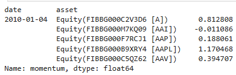

Biến **my_factor** của chúng ta chứa một **pandas Series** với giá trị yếu tố cho từng cổ phiếu trong universe tại mỗi thời điểm. 

Ở đây, chúng ta tạo một **Series** khác chứa thông tin về ngành (sector) cho từng cổ phiếu thay vì các giá trị yếu tố. Đây là dữ liệu phân loại mà chúng ta sẽ sử dụng như một tham số cho **Alphalens** sau này.

```python
sectors = results['sector']
```

# Alphalens Components

Bây giờ, khi chúng ta đã có các thành phần cơ bản cần thiết để phân tích yếu tố, chúng ta có thể bắt đầu làm việc với **Alphalens**. Lưu ý rằng chúng ta sẽ tách các thành phần riêng lẻ của gói, vì vậy đây không phải là quy trình làm việc điển hình khi sử dụng một "tear sheet" của Alphalens. Quy trình làm việc điển hình được trình bày ở cuối sổ ghi chú.

Đầu tiên, chúng ta tính toán lợi nhuận kỳ vọng (*forward returns*). Lợi nhuận kỳ vọng là lợi nhuận mà chúng ta sẽ nhận được nếu nắm giữ từng chứng khoán trong khoảng thời gian tính theo ngày, kết thúc tại ngày đã cho, được truyền qua tham số **periods**. Trong trường hợp này, chúng ta xem xét các khoảng thời gian 1, 5 và 10 ngày trong tương lai. Chúng ta có thể xem điều này như một bài *budget backtest*. "Tear sheet" không tính đến bất kỳ chi phí hoa hồng hay độ trượt giá nào; thay vào đó, nó chỉ xem xét các giá trị như thể chúng ta đã nắm giữ các cổ phiếu được chỉ định trong số ngày cụ thể đến ngày hiện tại.

```python
periods = [1, 5, 10]
forward_returns = get_forward_returns(my_factor, periods=periods, bundle="usstock-learn-1d")
```

Tiếp theo, chúng ta chuyển dữ liệu yếu tố và lợi nhuận kỳ vọng (*forward returns*) vào Alphalens:

```python
factor_data = al.utils.get_clean_factor(
    my_factor,
    forward_returns,
    groupby=sectors
)
```

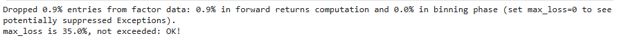

Biến `factor_data` ở đây tương tự như biến `my_factor` ở trên. Nó có giá trị yếu tố cho từng cổ phiếu trong universe của chúng ta tại mỗi thời điểm. Hàm `Alphalens` của chúng ta ở đây cũng cung cấp một nhóm phân loại theo ngành đi kèm với giá trị yếu tố.

```
factor_data.head()
```

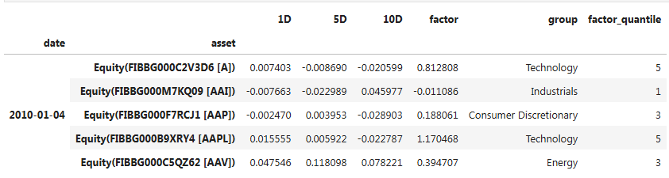

Như đã giải thích ở trên, lợi nhuận kỳ vọng (forward returns) là lợi nhuận mà chúng ta sẽ nhận được nếu nắm giữ từng chứng khoán trong số ngày được chỉ định, kết thúc vào ngày đã cho. Những lợi nhuận này cũng được phân chia theo ngành.

Hàm này cũng phân loại yếu tố của chúng ta vào các phần vị (quantiles) cho mỗi ngày, thay thế giá trị yếu tố bằng phần vị phù hợp vào một ngày nhất định. Vì chúng ta sẽ nắm giữ các nhóm cổ phiếu thuộc phần vị cao nhất và thấp nhất, chúng ta chỉ quan tâm đến yếu tố này khi nó liên quan đến sự dịch chuyển vào và ra khỏi các nhóm này.

**Alphalens** cung cấp bốn loại phân tích trên các yếu tố alpha:

- Phân bố Yếu tố (Factor Distribution)
- Lợi nhuận (Returns)
- Thông tin (Information)
- Tỷ lệ thay đổi (Turnover)

Mỗi chủ đề này được trình bày trong một "tear sheet" riêng biệt cũng như trong một "tear sheet" đầy đủ bao quát toàn bộ.

# Factor Distribution Table

Một "tear sheet" đầy đủ bắt đầu với một bảng thống kê mô tả sự phân bố của các giá trị yếu tố. Bảng này có thể được hiển thị riêng bằng đoạn mã sau:

```python
al.plotting.plot_factor_distribution_table(factor_data)
```

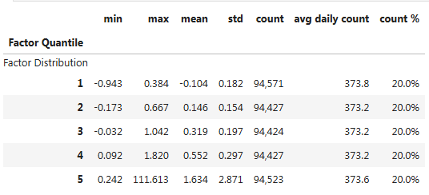

Bảng bao gồm một hàng cho mỗi phần vị (quantile) của yếu tố. Theo mặc định, các yếu tố được chia thành 5 phần vị có kích thước bằng nhau; điều này có thể được thay đổi bằng cách sử dụng tham số `quantiles` trong hàm `get_clean_factor` (hoặc sử dụng các hàm phổ biến hơn được trình bày sau trong sổ ghi chú).

Đối với mỗi phần vị, chúng ta sẽ thấy giá trị nhỏ nhất, lớn nhất, trung bình và độ lệch chuẩn của các giá trị yếu tố. Điều này cung cấp cho chúng ta một cái nhìn tổng quan về việc các giá trị yếu tố kết thúc ở phần vị nào.

Chúng ta cũng có thể xem tổng số lượng giá trị trong mỗi phần vị cho toàn bộ phân tích, số lượng trung bình hàng ngày trên mỗi phần vị và tỷ lệ phần trăm trên mỗi phần vị. Ở đây, vì chúng ta sử dụng phần vị có kích thước bằng nhau (tùy chọn mặc định), nên số lượng là giống nhau cho mỗi phần vị. Ngoài ra, chúng ta có thể chỉ định tham số `bins` cho hàm `get_clean_factor` (hoặc sử dụng các hàm phổ biến hơn được trình bày sau trong sổ ghi chú) thay vì `quantiles`. Việc sử dụng tham số `bins` sẽ tạo ra các phần vị có chiều rộng bằng nhau (được phân cách theo phạm vi tổng thể của các giá trị yếu tố) thay vì các phần vị có kích thước bằng nhau. Trong trường hợp đó, số lượng thường sẽ khác nhau giữa các phần vị.

# Returns Tear Sheet

Nếu chúng ta chỉ quan tâm đến lợi nhuận, chúng ta có thể tạo một "tear sheet" chỉ chứa phân tích lợi nhuận. Đoạn mã sau đây tạo ra tất cả các biểu đồ lợi nhuận của chúng ta sau khi đã lưu trữ dữ liệu lợi nhuận kỳ vọng (forward returns):

```python
al.tears.create_returns_tear_sheet(factor_data, by_group=True);
```

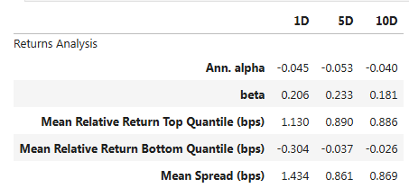

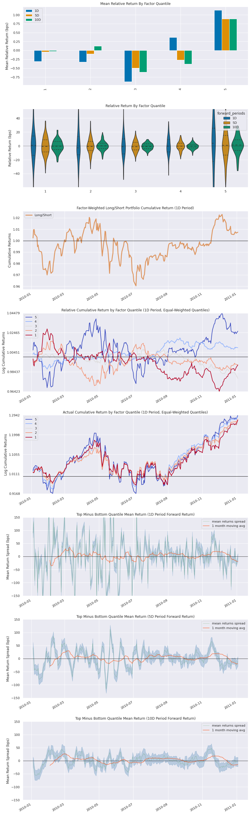

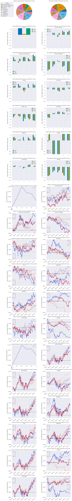

# Returns Tear Sheet Breakdown

### \( \alpha \) and \( \beta \) Point Estimates Table
"Tear sheet" tính toán \( \alpha \) và \( \beta \) của yếu tố của chúng ta so với thị trường. Các giá trị này được tính bằng cách tạo một hồi quy (regression) của lợi nhuận thị trường trong mỗi giai đoạn so với một danh mục yếu tố long-short và trích xuất các tham số. Các giá trị này biểu thị lợi nhuận vượt mức liên quan đến yếu tố của chúng ta và hệ số beta của thị trường, tương ứng.

### Returns Point Estimates Table
Các ước lượng điểm này cũng được tính toán mà không quan tâm đến việc phân nhóm theo ngành, vì vậy chúng cung cấp cho chúng ta một cái nhìn tổng quan về việc chênh lệch (spread) của chúng ta sẽ trông như thế nào nếu chúng ta giao dịch yếu tố này bằng một thuật toán *long-short equity* mà không xem xét lợi nhuận đến từ các ngành nào.

### Mean Relative Return by Factor Quantile
Yếu tố đã được phân vị (quantized factor) được sử dụng để tạo ra các nhóm riêng biệt, với lợi nhuận cho mỗi nhóm được tính toán theo từng khoảng thời gian ngày. Chúng ta nhận được thông tin này thông qua các biểu đồ cột và biểu đồ violin.

Những biểu đồ này cung cấp một tóm tắt đơn giản nhất về giá trị dự đoán của yếu tố. Đối với một yếu tố có tính dự đoán, chúng ta muốn thấy lợi nhuận trung bình tăng dần (hoặc giảm dần) một cách đơn điệu theo các phần vị từ trái sang phải.

Biểu đồ cột cung cấp lợi nhuận trung bình cho mỗi phần vị yếu tố, theo từng khung thời gian. Điều này mang lại cho chúng ta một tập hợp các ước lượng điểm để hiểu sơ bộ về cách giá trị yếu tố tương quan với lợi nhuận.

Sự khác biệt chính giữa biểu đồ cột và biểu đồ violin là biểu đồ violin cho thấy mật độ dữ liệu của chúng ta. Biểu đồ violin càng "mập", mật độ lợi nhuận ở vùng đó càng cao. Tại đây, chúng ta biểu diễn các biểu đồ violin cho lợi nhuận kỳ vọng trong 1, 5 và 10 ngày đối với từng phần vị.

### Factor-Weighted Long/Short Portfolio Cumulative Return

Biểu đồ này hiển thị lợi nhuận tích lũy - *cumulative returns* của một chiến lược cổ phiếu đa chiều với trọng số theo yếu tố, dựa trên yếu tố đầu vào - *factor-weighted cross-sectional equity strategy based on the input factor*. Danh mục đầu tư giữ tất cả các tài sản trong universe, được phân bổ trọng số theo giá trị yếu tố của chúng và cân bằng lại hàng ngày. Theo mặc định, danh mục này là một danh mục long-short, trong đó mọi tài sản có giá trị yếu tố cao hơn mức trung bình hàng ngày sẽ được mua (LONG), và mọi tài sản có giá trị yếu tố thấp hơn mức trung bình hàng ngày sẽ được bán khống (SHORT).

Do danh mục đầu tư được trọng số theo yếu tố - *factor-weighted*, các tài sản có giá trị yếu tố gần với mức trung bình sẽ có trọng số tuyệt đối nhỏ hơn, trong khi các tài sản có giá trị yếu tố xa mức trung bình sẽ có trọng số tuyệt đối lớn hơn. Lưu ý rằng điều này có nghĩa là biểu đồ lợi nhuận tích lũy - *cumulative return* có thể bị chi phối bởi một số lượng nhỏ các giá trị ngoại lệ (outliers) có giá trị rất xa so với mức trung bình. Vì lý do này, bạn nên bổ sung biểu đồ này bằng các biểu đồ **Lợi nhuận Tích lũy theo Phần vị** (*Cumulative Return by Quantile*), sử dụng phương pháp trọng số đều - *equal-weighted*, ít nhạy cảm hơn với các giá trị ngoại lệ.

### Relative Cumulative Return by Quantile

Biểu đồ tiếp theo này tổng hợp lợi nhuận tương đối của từng phần vị riêng lẻ - *relative returns of each individual quantile* thành một biểu đồ lợi nhuận tích lũy - *cumulative returns *được tách ra theo từng nhóm cho lợi nhuận kỳ vọng trong một khoảng thời gian (1 ngày). Trong mỗi phần vị, các tài sản được phân bổ trọng số đều, không phải trọng số theo yếu tố như trong biểu đồ trước. Điều này làm cho biểu đồ ít nhạy cảm hơn với các giá trị ngoại lệ.

Điều chúng ta muốn thấy ở đây là 5 "đường cong" rời rạc với ít hoặc không có sự giao nhau. Điều này sẽ cho chúng ta một cái nhìn về phần vị nào có xu hướng chi phối lợi nhuận (lý tưởng nhất là phần vị thứ nhất và thứ năm).

### Actual Cumulative Return by Quantile

Biểu đồ này giống với biểu đồ trước đó, ngoại trừ việc nó hiển thị lợi nhuận thực tế của từng phần vị - *actual returns of each quantile*, trong khi biểu đồ trước hiển thị lợi nhuận tương đối - *relative returns* (tức là, so với lợi nhuận trung bình hàng ngày tổng thể - *relative to the overall daily mean return*). Khi kết hợp, các biểu đồ này có thể tiết lộ (ví dụ) liệu một phần vị thấp nhất của cổ phiếu, có thể là ứng viên để bán khống trong một chiến lược long-short, có lợi nhuận âm - *negative returns* (và do đó có thể bán khống có lãi) hay chỉ đơn giản là có lợi nhuận dương thấp hơn so với các phần vị cao hơn - *less positive returns than higher quantiles* (và do đó có thể cung cấp một hàng rào bảo vệ - *provide a hedge* nhưng sẽ gây thua lỗ).

### Quantile Mean Return in BPS

Tiếp theo, chúng ta tính toán điểm cơ bản (*basis points*) của mức chênh lệch (spread), dựa trên việc trừ đi lợi nhuận trung bình của phần vị thấp nhất khỏi lợi nhuận trung bình của phần vị cao nhất - *based on subtracting the mean return of the lowest quantile from the mean return of the highest quantile* (mô phỏng việc bán khống ở phần vị thấp nhất và mua ở phần vị cao nhất). Chúng ta cũng tính toán sai số và vẽ tất cả lên một biểu đồ, cung cấp cho chúng ta một chuỗi thời gian của các điểm cơ bản cùng với khoảng tin cậy (confidence intervals) cho mỗi khoảng thời gian.

### Top and Bottom Quantile Composition by Sector

Vì chúng ta đã cung cấp thông tin về ngành (sector) như một khóa phân nhóm, tiếp theo chúng ta sẽ có hai biểu đồ tròn hiển thị thành phần của phần vị cao nhất và thấp nhất theo ngành. Điều này giúp chúng ta xem liệu các phần vị cao nhất và thấp nhất có tập trung ở một số ít ngành hay được phân bổ đều trên nhiều ngành.

### Sector Breakdown of Returns

Vì chúng ta đã cung cấp tham số `groupby`, chúng ta cũng sẽ thấy các biểu đồ riêng biệt hiển thị lợi nhuận trung bình theo phần vị cho từng nhóm - showing the mean return by quantile for each group (ngành - sector), lợi nhuận tích lũy tương đối theo phần vị cho từng nhóm (ngành), và lợi nhuận tích lũy thực tế theo phần vị cho từng nhóm. Mặc dù việc phân tích theo phần vị rất hữu ích, nhưng cũng quan trọng để xem yếu tố của bạn tiếp xúc với các khía cạnh khác nhau của thị trường như thế nào. Đây là một cách tốt để đánh giá liệu yếu tố của bạn có hoạt động như mong đợi trong universe của bạn hay không. Ví dụ, nếu bạn dự định universe của mình chỉ bao gồm một ngành cụ thể, thì việc xác nhận rằng yếu tố của bạn và universe thực sự chỉ tiếp xúc với ngành đó là rất đáng giá.

Lưu ý rằng bạn không bị giới hạn bởi một khóa phân nhóm duy nhất - *single grouping key*. Bạn có thể cung cấp một danh sách các khóa phân nhóm cho tham số `groupby`, và `Alphalens` sẽ hiển thị các biểu đồ cụ thể theo nhóm cho mỗi bộ khóa phân nhóm - *for each set of grouping keys*.

### Information Coefficient

Chúng ta sử dụng **hệ số thông tin** (Information Coefficient - IC) để đánh giá khả năng dự đoán của một yếu tố. IC của một yếu tố là hệ số *Spearman Rank Correlation* của nó. Để tìm hiểu thêm về các cơ sở toán học liên quan đến IC, hãy tham khảo bài giảng về *Spearman Rank Correlation*.

Để đơn giản, chúng ta tính IC giữa các giá trị yếu tố và lợi nhuận kỳ vọng (forward returns) cho mỗi giai đoạn. IC đánh giá mối quan hệ đơn điệu giữa các yếu tố và lợi nhuận. Trực giác, điều này có nghĩa là IC cung cấp một thước đo để xem liệu các giá trị yếu tố cao hơn có liên quan đến lợi nhuận cao hơn hay không.

Một IC cao hơn cho thấy rằng các giá trị yếu tố cao hơn liên quan mật thiết hơn đến các giá trị lợi nhuận cao hơn (và các giá trị yếu tố thấp hơn liên quan mật thiết đến các giá trị lợi nhuận thấp hơn). Một IC rất âm cho thấy rằng các giá trị yếu tố cao hơn liên quan mật thiết hơn đến các giá trị lợi nhuận thấp hơn. Một IC bằng 0 cho thấy không có mối quan hệ nào.

### Information Tear Sheet

Tương tự như "tear sheet" về lợi nhuận, chúng ta cũng có thể tạo một "tear sheet" chỉ cung cấp dữ liệu về hệ số thông tin (information coefficient).

```python
al.tears.create_information_tear_sheet(factor_data, by_group=True)
```

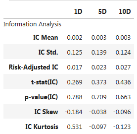

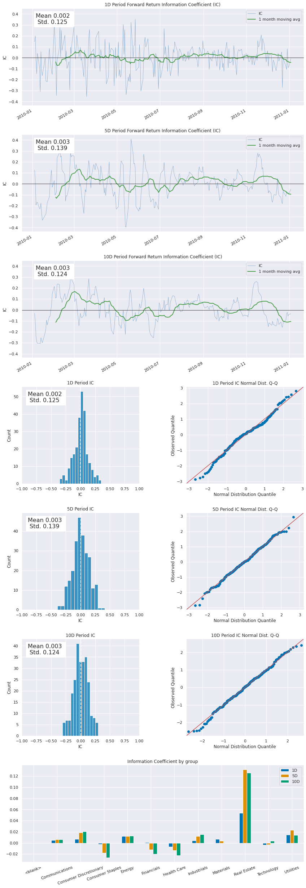

### IC Point Estimates

Bảng đầu tiên này cung cấp cho chúng ta số liệu thống kê về phân phối của hệ số thông tin (IC) cho từng khung thời gian. Các số liệu bao gồm trung bình, độ lệch chuẩn, độ lệch (skewness) và độ nhọn (kurtosis), giúp chúng ta có cái nhìn rõ ràng về hình dạng của phân phối.

### IC Time Series
Tại đây, chúng ta vẽ IC dưới dạng chuỗi thời gian cho mỗi giai đoạn, cùng với đường trung bình động 1 tháng để làm mượt dữ liệu. Điều chúng ta muốn thấy là sự nhất quán theo thời gian và tín hiệu mang tính thông tin liên tục.

### IC Histograms
Biểu đồ histogram rất hữu ích để hiển thị phân phối của IC. Các biểu đồ này sẽ rõ ràng cho thấy bất kỳ giá trị ngoại lệ kỳ lạ nào và cách chúng ảnh hưởng đến đường cong tổng thể.

### IC QQ-Plots
Biểu đồ QQ (QQ-plot) so sánh phân phối của IC với phân phối chuẩn. Nó vẽ các phần vị của một phân phối so với phần vị của phân phối khác, thường với một đường tham chiếu tại \( y = x \). Nếu các điểm trên biểu đồ QQ hoàn toàn nằm trên đường này, điều đó cho thấy hai phân phối là giống nhau. Trong thực tế, biểu đồ QQ đóng vai trò như một thước đo sự tương đồng giữa các phân phối. Thông thường, điều chúng ta muốn thấy là một đường cong hình chữ S. Điều này chỉ ra rằng phần đuôi của phân phối IC dày hơn và chứa nhiều thông tin hơn.

### IC by Group
Nhìn vào lợi nhuận theo phần vị cho từng ngành riêng lẻ trong "tear sheet" giúp chúng ta thấy ngành nào đang thúc đẩy phần lớn lợi nhuận của chúng ta, cũng như liệu các phần vị trong mỗi ngành có hoạt động như mong đợi hay không (với phần vị thấp nhất cho lợi nhuận thấp nhất và phần vị cao nhất cho lợi nhuận cao nhất). Nếu một ngành riêng lẻ có ít hoặc không có tín hiệu (IC), thì việc lợi nhuận phần vị trong ngành đó nằm rải rác là hợp lý. Nhìn vào IC theo nhóm giúp đảm bảo rằng mọi thứ hoạt động đúng như mong đợi.

### Turnover

Khi xem xét tác động của việc thực hiện một tín hiệu trong chiến lược, turnover là một yếu tố quan trọng cần cân nhắc. Biểu đồ này hiển thị turnover của các phần vị cao nhất và thấp nhất của yếu tố, là các nhóm mà bạn sẽ thực sự giao dịch trong một cách tiếp cận long-short.

Turnover quá cao sẽ làm giảm lợi nhuận của chiến lược thông qua chi phí hoa hồng. Đôi khi một tín hiệu không đủ tốt để chống lại chi phí giao dịch mà bạn phải xử lý thông qua nhà môi giới của mình.

### Turnover Tear Sheet

Chúng ta có thể xem xét hai chỉ số khác nhau của turnover bằng cách sử dụng `Alphalens`: phần trăm turnover và tự tương quan yếu tố (factor autocorrelation).

```python
al.tears.create_turnover_tear_sheet(factor_data);
```

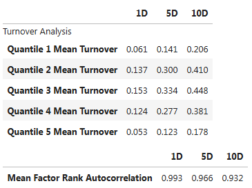

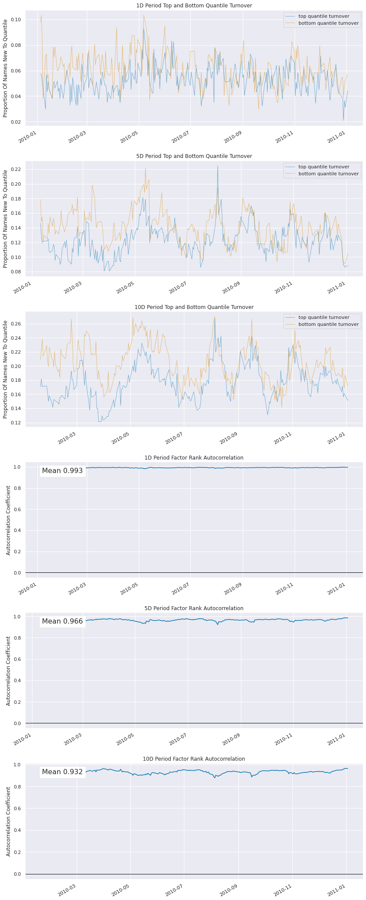

### Quantile Turnover

Bảng đầu tiên là một biểu đồ turnover cho từng phần vị theo từng giai đoạn. Biểu đồ này cho thấy tỷ lệ các mã cổ phiếu di chuyển vào và ra khỏi mỗi nhóm.

### Factor Autocorrelation

**Tự tương quan yếu tố (Factor autocorrelation)** là thước đo mối tương quan giữa giá trị hiện tại của yếu tố và giá trị trước đó của nó. Ý tưởng đằng sau việc tính toán này là cung cấp một thước đo khác về turnover của các phần vị yếu tố. Nếu tự tương quan thấp, điều này cho thấy giá trị hiện tại của yếu tố ít liên quan đến giá trị trước đó và các vị trí danh mục đầu tư đang thay đổi thường xuyên theo từng giai đoạn. Nếu giá trị tiếp theo của yếu tố bị ảnh hưởng đáng kể bởi giá trị cuối cùng, điều này có nghĩa là phương pháp xếp hạng của bạn nhất quán hơn (mặc dù điều này không ảnh hưởng đến khả năng dự đoán sự chuyển động giá tương đối của nó).

### Top and Bottom Quantile Turnover

Biểu đồ này hiển thị turnover khá bình thường đối với yếu tố, điều này cho thấy rằng chúng ta sẽ không bị ảnh hưởng quá lớn bởi việc thay đổi liên tục các vị trí trong danh mục, mặc dù điều này thay đổi tùy theo thời gian. Chúng ta không thể trực tiếp thấy chi phí, vì **Alphalens** không mô phỏng chi phí hoa hồng. Biểu đồ này chỉ cung cấp các số liệu mà chúng ta có thể sử dụng để đánh giá yếu tố một cách độc lập. Để mô hình hóa chính xác các ảnh hưởng như trượt giá và hoa hồng, bạn sẽ cần triển khai chiến lược của mình trong một bài kiểm tra.

### Autocorrelation

Tập hợp biểu đồ thứ hai trong "tear sheet" turnover là tự tương quan yếu tố theo thời gian. Trong trường hợp này, chúng ta có tự tương quan khá cao, xác nhận các biểu đồ turnover ở trên gợi ý rằng các vị trí danh mục đầu tư ổn định hơn.

# Full Factor Tear Sheet

Chúng ta cũng có thể tạo tất cả các biểu đồ và thống kê trên trong một "tear sheet" hoàn chỉnh. Nếu bạn đã làm theo các bước ở trên để tạo dữ liệu yếu tố và lợi nhuận kỳ vọng, bạn có thể tạo một "tear sheet" đầy đủ chỉ với một lần chạy như sau:

```python
al.tears.create_full_tear_sheet(factor_data, by_group=True);
```

Tuy nhiên, một cách tiếp cận dễ dàng hơn là đi trực tiếp từ định nghĩa pipeline đến một "tear sheet" hoàn chỉnh, để `Alphalens` xử lý các bước trung gian như thực thi pipeline, tính toán lợi nhuận kỳ vọng, và định dạng dữ liệu yếu tố. Bắt đầu với định nghĩa pipeline của chúng ta từ trước đó:

```python
pipe = Pipeline(
    columns = {
        'momentum' : momentum,
        'sector' : master.SecuritiesMaster.usstock_Sector.latest
    },
    initial_universe=initial_universe,
    screen=screen
)
```

Chúng ta chỉ cần chuyển định nghĩa pipeline trực tiếp vào hàm `from_pipeline` của **Alphalens**, chỉ định tên cột chứa yếu tố mà chúng ta muốn phân tích, các tên cột tùy chọn chứa khóa phân nhóm (nếu có), và các tham số khác, để tạo ra một "tear sheet" hoàn chỉnh:

```python
al.from_pipeline(
    pipe,
    start_date='2010-01-01', 
    end_date='2011-01-01', 
    bundle='usstock-learn-1d',
    factor="momentum", # pipeline column name containing the factor
    groupby="sector", # optional pipeline column name(s) to group by
    periods=[1, 5, 10] # forward returns periods
)
```

Bên cạnh sự tiện lợi, một lợi ích quan trọng của hàm `from_pipeline` là nó hỗ trợ phân tích theo từng đoạn (segmented analysis), nghĩa là nó có thể phân tích các phạm vi ngày lớn ngay cả khi tổng lượng dữ liệu quá lớn để đưa vào bộ nhớ. Để tận dụng tính năng này, hãy truyền một alias offset của `pandas` (chẳng hạn như "Y" cho năm) làm tham số `segment`. Điều này khiến `Alphalens` chia phạm vi ngày tổng thể thành các đoạn dài một năm.

`Alphalens` chạy từng đoạn liên tiếp và ghép nối kết quả để tạo ra "tear sheet" cuối cùng. Điều này giúp giảm mức sử dụng bộ nhớ vì `Alphalens` có thể loại bỏ các cấu trúc dữ liệu trung gian và chỉ giữ lại các đầu ra cần thiết.

```python
al.from_pipeline(
    pipe,
    start_date='2008-01-10', 
    end_date='2011-12-10', 
    bundle='usstock-learn-1d',
    factor="momentum", # pipeline column name containing the factor
    groupby="sector", # optional pipeline column name(s) to group by
    periods=[1, 5, 10], # forward returns periods
    segment="Y",
)
```

## More on Factors

Việc tạo ra các yếu tố mới luôn là điều tốt, nhưng bạn thường sẽ cần nhiều yếu tố độc lập có khả năng dự đoán để tạo ra một tín hiệu đủ ổn định để giao dịch. Các phương pháp tổng hợp các yếu tố sẽ được thảo luận trong các bài giảng tiếp theo, nhưng cách tiếp cận ban đầu đơn giản nhất là chuẩn hóa giá trị của từng yếu tố mà bạn muốn đưa vào tổng hợp, sau đó cộng các yếu tố đã được chuẩn hóa lại với nhau và xếp hạng dựa trên giá trị yếu tố kết hợp mới này.

## Next Steps

Khi bạn đã có một yếu tố trông khả quan, bước tiếp theo là triển khai nó trong một thuật toán. Thật không may, chỉ có một tín hiệu tốt là chưa đủ. Các thuật toán giao dịch phải xem xét nhiều yếu tố khác không được bao gồm trong **Alphalens**. Chúng ta cần xem xét cách thị trường tổng thể sẽ phản ứng với các giao dịch mà chúng ta thực hiện (tác động thị trường/trượt giá) cũng như các chi phí giao dịch liên quan đến việc thực hiện các giao dịch này. Những yếu tố này có thể làm giảm lợi nhuận nếu chúng ta không đánh giá đúng tác động của chúng thông qua việc thử nghiệm kỹ lưỡng.

Để giải quyết điều này, chúng ta có các bài kiểm tra toàn diện (*backtests*) sử dụng **Zipline**. Nó cho phép mô phỏng trượt giá và chi phí giao dịch cũng như đặt ra các giới hạn về mức đòn bẩy (nợ) mà thuật toán của bạn có thể sử dụng để thực hiện giao dịch. Tìm hiểu thêm về đòn bẩy trong bài giảng về Leverage.

